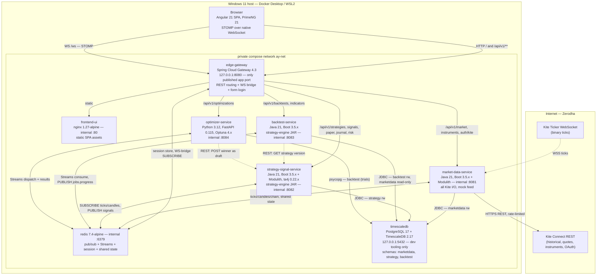
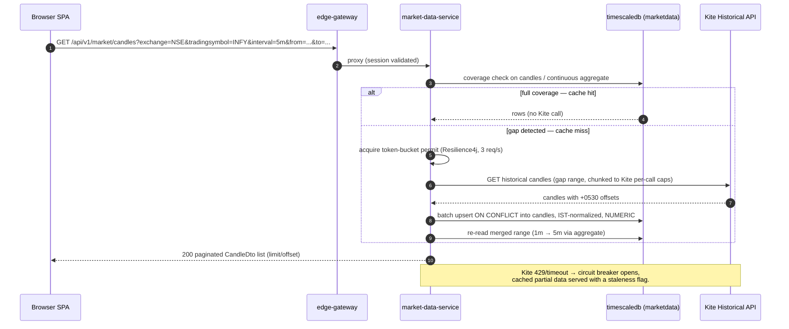
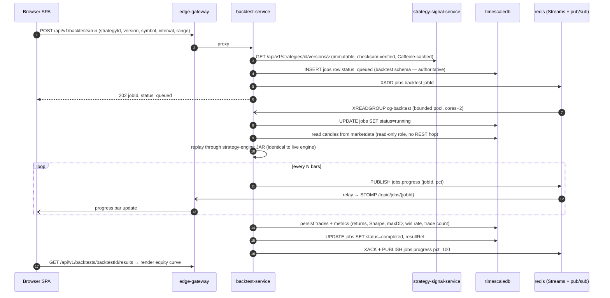
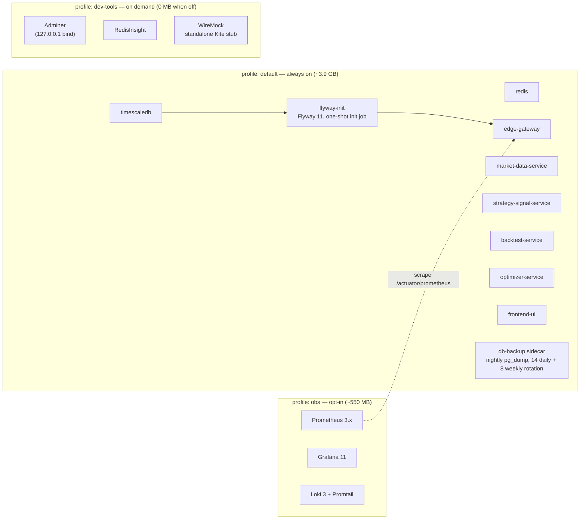
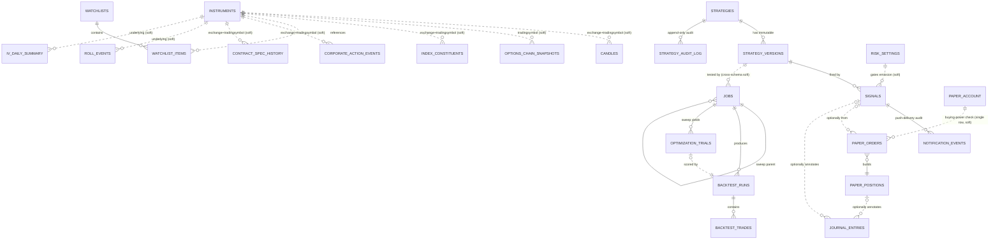
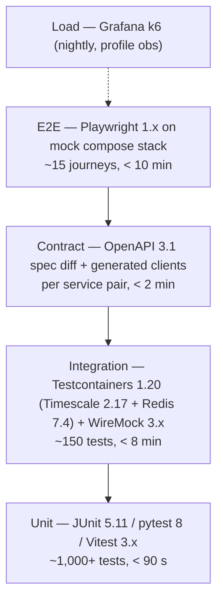
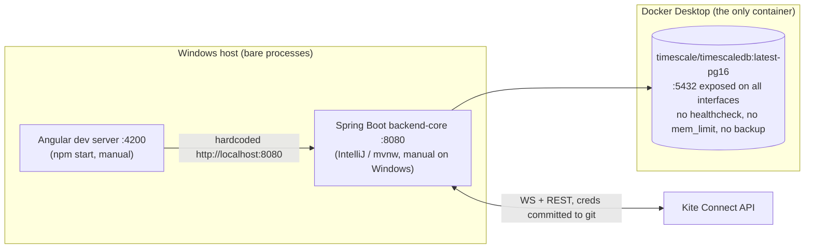
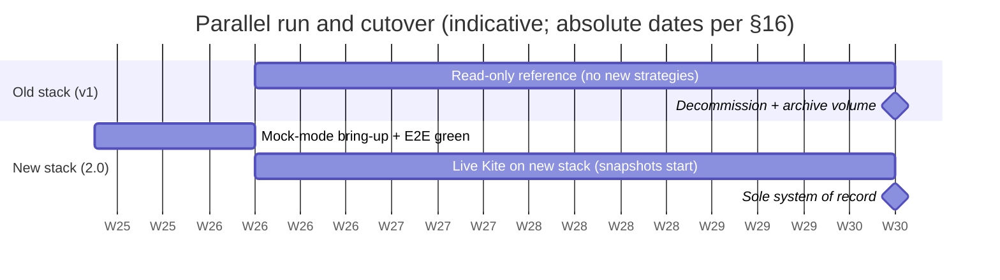
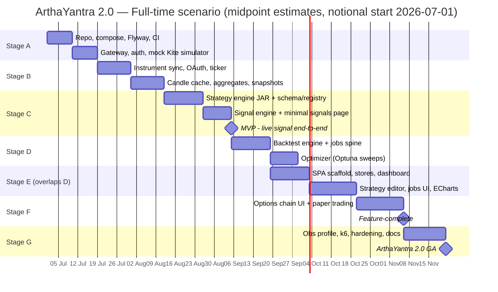

# ArthaYantra 2.0 — Common Reference (app-wide & multi-stage spec)

**Purpose.** This file is the single shared substrate for the ArthaYantra 2.0 build: the binding ADR, the system architecture, backend/database/devops/testing/security standards, the v1 lessons the rebuild must honor, the risk register, migration path, effort ledger, alternatives, open questions, and the full review-decisions ledger. Every stage file (A–G) assumes this file is read alongside it; together they replace the four original design documents.

**Provenance.** Consolidated 2026-06-12 from the four ArthaYantra 2.0 design documents — `ARTHAYANTRA_2_ADR.md` (binding D1–D18 + amendments A1–A6), `ARTHAYANTRA_2_REVIEW_DECISIONS.md` (review dispositions), `ARTHAYANTRA_2_REDESIGN_PLAN.md` (Rev 1.1 deep design), `ARTHAYANTRA_2_IMPLEMENTATION_PHASES.md` (Rev 1.1, 48 phases) — which are superseded by this file set and may be deleted. Section breadcrumbs like *(plan §3.1 — inlined below)* preserve provenance for tracing; no instruction here requires opening the originals.

**ArthaYantra 2.0 in one line.** A greenfield rebuild of a single-user signal-generation and backtesting platform for Indian markets (Zerodha Kite Connect; signals only, no live order execution), redesigned as eight Docker containers on one Windows 11 machine: Java 21 / Spring Boot 3.5 + Spring Modulith services, Angular 21 SPA, Python optimizer, PostgreSQL 17 + TimescaleDB 2.17, Redis 7.4.

## File map

The build is split across 8 self-contained files. Stage letters A–G correspond to the plan's macro Phases 0–6.

| File | Stage | Plan macro-phase | Phases covered |
|---|---|---|---|
| `ARTHAYANTRA_2_COMMON_REFERENCE.md` (this file) | — | app-wide / all | App-wide & multi-stage material (ADR, architecture, cross-cutting standards, ledgers) |
| `ARTHAYANTRA_2_STAGE_A_FOUNDATIONS.md` | A | Phase 0 | Phases 1–8 |
| `ARTHAYANTRA_2_STAGE_B_MARKET_DATA_SPINE.md` | B | Phase 1 | Phases 9–17 (+9A, 15A, 15B, 16A) |
| `ARTHAYANTRA_2_STAGE_C_STRATEGY_ENGINE_MVP.md` | C | Phase 2 | Phases 18–27 (ends at the MVP gate) |
| `ARTHAYANTRA_2_STAGE_D_BACKTEST_OPTIMIZER.md` | D | Phase 3 | Phases 28–34 (+30A, 32A) |
| `ARTHAYANTRA_2_STAGE_E_FRONTEND_UX.md` | E | Phase 4 | Phases 35–41 (+40A, 40B, 40C — build order 35…39, 40B, 40, 40C, 40A, 41 [A13]) |
| `ARTHAYANTRA_2_STAGE_F_OPTIONS_PAPER_UNIVERSE.md` | F | Phase 5 | Phases 42–44 (+42A, 42B, 43A, 43B, 44A) |
| `ARTHAYANTRA_2_STAGE_G_HARDENING_GA.md` | G | Phase 6 | Phases 45–48 |

Letter-suffixed phases (9A … 44A) were added by the 2026-06-12 owner feature selection (Amendments A7–A12 in §6; full index in §5) and run immediately after their base-numbered phase — existing phase numbers 1–48 are unchanged, total 60 phases. The feature-complete milestone stays at the Stage F exit; Stage G stays strictly last. [owner selection 2026-06-12] Amendment A13 (2026-06-12) adds Phases 40B and 40C (total 62 phases) with an exception to the suffix-ordering rule: 40B builds BEFORE Phase 40, and the Stage E build order is 35…39, 40B, 40, 40C, 40A, 41. [A13, 2026-06-12]

---

## 1. How to use this file set — execution protocol

*(adapted from phases-doc §0.1; kickoff prompt rewritten for the new structure)*

- **Target: a brand-new empty repository** (working name `artha-yantra-2`). The existing v1 repo is never modified, imported, or referenced by code. All paths below are relative to the new repo root.
- **Phases run strictly sequentially.** One phase per Claude Code session: implement → test → update `PHASE_GATES.md` → commit → push → stop. Start the next phase with a fresh prompt.
- **Suggested kickoff prompt per phase:** *"Read `docs/phases/ARTHAYANTRA_2_STAGE_<X>_*.md` Phase N plus `docs/phases/ARTHAYANTRA_2_COMMON_REFERENCE.md`. Implement exactly that phase. Do not pull work from later phases; park ideas in `PHASE_GATES.md`. When acceptance criteria pass, commit with the suggested message and push."* (X = the stage letter that contains Phase N per the §5 phase index.)
- **Every phase is independently buildable, runnable, and testable on the mock profile** (`SPRING_PROFILES_ACTIVE=mock`) with zero Kite credentials. Live-Kite code paths are exercised only via WireMock in tests; real-Kite verification is an owner activity outside these phases.
- **Definition of done (every phase):** all listed tests green locally; `ay up` (where the stack is touched) reaches healthy; no secrets in the diff (gitleaks hook passes); Conventional Commit; acceptance criteria checked off in `PHASE_GATES.md`.
- **Stage-exit gates (S5 ritual):** the closing phase of each stage copies the matching plan §15.2 acceptance row (reproduced in §16.2 below) into `PHASE_GATES.md` as a checklist; a standing **Friday gate review** walks the current checklist against the running mock stack — unchecked boxes extend the phase, never the reverse (see §16.6 de-scoping levers / phase-exit ritual).
- **Phase-split rule:** a phase that turns out too large mid-session is split at the listed sub-phase seams — finish and commit the first sub-phase, then take the rest as the next session.
- **Mock-profile rule:** mock vs live is orthogonal to compose profiles; `SPRING_PROFILES_ACTIVE=mock` in `.env` flips the whole stack to the credential-free path. Every phase must keep the mock path green — any PR that breaks it fails `ci-e2e.yml` before it can merge.

## 2. Owner Day-0 actions (before Phase 1)

*(phases-doc §0.2 — human actions, not coding work; Phase 1 records their outcomes)*

1. **Provision a brand-new Kite API key pair for 2.0 when going live** (ADR amendment A6, owner decision 2026-06-12) — the v1 pair is never configured anywhere in 2.0; no digests are recorded and the P1-4 tripwire is dropped. Deleting/rotating the old v1 key in the Zerodha console is recommended housekeeping, not a gate. Nothing is needed until the first live session — mock mode requires no credentials.
2. Create the new private GitHub repository; keep **GHCR packages private by choice** — trading-strategy IP and Kite-credential hygiene under the single-user posture (the old vendored-TradingView redistribution rationale is gone; there is no redistribution mandate anymore). [A13, 2026-06-12]
3. Decide Tailscale adoption for phone access (Q3) — documentation-only impact.
4. Reserve ≥ 100 GB SSD headroom (Q4) and confirm Docker Desktop + WSL2 with `.wslconfig` limits (§10.2 Windows guidance below).
5. ~~Ratify ADR amendments A1–A5~~ **Done 2026-06-12** — A1–A6 recorded in the ADR's Amendments section (§6 Amendments, below): A1 composite formula → Phase 20; A2/A4 → Phases 14–15; A3 awaits the Phase 16 depth probe; A5 records Q1–Q6; A6 fresh-credentials decision. A7–A12 (owner feature selection, also 2026-06-12) and A13 (chart-renderer decision, 2026-06-12) are recorded in the same section. [owner selection 2026-06-12] [A13, 2026-06-12]
6. **Verify the NSE index-constituents CSV source** (URL, format, cadence, ToS) **before Phase 22** — if unverified by then, Phase 22 ships only the port + mock fixture and the live fetcher becomes a follow-up slice (decisions-ledger §20.4 open item 2).

## 3. Global conventions (apply to every phase)

*(phases-doc §0.3 in full)*

- **Stack versions:** exactly the ADR canonical table (§6 below) — Java 21 / Boot 3.5.x / Modulith 1.3 / Cloud Gateway 4.3; Python 3.12 / FastAPI 0.115 / Optuna 4.x; Angular 21 / PrimeNG 21 / @ngrx/signals 21 / TS 5.9; PG 17 + TimescaleDB 2.17; Redis 7.4-alpine; Flyway 11; ta4j 0.22.x; javakiteconnect 3.5.x (bundled Gson excluded, Gson 2.13.2 pinned). Pin everything; no `latest`.
- **Repo layout:** the monorepo tree in §10.1 below (`services/`, `libs/`, `frontend-ui/`, `deploy/`, `e2e/`, `load/`, `tools/`, `.github/workflows/`, `ay.ps1`/`ay.sh`).
- **Money = `BigDecimal`/`NUMERIC`; time = `TIMESTAMPTZ` in `Asia/Kolkata`; identity = `(exchange, tradingsymbol)`** — never floats, never naive times, never numeric Kite tokens as identity.
- **API:** `/api/v1/{domain}` prefix, DTOs only, `{ code, message, details }` error envelope on every non-2xx, `limit/offset` paging, `202 {jobId}` for long-running ops (D8).
- **Ports:** gateway `127.0.0.1:8080` (only published app port), timescaledb `127.0.0.1:5432`; internal 8081 market-data, 8082 strategy-signal, 8083 backtest, 8084 optimizer; dev-tools profile publishes internals + Adminer `127.0.0.1:8085`, RedisInsight `127.0.0.1:5540`.
- **Commands** are cross-platform; on Windows PowerShell use `.\mvnw.cmd` for `./mvnw` and `.\ay.ps1` for `ay`. All `mvnw` invocations run from the repo root with `-pl <module> -am`.
- **Tests:** JUnit 5 + AssertJ + Mockito + Testcontainers 1.20 + WireMock 3.x (Java); pytest 8 + respx (Python); Vitest 3.x (frontend); Playwright 1.x (E2E). Coverage gates (§11.2 testing pyramid below): `libs/strategy-engine` ≥ 70 % branch from the phase it exists; Java services ≥ 60 % line; optimizer ≥ 75 % line; frontend stores/services ≥ 70 % line — each enforced in its stack's CI workflow from the phase that creates it.
- **Canonical shared-state names** (the plan is internally split; these spellings win): Redis key `kite:session:status` for Kite session/ticker state (plan §8.2 — Flow 1's `kite:status` shorthand resolves to this); pub/sub channel `kite.status`; jobs-summary key `jobs:summary`. Error-code pins: `KITE_TOKEN_EXPIRED` (§10 taxonomy below wins over §8.2's `KITE_SESSION_EXPIRED`); `DATA_GAP` for backtest coverage failures (§10 taxonomy wins over §7.4's `INSUFFICIENT_DATA`).
- **Non-negotiables under any pressure:** Flyway-managed schemas, mock mode, shared engine JAR + golden vectors, NUMERIC/IST conventions, credential hygiene (§16.6 levers).

## 4. Chosen-by-default decisions CD-1..CD-17 (revisable; flagged per the prompt's rule)

*(phases-doc §0.4 in full)*

| # | Choice | Default taken |
|---|---|---|
| CD-1 | Where roles/schemas are created | A fourth tiny Flyway lineage `deploy/flyway/admin/` runs first (creates the 3 schemas, 3 service roles, default privileges incl. backtest read-only on `marketdata`); the three per-schema lineages own only their tables |
| CD-2 | NSE holiday calendar storage | Versioned resource file inside `libs/market-calendar` (yearly refresh by PR), not a DB seed |
| CD-3 | Gateway STOMP bridge implementation | Minimal STOMP-subset codec (CONNECT/SUBSCRIBE/UNSUBSCRIBE/MESSAGE/heartbeat) over a WebFlux `WebSocketHandler` in edge-gateway — sufficient for `@stomp/stompjs`; classic `@EnableWebSocketMessageBroker` is servlet-only |
| CD-4 | JSON Schema validation library | `networknt/json-schema-validator` (draft 2020-12) |
| CD-5 | YAML parsing | SnakeYAML in `SafeConstructor` mode (plan §11.4 — see §12.5 below) |
| CD-6 | IV solver | Bracketed Newton–Raphson with bisection fallback, `T_min` clamp per spike S1 |
| CD-7 | Migration directory | `deploy/flyway/{admin,marketdata,strategy,backtest}/` (plan §9.1 layout wins over §6.10's `db/` sketch) |
| CD-8 | OpenAPI spec capture | Specs committed under `contracts/`; CI boots each service (mock), dumps `/v3/api-docs`, diffs with `openapi-diff`; frontend types via `openapi-typescript` |
| CD-9 | Chart renderer containment [A13, 2026-06-12] | lightweight-charts ≥ 5.2 is the sole main-chart renderer (Apache-2.0 + NOTICE attribution, `attributionLogo` on); the datafeed core has zero chart-library imports; lightweight-charts imports are confined to designated chart-wrapper components (lint-enforced, CI); no second main-chart renderer — reintroducing TradingView requires a new ADR amendment |
| CD-10 | Standalone `kite-sim` WireMock container | Deferred — embedded mock profile + per-test WireMock cover all phases here; the embedded feed gains scenario (`MOCK_SCENARIO`: trend-up/trend-down/chop/gap-open) and rate (`MOCK_TICKS_PER_SEC`) knobs in Phase 7; the full plan-§10.5 scenario library (expiry-pin, circuit-halt), fault-injection harness and recorded-session replay are deferred with the container (Appendix §21) |
| CD-11 | Editor form mode v1 | Metadata + indicator weight/optional toggles only — an **explicit scope reduction vs plan §7.7 screen 2** (universe pickers, rule builder, risk fields stay YAML-only in v1; parked in `PHASE_GATES.md` at Phase 36), not an unspecified default |
| CD-12 | Fold-fed pruning transport | Trial workers stream per-fold intermediate objectives onto `optimizations.results`; optimizer applies MedianPruner and cancels pruned trials via the job-cancel path (S3 spike calibrates `n_startup_trials`/warm-up folds) |
| CD-13 | Password-hash helper | `tools/hash-password` tiny Java main (Argon2id PHC string) invoked via `mvnw exec:java`, documented in README |
| CD-14 | Mock instrument dump | ~5k-row fixture CSV committed as a classpath resource in market-data-service (indices, top stocks, one NFO expiry ladder) |
| CD-15 | Python dependency management | `requirements.txt` with hashes + plain `pip`; ruff for lint/format |
| CD-16 | Redis eviction policy | `volatile-lru` instance-wide (Redis eviction cannot be scoped to a keyspace): TTLs only on cache keys, so session/Streams keys are never evictable; the S3B memory-ratio warning (Phase 45) is the compensating control |
| CD-17 | backtest-service module structure | Ships without Modulith (single-purpose engine; the D7 row's plain "Boot 3.5.x" is followed; D6's "all always-on services" is read as not mandating module seams there) |

## 5. Phase index

*(phases-doc §0.5 full table, with a stage→file column added)*

Stages A–G correspond to the plan's macro Phases 0–6. Times assume Claude-Code-assisted solo work; minutes are active implementation time per session (each fits comfortably in a 5-hour usage window). The **File** column names the stage file that contains the phase.

| # | Phase | Stage | File | Est. min |
|---|---|---|---|---|
| 1 | Repo scaffold, hygiene & process docs | A | STAGE_A | 45–60 |
| 2 | Core infra compose: TimescaleDB + Redis + backup sidecar + `ay` CLI | A | STAGE_A | 60–90 |
| 3 | Flyway init job + schemas/roles baseline | A | STAGE_A | 60–90 |
| 4 | Maven reactor + shared libs (common-web, market-calendar) | A | STAGE_A | 60–90 |
| 5 | edge-gateway: form login, sessions, routing skeleton | A | STAGE_A | 90–120 |
| 6 | GitHub Actions CI (Java, migrations, gitleaks) | A | STAGE_A | 60–90 |
| 7 | market-data-service skeleton + mock tick feed (5 ports) | A | STAGE_A | 90–120 |
| 8 | Gateway WS bridge (STOMP over native WS) — Stage-A exit gate | A | STAGE_A | 90–120 |
| 9 | Instruments: schema, sync, search API | B | STAGE_B | 90–120 |
| 9A | Contract-spec history accrual (lot/tick as-of) [FP-3] | B | STAGE_B | 60–90 |
| 10 | Candles hypertable + 1m builder + continuous aggregates | B | STAGE_B | 90–120 |
| 11 | Historical candle cache + gap detection + Kite rate limiting | B | STAGE_B | 90–120 |
| 12 | Kite OAuth lifecycle + AES-GCM token store | B | STAGE_B | 90–120 |
| 13 | Live ticker adapter + subscription registry + binary-frame guard | B | STAGE_B | 90–120 |
| 14 | Black-76 Greeks solver + offline golden vectors (spike S1) | B | STAGE_B | 90–120 |
| 15 | Options chain endpoint + 5-min snapshots (raw-first, IV gated) | B | STAGE_B | 90–120 |
| 15A | Futures data slice: registry pins, FUT backfill, per-bar OI, term-structure endpoint [FP-9, FP-10-dep, FP-14] | B | STAGE_B | 90–120 |
| 15B | Continuous futures series + roll events [FP-11b] | B | STAGE_B | 90–120 |
| 16 | Schedulers, Kite contract canary, retention doc + depth probe | B | STAGE_B | 60–90 |
| 16A | Corporate-action detection + candle-cache rebuild [FP-1] | B | STAGE_B | 90–120 |
| 17 | Watchlists, screener, aggregated system status | B | STAGE_B | 90–120 |
| 18 | `strategy-schema/v1` + validation/canonicalization lib | C | STAGE_C | 90–120 |
| 19 | strategy-engine: indicators + normalizers | C | STAGE_C | 90–120 |
| 20 | strategy-engine: gates, composite scoring, score breakdown | C | STAGE_C | 90–120 |
| 21 | strategy-signal-service: registry CRUD + lifecycle + diff | C | STAGE_C | 120–150 |
| 22 | index_constituents accrual + constituents API (S8 part 1) | C | STAGE_C | 60–90 |
| 23 | Live signal engine + signals API + determinism goldens | C | STAGE_C | 120–150 |
| 24 | OpenAPI contracts + spec-diff CI + TS client generation | C | STAGE_C | 60–90 |
| 25 | Angular scaffold + login + app shell + nginx container | C | STAGE_C | 90–120 |
| 26 | Signals page + WS client — **MVP gate** | C | STAGE_C | 90–120 |
| 27 | Playwright E2E harness + smoke + ci-e2e | C | STAGE_C | 60–90 |
| 28 | backtest-service skeleton + jobs spine (table, Streams, progress) | D | STAGE_D | 120–150 |
| 29 | FillSimulator port + full cost model in engine JAR (Q1) | D | STAGE_D | 90–120 |
| 30 | Backtest replay engine + metrics + parity golden test | D | STAGE_D | 120–150 |
| 30A | Options replay fidelity contract + synthetic premium mode [FP-4] | D | STAGE_D | 90–120 |
| 31 | Walk-forward folds + fold metrics + degradation (BPC, S1B) | D | STAGE_D | 90–120 |
| 32 | Regime attribution + fold_aggregation + stress-test guard (S1A, S1C) | D | STAGE_D | 120–150 |
| 32A | Benchmark-relative metrics + Monte Carlo run analytics [FP-31, FP-32] | D | STAGE_D | 90–120 |
| 33 | optimizer-service core: sweeps (grid/random) + trial loop | D | STAGE_D | 120–150 |
| 34 | optimizer: TPE/NSGA-II + pruning + leaderboard + promote | D | STAGE_D | 90–120 |
| 35 | Dashboard, jobs monitor, watchlists + settings UI | E | STAGE_E | 120–150 |
| 36 | Strategy editor (Monaco + schema) + quick backtest | E | STAGE_E | 120–150 |
| 37 | Versions/diff/publish UI + stress-test advisory | E | STAGE_E | 90–120 |
| 38 | Backtest runner, results + comparison UI | E | STAGE_E | 90–120 |
| 39 | Sweep explorer + leaderboard UI (regime cols, badges, folds) | E | STAGE_E | 120–150 |
| 40B | Indicator-series endpoint (ta4j overlays) [A13] | E | STAGE_E | 90–120 |
| 40 | lightweight-charts main chart page + containment boundary (S7) [A13] | E | STAGE_E | 90–120 |
| 40C | Chart toolbar, overlays & persistence [A13] | E | STAGE_E | 90–120 |
| 40A | Chart-context drill-down: signals & trades on charts [FP-67][A13] | E | STAGE_E | 90–120 |
| 41 | Signal notifier: ntfy/Telegram + UI controls (Q6) | E | STAGE_E | 90–120 |
| 42 | Options chain UI + analytics tabs | F | STAGE_F | 120–150 |
| 42A | Futures workbench UI [FP-9, FP-10] | F | STAGE_F | 90–120 |
| 42B | IV rank/percentile rollup + IV analytics tab [FP-12] | F | STAGE_F | 60–90 |
| 43 | Paper trading ledger + UI (Q1 rest) | F | STAGE_F | 120–150 |
| 43A | Paper account, capital/margin model, suggested qty + global risk limits [FP-41, FP-42, FP-43] | F | STAGE_F | 120–150 |
| 43B | Derivative paper lifecycle: expiry settlement + rollover prompts [FP-2] | F | STAGE_F | 90–120 |
| 44 | Universe pinning + checksum + editor label (S8 rest) | F | STAGE_F | 90–120 |
| 44A | Trade journal [FP-66] | F | STAGE_F | 90–120 |
| 45 | obs profile: Prometheus/Grafana/Loki + alerts + bus health (S3B) | G | STAGE_G | 90–120 |
| 46 | k6 load suite + nightly perf gates | G | STAGE_G | 60–90 |
| 47 | Image/container hardening + supply-chain CI + AOT/AppCDS | G | STAGE_G | 90–120 |
| 48 | Runbook, restore drill, GA gate | G | STAGE_G | 60–90 |

Roll-up: ≈ 98–130 active hours of assisted implementation across 62 sessions, consistent with the plan's restated FT milestones (MVP at the end of Stage C; GA after Stage G) once live-market validation, spikes S2/S3, debugging, and owner review time are added per §16.1. *(Previously ≈ 75–100 hours across 48 sessions; the 12 letter-suffixed phases from the 2026-06-12 owner feature selection add ~18–24 active hours across Stages B/D/E/F — itemized per stage in §16.2, never silently absorbed. [owner selection 2026-06-12] A13 adds Phases 40B/40C and raises 40A's estimate — ~+3.5–4.5 active hours in Stage E, itemized as explicit A13 entries in §16.2, never silently absorbed. [A13, 2026-06-12])*

## 6. ADR-001 — Binding Architecture Decisions (near-verbatim)

*(the full ADR; the D7 table is the naming authority and Amendments A1–A13 govern on conflict — A7–A12 added per the 2026-06-12 owner feature selection; A13 added per the 2026-06-12 chart-renderer owner decision)*

**Status:** Accepted (final). **Date:** 2026-06-10. **Decider:** Chief Architect. **Amendments:** A1–A6 ratified 2026-06-12; A7–A12 additionally ratified 2026-06-12 from the owner feature selection [owner selection 2026-06-12]; A13 ratified 2026-06-12 (owner decision — chart renderer) [A13, 2026-06-12] — see the Amendments subsection at the end of §6; where an amendment conflicts with a D-section, the amendment governs.

### Context

ArthaYantra 2.0 is a greenfield rebuild of a single-user signal-generation and backtesting platform for Indian markets (Zerodha Kite Connect; no live execution): microservices on Docker Desktop on one Windows 11 machine, Java/Spring + Angular comfort zone (Python pre-approved for optimization), versioned YAML strategies + parameter sweeps as the center of gravity, BigDecimal prices, IST times, stable `exchange + tradingsymbol` keys, credential-free mock mode. The **Spring-Native Conservative** proposal is adopted as the base: it alone guarantees live/backtest parity via one shared Java strategy engine (the polyglot proposal duplicates every indicator forever; the challenger adds four languages). Two challenger ideas are imported: ECharts for sweep visualization, and dropping SockJS. All 13 section authors MUST conform to these decisions; the D7 table is the naming authority.

### D1 — Frontend framework
**Decision:** Angular 21.x (standalone components, signals-first, zoneless), TypeScript 5.9, strict + strictTemplates. Owner comfort zone, already on v21; signals fix the v1 change-detection hazards, and the library-agnostic chart datafeed core ports unchanged [A13, 2026-06-12].

| Alternative | Why rejected |
|---|---|
| SolidJS 1.9 | 2–3 week ramp, thin ecosystem; Angular signals suffice |
| React 19/Next.js | New mental model; SSR pointless for a local SPA |

### D2 — UI component / design system
**Decision:** PrimeNG 21.x (Aura theme), actually using its DataTable/forms/Toast components; one consolidated `--ay-*` token palette (dark default); Monaco + monaco-yaml for the strategy editor.

| Alternative | Why rejected |
|---|---|
| Tailwind 4 + headless (Kobalte) | Too much build-your-own for a solo dev |
| Angular Material | Weaker dense-data tables for chains/trial grids |

### D3 — Frontend state management
**Decision:** `@ngrx/signals` 21.x SignalStore — one store per domain (market, strategies, signals, backtests, jobs, session); RxJS 7.8 only at the WebSocket edge; environment files + dev proxy replace hardcoded `localhost:8080`.

| Alternative | Why rejected |
|---|---|
| Component-local state (status quo) | Proven source of polling sprawl and CD bugs |
| NgRx classic / TanStack Query | Boilerplate or extra paradigm vs SignalStore idiom |

### D4 — Charting
**Decision [A13, 2026-06-12] *(amended by A13 — see §6 Amendments)*:** lightweight-charts pinned `>=5.2 <6` as the sole main-chart renderer (Apache-2.0 + NOTICE attribution + tradingview.com link, built-in `attributionLogo` option ON), with **server-computed studies**: overlays/oscillators are engine-computed ta4j series served by the Phase 40B indicator-series endpoint in backtest-service — no client-side indicator engine, ever (S7). The library-agnostic typed datafeed core is preserved (internal candle DTOs, IST bucketing, refcounted subscriptions, internal backward-paging contract); a thin `LwcChartBinding` maps it to the chart. lightweight-charts continues to serve sparklines and equity/drawdown curves (unchanged); Apache ECharts 5.6 for optimization heatmaps and parallel-coordinates trial explorers (unchanged).

| Alternative | Why rejected |
|---|---|
| Vendored TradingView Advanced Charts | License unobtainable for private single-user use — TV FAQ + Free Advanced Charts Agreement v.0325.FAC section 2.4 (public-access service only, "not for private, personal or internal uses"); grant non-transferable per section 2.1, so the "v1 approval carries over" premise has no legal basis [A13, 2026-06-12] |
| lightweight-charts only (with client-side studies) | The old "no built-in studies; resurrects 13 hand-rolled indicators" objection no longer bites — studies are ta4j-served (Phase 40B) and hand-rolled TS indicators stay forbidden (S7); adopted in this amended server-side-studies form [A13, 2026-06-12] |
| chart.js/ng2-charts | Unused today; weak for financial views |

### D5 — Frontend build + test tooling
**Decision:** Angular CLI 21 (esbuild builder), Vitest 3.x + jsdom unit tests, Playwright 1.x E2E against the mock-mode stack, ESLint 9 + Prettier.

| Alternative | Why rejected |
|---|---|
| Karma/Jasmine | Deprecated path; Vitest already configured |
| Cypress | Playwright has better multi-tab/WS support |

### D6 — Backend languages + frameworks
**Decision:** Java 21 (LTS) + Spring Boot 3.5.x with Spring Modulith 1.3 for all always-on services; Python 3.12 + FastAPI 0.115 ONLY in optimizer-service (pre-approved deviation — Optuna's samplers are not worth re-writing in Java). ta4j 0.22.x; javakiteconnect 3.5.x (bundled Gson excluded, Gson 2.13.2 pinned).

| Alternative | Why rejected |
|---|---|
| Quarkus + GraalVM native | New idioms; Kite SDK blocks native; AOT/CDS closes most of the gap |
| Python backtest engine (vectorbt) | Dual rule-engine: every indicator written twice, permanent parity risk |
| Go gateway | Fourth language for ~1,500 LOC of plumbing |

### D7 — Microservice decomposition (CANONICAL — naming authority)

| Service | Language / Framework | Host port | Datastore(s) | Responsibility |
|---|---|---|---|---|
| `edge-gateway` | Java 21, Spring Cloud Gateway 4.3 | **127.0.0.1:8080** (only published app port) | Redis (session) | Single entry: REST + WS routing, single-user session auth, security headers, rate limits |
| `market-data-service` | Java 21, Boot 3.5.x + Modulith | none (internal 8081) | PG `marketdata`; Redis pub/sub | All Kite integration: OAuth token lifecycle, ticker + circuit breaker, instrument sync, rate-limited OHLCV cache, options chain with computed Black-76 IV/Greeks, mock feed |
| `strategy-signal-service` | Java 21, Boot 3.5.x + Modulith + ta4j + strategy-engine JAR | none (internal 8082) | PG `strategy`; Redis | **STRATEGY ENGINE** (shared JAR) + registry (versioned YAML, draft/publish/rollback/diff) + **SIGNAL ENGINE** (live weighted composite scoring, per-indicator breakdown) + paper-trading ledger |
| `backtest-service` | Java 21, Boot 3.5.x + strategy-engine JAR | none (internal 8083) | PG `backtest` rw + `marketdata` read-only; Redis Streams | **BACKTEST ENGINE**: bounded worker pool (cores−2) replaying cached candles/chains through the same engine JAR as live; persists trades + metrics (returns, Sharpe, maxDD, win rate, trades); serves the chart indicator-series endpoint (`/api/v1/indicators` — ta4j series over cached candles, web threadpool, Redis-cached) [A13] |
| `optimizer-service` | Python 3.12, FastAPI 0.115 + Optuna 4.x | none (internal 8084) | PG `backtest` (trials); Redis Streams | **OPTIMIZER**: grid/random/TPE/NSGA-II sweeps over `optimize.parameters`; dispatches trials to backtest-service; early stopping; promotes winners to strategy drafts |
| `frontend-ui` | Angular 21 SPA on nginx 1.27-alpine | none (internal 80, via gateway) | — | Static SPA: dashboard, strategy editor, jobs monitor, options chain, signals, paper P&L, charts |
| `timescaledb` | PostgreSQL 17 + TimescaleDB 2.17 (pinned) | 127.0.0.1:5432 (dev tooling only) | — | Single DB, schema-per-service, Flyway-managed, nightly pg_dump sidecar |
| `redis` | Redis 7.4-alpine | none (internal 6379) | — | Pub/sub bus + Streams job transport + cache + session store |

**Gateway decision: YES** — exactly one thin Spring Cloud Gateway centralizing auth, CORS elimination, and WS proxying. Observability containers (D14) run only under compose profile `obs`.

| Alternative | Why rejected |
|---|---|
| 8–10 fine-grained services | +1.5–2 GB idle JVM RAM, no single-user payoff; Modulith seams stay promotable |
| Caddy/nginx edge | Saves ~300 MB but moves auth/session/WS outside the owner's stack |

### D8 — API style + versioning + errors
**Decision:** REST/JSON, OpenAPI 3.1 (springdoc-openapi 2.x; FastAPI-native). Canonical prefix `/api/v1/{domain}/...`: `/api/v1/market|instruments|auth/kite/**` → market-data-service; `/api/v1/strategies|signals|paper/**` → strategy-signal-service; `/api/v1/backtests/**` → backtest-service; `/api/v1/indicators/**` → backtest-service (chart indicator series [A13]); `/api/v1/optimizations/**` → optimizer-service; `/ws` for WebSocket. Long-running ops return `202 {jobId}`. Standard error envelope on every non-2xx: `{ "code", "message", "details" }`. Lists paginate via `limit/offset`; DTOs only.

| Alternative | Why rejected |
|---|---|
| gRPC | Protobuf toolchain buys nothing at localhost latency |
| GraphQL | Resolver overhead for one known client |

### D9 — Event bus / messaging
**Decision:** Redis 7.4: pub/sub for the hot path (`ticks.{exchange}.{tradingsymbol}`, `candles.1m.*`, `signals`, `options.chain`, `jobs.progress`); Redis Streams + consumer groups for durable trial dispatch (at-least-once; the Postgres `jobs` table is authoritative). Browser: STOMP over **native WebSocket** (SockJS dropped) via the gateway, with per-symbol topics.

| Alternative | Why rejected |
|---|---|
| NATS JetStream | Good, but new tech when Redis already serves cache + session |
| RabbitMQ / Kafka / Redpanda | +200 MB / +1 GB containers; absurd for one user |

### D10 — Database + time-series strategy
**Decision:** One PostgreSQL 17 + TimescaleDB 2.17 instance (pinned image, healthcheck, `shared_buffers=512MB`), schema-per-service (`marketdata`, `strategy`, `backtest`) with role grants. Hypertables: `candles` (1-week chunks, compress after 7d, no retention — DB-as-cache for Kite's 2-year minute window) and `options_chain_snapshots` (1-day chunks, compress 7d, **retain ≥ 2 years** — self-archived IV is irreplaceable). Continuous aggregates roll 1m → 5m/15m/1h/1d. `NUMERIC` for every price, `TIMESTAMPTZ` normalized to `Asia/Kolkata`, PK `(exchange, tradingsymbol, interval, bucket)`. backtest-service reads `marketdata` read-only (single-writer rule) rather than streaming candles over REST.

> **Amended (A2, A3):** the `options_chain_snapshots` retention floor is raised to **≥ 5 years**; the "2-year Kite minute window" is corrected to a **policy-bound retention** (Kite minute history reportedly extends to ~2015; the 60-days-per-request limit is a paging limit, not a depth limit — pending confirmation by the Phase 16 depth probe). See §6 Amendments.

| Alternative | Why rejected |
|---|---|
| QuestDB / ClickHouse | Second always-on server, 0.4–1 GB idle, no payoff at this scale |
| DuckDB + Parquet lake | Export pipeline to maintain; ta4j replay doesn't need columnar scans |

### D11 — Caching
**Decision:** Three tiers: DB-as-cache for all Kite market data; Caffeine in-process per Java service (instruments 1h, kite-status 30s, expiries 10m — every cache must have a consumer); Redis for cross-service shared state (last-tick map, session, connection status).

| Alternative | Why rejected |
|---|---|
| Redis-only | Network hops for service-local lookups |
| Caffeine-only | No cross-service sharing of status/session |

### D12 — Async jobs + scheduling
**Decision:** Postgres `jobs` table (`queued/running/completed/failed/cancelled`, progress 0–100, parent sweep id) is the source of truth; Redis Streams is transport only. `POST /api/v1/backtests/run` and `/api/v1/optimizations/run` return `202 {jobId}`. backtest-service runs a bounded pool (cores−2, virtual threads for IO); optimizer-service drives Optuna ask/tell with pruning; stale `running` jobs re-queue on startup. Scheduled work (instrument sync 08:30 IST, 5-min chain snapshots, token health, backup) uses Spring `@Scheduled` in the owning service against ONE shared `MarketCalendar` library (09:15–15:30 IST Mon–Fri + NSE holidays). Progress streams via `jobs.progress` → gateway WS.

| Alternative | Why rejected |
|---|---|
| Quartz / scheduler container | Extra infra for cron-grade needs |
| Celery + broker | Wrong ecosystem; another broker dependency |

### D13 — Auth + secrets
**Decision:** (1) Owner→system: Spring Security form login at the gateway only — Argon2id hash via `ARTHA_OWNER_PASSWORD_HASH` in `.env`, Spring Session in Redis, HttpOnly SameSite=Strict cookie; gateway binds 127.0.0.1; all other services sit on a private compose network trusting a gateway-injected header. (2) System→Kite: market-data-service owns the daily OAuth ritual; access token AES-GCM-encrypted in Postgres under `ARTHA_MASTER_KEY` (restarts before the ~6 AM IST expiry need no re-login); 5-min health check. `KITE_API_KEY`/`KITE_API_SECRET` via git-ignored `.env` + Docker secrets; **the leaked v1 credentials are rotated day zero**. `SPRING_PROFILES_ACTIVE=mock` gives a credential-free dev path with identical topics/flows.

> **Amended (A6):** the 2.0 stack uses a **brand-new Kite key pair**; the v1 pair is never configured anywhere in 2.0, so "the leaked v1 credentials are rotated day zero" is no longer a build gate and the P1-4 leaked-credential tripwire is **dropped as moot**. All other D13 mechanics stand. See §6 Amendments.

| Alternative | Why rejected |
|---|---|
| Keycloak/OIDC | 500 MB of IAM for one human |
| Basic-auth at a proxy | Loses session UX and the Spring security home |

### D14 — Observability
**Decision:** Always on: Actuator + Micrometer (Java), `prometheus-fastapi-instrumentator` (Python), structured JSON logs to stdout, compose healthchecks + `depends_on: service_healthy`. Opt-in `--profile obs`: Prometheus 3.x, Grafana 11 (tick latency, Kite rate budget, job throughput, per-container RSS dashboards), Loki 3 + Promtail (~550 MB). No tracing by default; OTel is a documented flip-on.

| Alternative | Why rejected |
|---|---|
| Always-on Prometheus/Grafana | ~550 MB daily tax for rarely-viewed dashboards |
| VictoriaMetrics/Logs | Lighter but less familiar; profile gating already solves RAM |

### D15 — Testing stack
**Decision:** Backend: JUnit 5 + AssertJ + Mockito, Testcontainers 1.20 (Timescale + Redis), WireMock 3.x as the Kite stub, Modulith verification tests, JaCoCo ≥ 70% on engine code; golden-vector tests pin engine determinism (same YAML + candles → identical signals live and backtest). Python: pytest 8 + respx. Frontend: Vitest 3.x. E2E: Playwright on the mock stack. Load: Grafana k6 (WS fan-out; tick-to-browser ≤ 150 ms p99).

| Alternative | Why rejected |
|---|---|
| Manual curl scripts (status quo) | The v1 failure mode; not repeated |
| Gatling | k6 scripts are JS, easier for the owner |

### D16 — CI/CD + deployment
**Decision:** GitHub Actions: per-service build + tests, Docker image build (Spring AOT + AppCDS training runs, `-Xmx` caps, SerialGC on small services), Playwright E2E on the mock stack, push to GHCR. Deployment: `docker compose up -d`; default profile = 8 core containers, `obs` = observability; nightly `pg_dump` backup sidecar always on. Mock vs live via `SPRING_PROFILES_ACTIVE` in `.env`. Every container: `mem_limit`, pinned tag, healthcheck.

| Alternative | Why rejected |
|---|---|
| Kubernetes (k3s/kind) | Operational overkill for one machine |
| Host-run services (status quo) | Violates the everything-on-Docker constraint |

### D17 — DB migrations
**Decision:** Flyway 11 as a one-shot compose init job running all `V###__*.sql` across the three schemas before app services start (`service_completed_successfully`); `ddl-auto=none` everywhere. Kills the v1 initdb.d drift and ordering bug class.

| Alternative | Why rejected |
|---|---|
| Liquibase | Changelogs add nothing over versioned SQL |
| initdb.d scripts (status quo) | No version tracking; broken on fresh volumes |

### D18 — Strategy configuration format
**Decision:** YAML is the canonical authoring format, validated against versioned JSON Schema `strategy-schema/v1`: metadata (id, name, semver, tags, author, enabled), `indicators[]` with `params`/`weight`/`optional`, `entry_rules`/`exit_rules`, composite scoring (`sum(weight × normalized_score) ≥ threshold`; optional indicators count only as reinforcement), `risk.position_sizing`, `backtest.optimize` (`parameters[].path/range`, `method: grid|random|tpe|nsga2`, `max_trials`) — per the owner's example. Storage: `strategy.strategies` + `strategy_versions` (canonicalized JSONB + SHA-256 checksum, immutable versions, `draft → published → archived`, audit log). Endpoints: CRUD, `/versions`, `/publish`, `/rollback`, `/diff`; the optimizer writes winners back as new drafts. Engines consume only published or explicitly referenced versions.

> **Amended (A1):** the literal `sum(weight × normalized_score)` is superseded by the weight-normalized composite formula; optional indicators *activate* per `optional_min_score` / `optional_gate_margin` (reinforce, never gate). See §6 Amendments.

| Alternative | Why rejected |
|---|---|
| Custom DSL | Parser burden; YAML + JSON Schema + Monaco gives validation free |
| Code-as-strategy (Java classes) | The v1 hard-coded failure; defeats the tuning goal |

### Canonical stack-version table

| Component | Version |
|---|---|
| Java / Spring Boot / Modulith / Cloud Gateway | 21 / 3.5.x / 1.3.x / 4.3.x (Cloud 2025.0) |
| ta4j / javakiteconnect / Gson | 0.22.x / 3.5.x / 2.13.2 |
| Python / FastAPI / Optuna | 3.12 / 0.115 / 4.x |
| Angular / PrimeNG / @ngrx/signals / TypeScript / RxJS | 21.x / 21.x / 21.x / 5.9 / 7.8 |
| lightweight-charts / ECharts / Monaco+monaco-yaml | `>=5.2 <6` [A13] / 5.6 / latest stable |
| PostgreSQL / TimescaleDB / Redis | 17 / 2.17 / 7.4-alpine |
| Flyway / nginx | 11 / 1.27-alpine |
| Vitest / Playwright / JUnit / Testcontainers / WireMock / k6 | 3.x / 1.x / 5.11 / 1.20 / 3.x / latest |
| Prometheus / Grafana / Loki (profile `obs`) | 3.x / 11 / 3 |

### Per-container RAM budget (compose `mem_limit`)

| Container | Cap |
|---|---|
| edge-gateway | 384 MB |
| market-data-service | 640 MB |
| strategy-signal-service | 640 MB |
| backtest-service | 896 MB (sweep burst; ~400 MB idle) |
| optimizer-service | 256 MB |
| frontend-ui (nginx) | 32 MB |
| timescaledb | 1,024 MB |
| redis | 64 MB |
| **Core total** | **~3.9 GB** |
| `obs` profile + Docker Desktop/WSL2 overhead | +~2.1 GB |
| **Worst-case total (obs on)** | **~6.0 GB — comfortably under 8 GB** |

### Amendments — ratified 2026-06-12

Proposed 2026-06-11 in the review dispositions (§20 below, §3 amendments table) as A1–A5; ratified 2026-06-12 by owner-delegated decision. A6 records a direct owner decision of 2026-06-12. Per the supersession rule the D-section texts above are not edited in place; these amendments govern on conflict.

**A1 — D18: composite-score normalization + optional-indicator activation semantics (RATIFIED).** The normative composite formula is the weight-normalized form of plan §7.1:

`composite = (Σ_required wᵢ·sᵢ + Σ_activated-optional wⱼ·sⱼ) / (Σ_required wᵢ + Σ_activated-optional wⱼ)`

An **optional** indicator *activates* (counts in numerator and denominator) only when (a) its own score ≥ `optional_min_score` (default 0.6) **and** (b) the required-only composite ≥ `threshold − optional_gate_margin` (default 0.15). This supersedes D18's literal `sum(weight × normalized_score)` phrasing and pins "reinforcement only" as *optional indicators can only activate, never gate or carry a signal alone*. Flow 5 (§7.4 below) and the §11.3 golden-test row align to this formula; the BPB score-breakdown contract and the golden-vector parity suite pin exactly this and nothing else.

**A2 — D10: options-snapshot retention floor raised to ≥ 5 years (RATIFIED).** `options_chain_snapshots` retention floor rises from ≥ 2 years to **≥ 5 years**. A floor, not a cap — the plan §6.5 no-drop default with export-before-drop continues to apply above it. Self-archived IV remains the platform's only irreplaceable dataset; compressed cost (~0.3–0.4 GB/yr at ATM-window scope) is immaterial.

**A3 — D10/context: "2-year Kite minute window" corrected to policy-bound retention (RATIFIED).** The context's "DB-as-cache for Kite's 2-year minute window" claim is corrected: Kite's 1-minute history reportedly extends to ~2015 for NSE equities/indices, and the 60-days-per-request limit is a *paging* limit, not a depth limit. Pending confirmation by the Phase 16 one-call depth probe, the bounded-backfill language in the plan (§6.3, §8, §13) is restated as a **configurable policy choice, not an API bound**. The probe outcome is recorded against this amendment when it runs.

**A4 — D6: dev-tooling exception for the offline Greeks fixture generator (RATIFIED).** An offline Python script (`tools/greeks-vectors/`, py_vollib) generating the S4 Black-76 golden-vector JSON fixtures is sanctioned as a non-runtime exception to "Python ONLY in optimizer-service": never containerized, never in any service image or CI runtime path; the committed JSON fixtures are the only artifact consumed (by JUnit).

**A5 — §17.1: open questions Q1–Q6 recorded as resolved (RATIFIED).** Per the review §2.5 (§20 below): **Q1** thin deterministic fills via a `FillSimulator` port in the strategy-engine JAR with the full cost model (brokerage + slippage + optional statutory fee schedule); **Q2** fundamentals stay out of scope, schema-vocabulary extensibility note only; **Q3** loopback-only gateway + Tailscale-serve-first phone access, LAN only via explicit compose override; **Q4** retention per A2/A3 with a 50 GB review trigger; **Q5** vendored TradingView confirmed with Phase 0 license + private-registry checks; **Q6** ntfy-primary signal notifier in strategy-signal-service, Telegram via plain HTTPS POST, landing Stage E (plan macro-Phase 4; Phase 41 in the §5 phase index). **Superseded in part by A13 (2026-06-12):** the Q5 vendored-TradingView resolution is replaced — lightweight-charts ≥ 5.2 is the primary main-chart renderer; see A13 below.

**A6 — D13: fresh Kite credentials supersede day-zero rotation + the P1-4 tripwire (owner decision, 2026-06-12).** The 2.0 stack is provisioned with a **brand-new Kite API key pair**; the v1 pair is never configured anywhere in 2.0. Consequently D13's "the leaked v1 credentials are rotated day zero" is no longer a 2.0 build gate, and the P1-4 leaked-credential digest tripwire is **dropped as moot** — no digests are recorded and there is nothing to compare at startup. Deleting or rotating the old v1 key in the Zerodha console remains recommended housekeeping (its secret is public in v1 git history; blast radius per plan §11.1 T1 is read-only market access, no order placement), but it gates nothing. All other D13 mechanics (Argon2id login, AES-GCM token at rest, `.env` + Docker secrets, mock mode) stand unchanged.

A7–A12 ratified 2026-06-12 from the owner feature selection (`docs/archive/ARTHAYANTRA_2_FEATURE_PROPOSALS.md`); content tagged [FP-N]. The selection's Future items are listed in §21.1 with no design detail.

**A7 — D18/strategy-schema: strategy-schema/v1 freeze-time additions (RATIFIED). [FP-6, FP-8, FP-11a, FP-19, owner selection 2026-06-12]** At the Phase 18 freeze the schema additionally carries: `timeframes` accepts `1w`; `risk.session.pre_close_at` (string `"HH:mm"`, default `"15:20"`, meaningful for style `btst`); `risk.session.fill_timing: next_open | at_close` (default `at_close` when style=btst, else `next_open`); `risk.session.exit_intrabar: true|false` (default `true` when the primary timeframe > 1m); an optional indicator-level `instrument: {exchange, tradingsymbol}` override (cross-instrument context series — the indicator reads another instrument's series at its declared timeframe); and `universe.mode` gains `futures_of_underlying` with `futures: {contract: front_month | next_month, roll_days_before_expiry: int, default 1}`. All are validated from day one; their consumers land in the letter-suffixed phases (§5) — the same freeze-time-obligation pattern as Stage C's §C-2.2 (`fold_aggregation` in the schema at the freeze, consumers in Stage D).

**A8 — D10/D11: corporate-action candle-cache reconciliation (RATIFIED). [FP-1, owner selection 2026-06-12]** Supersedes the absolute "closed bars are immutable / re-fetch only the trailing 2h" recency rule (per the supersession rule the original text stands where written, carrying a note pointing here): an EOD MarketCalendar-gated integrity job diffs sparse historical anchor closes against Kite's (back-adjusted) history; a beyond-tolerance uniform-ratio divergence ⇒ record a `marketdata.corporate_action_events` row, purge + full re-backfill of that symbol via the rate-limited HistoricalCandleGateway, refresh the continuous aggregates, and bump `fetched_at` (the dataHash flags pre-event runs as not-like-for-like), with a first-party ntfy alert. Kite-diff is the **sole** detection mechanism (no NSE feed — none was selected). Lands Phase 16A.

**A9 — FillSimulator & engine execution-semantics extensions (extends A5/Q1; RATIFIED). [FP-5, FP-6, FP-7, owner selection 2026-06-12]** (a) A **futures instrument class in the cost model**: brokerage min-of-pct/flat, sell-side futures STT, exchange transaction charge, buy-side stamp duty, SEBI fee — values pinned at implementation per the existing fee-constants pattern (§20.4 open item 3) — plus a futures slippage fallback. (b) **`at_close` fill timing**: the reference price is the signal bar's close (the btst default). (c) **Intra-bar exit-touch rule**: when `exit_intrabar=true`, stop/take-profit/trailing levels are evaluated on EACH CLOSED 1m BAR in BOTH live and replay (parity at the 1m floor; NOT tick-level); replay drills into cached 1m candles, falling back to primary-bar high/low worst-of (gap-through fills at bar open) only where 1m coverage is missing, recording `touch_basis` per trade. BTST evaluation uses a deterministic pre-close bar view assembled from 1m candles up to `risk.session.pre_close_at`, identically in live and replay. Entry evaluation stays primary-bar-close. The golden/fill vectors are extended for every new semantic.

**A10 — options-replay fidelity contract (RATIFIED). [FP-4, owner selection 2026-06-12]** Options strategies replay `options_chain_snapshots` at their native 5-minute snapshot granularity; the pre-flight coverage check runs against archive coverage (422 `DATA_GAP` with missing windows); a clearly-labelled approximate mode reconstructs premium series from underlying 1m candles via Black-76 (IV from the nearest archived snapshots; flat-IV assumption pre-archive); every run records `premium_source` (`SNAPSHOT` | `SYNTHETIC_B76` | `NA`), and leaderboard/compare flag mixed-source comparisons exactly like dataHash mismatches — a synthetic-premium run can never masquerade as snapshot-grade. The pure Black-76 math is hoisted into a small dependency-free `libs/black76-math` consumed by both market-data-service (Phase 14, behavior unchanged) and backtest-service. Lands Phase 30A.

**A11 — derivatives lifecycle & futures data (RATIFIED). [FP-2, FP-3, FP-9, FP-10, FP-11, FP-14, owner selection 2026-06-12]** Contract-spec history is accrued by diffing the daily instrument sync into `marketdata.contract_spec_history` (lot/tick as-of resolution in replay sizing; an honesty flag for windows predating accrual — the same accrue-from-today posture as `index_constituents`). Paper expiry settlement: index options cash-settle at intrinsic vs spot LTP at expiry close (a documented approximation of the official settlement price — Kite exposes no settlement-price feed), index futures cash-settle, stock F&O close with a physical-settlement warning; the expiry STT leg joins the shared fee schedule; a T−1 "roll or close?" push. Continuous futures: a synthetic per-underlying CONT series in the candles hypertable + `marketdata.roll_events` (roll date + price gap; adjusted and unadjusted reads); backtests of `futures_of_underlying` replay the CONT series while live trades the actual front contract — the roll-day basis divergence is documented, not hidden. INDIA VIX becomes a pinned index (registry + history backfill; it is an ordinary NSE index instrument on Kite). Lands Phases 9A, 15A, 15B, 43B.

**A12 — paper account & portfolio risk (RATIFIED). [FP-41, FP-42, FP-43, owner selection 2026-06-12]** A single-row `strategy.paper_account` (starting capital, cash; equity is *computed* = capital + realized + mark-to-market unrealized from the last-tick map — unrealized is still never stored); capital usage per instrument class (equities notional, long options premium, futures/short-options a config margin-pct-of-notional approximation — pure config, no Kite margin API); buying-power warnings on paper orders; the paper-account equity becomes the live input for `percent_equity`/`atr_risk`/`kelly_fraction` sizing and `max_daily_loss_pct`. Global risk limits live in `strategy.risk_settings` DB rows (never YAML — the notification-settings pattern): global max open paper positions, a global daily loss (INR or % equity) pausing ENTRY signal emission for the day, a one-click pause-all kill switch, and an audit row per trip. `signals.suggested_qty` is a `NUMERIC NULL` additive column (lot-rounded sizing computed at emission; NEVER inside the frozen ScoreBreakdown contract). Lands Phase 43A.

**A13 — D4/Q5/CD-9: lightweight-charts becomes the primary main-chart renderer (owner decision, 2026-06-12; RATIFIED).** TradingView Advanced Charts is dropped entirely; this supersedes D4's main-chart-renderer clause, A5's Q5 resolution, and CD-9's old content. *Rationale:* TradingView's published eligibility excludes this project — the TV FAQ states Advanced Charts is "not provided for personal use, hobbies, studies, or testing" and that licenses go "only to companies for use in public web projects and/or applications" (tradingview.com/free-charting-libraries); the Free Advanced Charts Agreement v.0325.FAC section 2.4 restricts use to a public-access service, "not for private, personal or internal uses", and requires giving TradingView free unlimited verification access; section 2.11 requires a public partnership blog post 14 days pre-launch; section 2.1 makes the grant non-transferable — so the old §16.5 premise that "the v1 approval/vendored bundle carries over" has no legal basis; sections 4.2(b)/4.4 make any grant revocable on 60 days' notice with immediate discontinuation on termination. The old §17.3 revisit trigger ("license untenable") is therefore satisfied PRE-BUILD; the escape hatch is executed now as the primary design. *Decision:* **(1) Renderer** — lightweight-charts pinned `>=5.2 <6` (the design depends on the v5.0.4+ marker-performance fix, v5.1 data conflation, v5.2 series hit-testing, and v5 native panes); license Apache-2.0 + NOTICE attribution + a tradingview.com link, with the built-in `attributionLogo` chart option ON (satisfies the link requirement); recorded in `docs/LEGAL.md`, whose scope changes from signed-agreement record to attribution record. **(2) Studies** — NO client-side indicator engine, ever (S7 — no third implementation of parity-critical math; now an explicit Phase 40 FAIL criterion); overlays/oscillators are engine-computed ta4j series served by a new indicator-series endpoint (Phase 40B) hosted in backtest-service (the only service already embedding the strategy-engine JAR AND holding `marketdata` read-only grants; computing an indicator series over a candle window is a bounded replay — served on the web threadpool, never the backtest worker pool); gateway routing gains `/api/v1/indicators/**` → backtest-service (D8); API = a registry list (`GET /api/v1/indicators`: id, label, params with defaults, output series names, render hints line|histogram, pane hint price|sub) plus `GET /api/v1/indicators/{id}/series?symbol=&interval=&from=&to=&params=` (params = URL-encoded JSON) returning named `{time, value}` series (multi-output indicators like Bollinger return several named series); values as decimal strings per platform convention; server-side warm-up over-fetch (e.g. EMA(200) fetches 200 lookback bars before `from`, returns values aligned to the requested range); Redis-cached keyed (indicator, params, symbol, interval, range); 422 `DATA_GAP` on missing coverage; OpenAPI documented; unit tests assert series values exactly equal engine golden-vector outputs; v1 refresh is closed-bar only (the frontend re-fetches active overlays on the existing closed-bar/candle WS event — NO per-tick recompute in v1). **(3) Marks** (FP-67 / Phase 40A) — TV getMarks/getTimescaleMarks replaced by `createSeriesMarkers`: entry = arrowUp aboveBar in `--ay-bull`, exit = arrowDown belowBar in `--ay-bear` (paired glyphs, never color-only), SL/target = price-positioned markers (atPriceTop/atPriceBottom/atPriceMiddle with explicit price); `createPriceLine` for SL/target ONLY in single-trade/signal focus mode (deep-linked runId+tradeId or signalId), NEVER in the multi-trade view; the timescale-mark lane is DROPPED (no LWC equivalent — explicit de-scope); mark timestamps get the same IST bucket-flooring as candles; hover tooltip (price/qty/P&L) AND click-through (marker → trade/signal detail) via a custom crosshair overlay, with a short hit-test spike in Phase 40A (v5.2 `hoveredItem` may not surface marker identity; fallback = own hit-region math from marker time/price). **(4) De-scopes** — chart drawing tools de-scoped for v1, recorded as a Future item ("minimal set — horizontal line, trend line, rectangle, fib — on the lightweight-charts primitives API", ~5 FT d if promoted); session shading + chart now-marker dropped (cosmetic; the point-based time scale already collapses closed-market gaps); Heikin-Ashi/Renko etc. never promised, out of scope. **(5) First-party chart chrome** (NEW Phase 40C) — interval picker (1m/5m/15m/1h/1d/1w over the existing caggs, 1w from `candles_1w` [FP-8]); instrument search (PrimeNG autocomplete on the existing instrument-search endpoint, reusing the TopBar/MarketStore search); overlay/oscillator picker over the Phase 40B registry (v1 param editing = registry defaults + period override only); oscillators in native v5 sub-panes (addPane/moveToPane/setStretchFactor); overlay back-fill on pagination; closed-bar overlay refresh; crosshair OHLCV + active-overlay-values legend; chart-state persistence to localStorage (symbol, interval, overlay set + params, pane layout) replacing TV save/load; the E-7 "View as table" toggle becomes the SOLE accessible representation of chart data (OHLCV + active overlay values + marks — an explicit deliverable); responsive toolbar collapse replaces the old E-5 "TV simplified toolbar" row; all chrome is first-party and must itself pass axe/keyboard checks. **(6) Datafeed architecture** — the E-10.1 library-agnostic core SURVIVES (internal candle DTOs, decimal-string prices, caggs + 1w REST access, IST bucket flooring, live tick-to-bar aggregation, refcounted per-(instrument,interval) subscriptions + the WsClientService generalization; getServerTime kept as an app utility); the TV pull contract is REMOVED — countBack paging becomes an internal paging contract (initial setData(N bars), then backward fill on subscribeVisibleLogicalRangeChange: fetch older page, prepend, setData), with the countBack unit test renamed/re-scoped to this internal-pagination contract; timestamp normalization targets LWC `UTCTimestamp` epoch-SECONDS for intraday with a constant +05:30 IST display shift, while daily/weekly bars use `BusinessDay` date objects and are NOT shifted; the shift is BIDIRECTIONAL — every time value read back from the chart (visible-range events, crosshair/click params, setVisibleRange inputs, marker times) must convert back — the new countBack-class error magnet, carrying a DEDICATED unit test; `TvDatafeedAdapter` is DELETED, replaced by `LwcChartBinding` (owns IChartApi/ISeriesApi/pane lifecycle; setData on load + `series.update(bar)`; the `update(bar, true)` historicalUpdate path for late/amended bars; pagination from visible-range events; priceFormat from the instrument master; decimal-string-to-number conversion at the render boundary ONLY; volume histogram on an overlay price scale; theming reads `--ay-*` tokens via getComputedStyle + applyOptions on theme switch; `attributionLogo` on); component naming `TvChartComponent` → `LwcChartComponent`; deep links must LOAD BARS AROUND the target time T first, then `timeScale().setVisibleRange` — explicit range orchestration. **(7) Containment** (E-9/S7 reframed; CD-9 redefined) — invariants: (a) the datafeed core has ZERO chart-library imports; (b) `lightweight-charts` imports are confined to designated chart-wrapper components — the lazy `/charts` module PLUS the existing shared sparkline/equity-curve wrapper components — via ESLint no-restricted-imports, CI-enforced (a naive "no LWC outside `/charts`" rule is WRONG: dashboard sparklines, Phase 38 equity curves and the paper P&L curve legitimately import LWC outside `/charts`); (c) no second main-chart renderer — reintroducing TV (or any renderer swap) requires a new ADR amendment; the E-6 dynamic-script-load row is deleted (LWC is a pinned npm dep) while the "no chart lib in the initial bundle" rule survives via import hygiene + CI bundle budgets (the `/charts` lazy chunk ≤ 400 KB gz budget is now trivially met — LWC ~61 KB gz full / ~35 KB tree-shaken, already shipped for sparklines); E2E mock seam = network-layer stubbing (REST candle endpoints + WS ticks; no object-injection seam remains); ALL "skipped gracefully when the bundle is absent" clauses are DELETED — chart E2E is unconditional. **(8) Phases** — NEW Phase 40B "Indicator-series endpoint (ta4j overlays)" (backend, built BEFORE Phase 40 — it breaks Phase 40's old "all endpoints exist" independence claim, so it must precede); NEW Phase 40C "Chart toolbar, overlays and persistence" (after 40, before 40A); Phase 40 re-scoped to "lightweight-charts main chart page + containment boundary"; Phase 40A re-scoped per item (3); Stage E build order 35 … 39, 40B, 40, 40C, 40A, 41; §5 index rows 40B/40/40C at 90–120 min and 40A raised to 90–120. **(9) License/repo posture** — Q5 artifacts deleted from operative text (Day-0 items, Phase 0 checklist tasks); `docs/LEGAL.md` scope = Apache-2.0 + NOTICE attribution + attributionLogo-on decision; private repo + private GHCR remain BY CHOICE (trading-strategy IP, Kite-credential hygiene, single-user posture) — the redistribution mandate is gone; CSP tightens to self-only (no vendored-bundle exception); the frontend-ui image ships Angular `dist/` only (shrinks by the multi-MB TV bundle). **(10) Effort accounting** (never silently absorbed) — chart-surface total under A13 = ~12.5–17.5 FT d (40B 2.5–3.5; 40 2–3; 40C 5–6.5; 40A 2.5–3; attribution 0.1) vs ~5–7 FT d for the old TV plan — NET **+1.5 to +2 FT weeks**, recorded as explicit A13 ledger entries in §16.2; the Q5 Phase 0 task (+0.25 d) is returned; drawings if ever promoted: +~5 d (Future). **(11) Plan C + triggers** — §17.3's old TV row is replaced by TWO rows: (i) a reverse-TV trigger — if the platform ever becomes a public, company-offered service (the only class TradingView licenses), Advanced Charts becomes the upgrade path behind the same `/charts` seam (near-permanently dormant); (ii) a drawings trigger — interactive drawings promoted to must-have AND hand-building on LWC primitives proves too costly → re-evaluate KLineCharts (Apache-2.0, built-in indicators + drawing overlays; re-check v10 GA status — v9 frozen Dec 2024, v10 in beta ~18 months; parity hazard: its client-side indicator engine must be passthrough-fed with engine values, never compute independently); §17.2's charting matrix is rewritten accordingly. [A13, 2026-06-12]

---

## 7. System architecture

*(plan §3 in full)*

### 7.1 Architecture at a glance

ArthaYantra 2.0 is a **fixed-shape, eight-container microservice system** on Docker Desktop, sized for exactly one user on one Windows 11 machine. The shape follows four rules that recur in every diagram below:

1. **One front door.** `edge-gateway` (Spring Cloud Gateway 4.3) is the only published application port, bound to `127.0.0.1:8080`. Everything else — services, Redis, the SPA's nginx — lives on a private compose network. The browser never talks to a service directly, which eliminates CORS entirely and concentrates session auth (§16 below) in one place.
2. **One Kite client.** `market-data-service` is the sole process that ever holds Kite credentials or an access token. Other services consume market data via Redis channels or read-only SQL — never via Kite (see Flow 1 for why the token is deliberately *not* distributed).
3. **One strategy engine.** The `strategy-engine` JAR is compiled once and embedded in both `strategy-signal-service` (live) and `backtest-service` (replay), guaranteeing live/backtest parity (Stage C); golden-vector tests pin this (§15 below).
4. **One bus, one database.** Redis 7.4 carries the hot path (pub/sub) and durable job dispatch (Streams); a single PostgreSQL 17 + TimescaleDB 2.17 instance hosts three service-owned schemas (`marketdata`, `strategy`, `backtest`), and the Postgres `jobs` table — not Redis — is the source of truth for job state (§12 below).



With `SPRING_PROFILES_ACTIVE=mock` the topology is byte-for-byte identical; only the two dotted Zerodha edges disappear, replaced by a deterministic random-walk feed inside `market-data-service` publishing to the same channels. Every downstream component is unaware of the difference — this is what makes Playwright E2E and k6 load tests (§15) runnable without credentials.

### 7.2 Service responsibility table

Names, ports, and datastore ownership below are canonical (ADR D7) and used verbatim across all stages.

| Service | Stack | Port | Datastore(s) | Responsibility |
|---|---|---|---|---|
| `edge-gateway` | Java 21, Spring Cloud Gateway 4.3 | **127.0.0.1:8080** (only published app port) | Redis (session) | Single entry point: REST routing per `/api/v1/{domain}` prefix, single-user form login (Argon2id + Spring Session), security headers, rate limits, Redis→STOMP WebSocket bridge |
| `market-data-service` | Java 21, Boot 3.5.x + Modulith, javakiteconnect 3.5.x | internal 8081 | PG `marketdata` (rw); Redis pub/sub | All Kite integration: OAuth token lifecycle, ticker + circuit breaker, instrument sync, rate-limited OHLCV cache, 1m candle building (single writer of `marketdata`), options chain with computed Black-76 IV/Greeks, mock feed |
| `strategy-signal-service` | Java 21, Boot 3.5.x + Modulith, ta4j 0.22.x, strategy-engine JAR | internal 8082 | PG `strategy` (rw); Redis | Strategy engine + registry (versioned YAML, JSONB versions, draft/publish/rollback/diff) + live signal engine (weighted composite scoring, per-indicator breakdown) + paper-trading ledger |
| `backtest-service` | Java 21, Boot 3.5.x, strategy-engine JAR | internal 8083 | PG `backtest` rw + `marketdata` read-only; Redis Streams | Backtest engine: bounded worker pool (cores−2, virtual threads for IO) replaying cached candles/chain snapshots through the same engine JAR; persists trades + metrics (returns, Sharpe, max drawdown, win rate, trade count); serves the chart indicator-series endpoint (`/api/v1/indicators` — ta4j series over cached candles, web threadpool, Redis-cached) [A13] |
| `optimizer-service` | Python 3.12, FastAPI 0.115, Optuna 4.x | internal 8084 | PG `backtest` (trials); Redis Streams | Grid/random/TPE/NSGA-II sweeps over `backtest.optimize.parameters`; Optuna ask/tell with pruning; dispatches trials to backtest-service; promotes winners to strategy drafts |
| `frontend-ui` | Angular 21 SPA on nginx 1.27-alpine | internal 80 (via gateway) | — | Static SPA: dashboard, Monaco strategy editor, jobs monitor, options chain, signals, paper P&L, charts |
| `timescaledb` | PostgreSQL 17 + TimescaleDB 2.17, pinned image | 127.0.0.1:5432 (dev tooling only) | — | Single DB, schema-per-service with role grants, Flyway 11-managed, hypertables + continuous aggregates, nightly pg_dump sidecar |
| `redis` | Redis 7.4-alpine | internal 6379 | — | Pub/sub hot path, Streams job transport, cross-service shared state (last-tick map, Kite status), Spring Session store |

### 7.3 Inter-service communication and event topology

Three communication styles, each with a single rule for when it applies:

- **Synchronous REST/JSON** (`/api/v1/...`, OpenAPI 3.1) for request/response: everything the browser initiates, plus exactly two internal calls — `backtest-service → strategy-signal-service` (fetch an immutable, checksum-verified strategy version; Caffeine-cached since versions never mutate) and `optimizer-service → strategy-signal-service` (write a sweep winner back as a new draft). Long-running operations return `202 { jobId }` (D8, D12).
- **Redis pub/sub** for fire-and-forget hot-path fan-out where losing a message under restart is acceptable (the next tick supersedes it).
- **Redis Streams + consumer groups** for at-least-once job dispatch, where the Postgres `jobs` table remains authoritative and stale `running` jobs are re-queued on service startup (D12).

#### 7.3.1 Pub/sub channel catalog

| Channel | Producer | Consumers | Payload / cadence |
|---|---|---|---|
| `ticks.{exchange}.{tradingsymbol}` | market-data-service | strategy-signal-service (symbols referenced by published strategies); edge-gateway WS bridge (symbols with active browser subscriptions) | Normalized tick DTO (NUMERIC prices, IST timestamp, OI, depth); per tick |
| `candles.1m.{exchange}.{tradingsymbol}` | market-data-service (bar builder, single writer of `marketdata`) | strategy-signal-service (bar-close evaluation); edge-gateway WS bridge (live chart updates) | Closed 1m bar; on bar close |
| `signals` | strategy-signal-service | edge-gateway WS bridge | Signal with strategy name, composite score, per-indicator contribution breakdown |
| `options.chain` | market-data-service | edge-gateway WS bridge | Chain refresh with IV/Greeks; ~30s during market hours |
| `jobs.progress` | backtest-service, optimizer-service | edge-gateway WS bridge | `{ jobId, parentId?, status, progress 0–100 }` |
| `kite.status` (supplementary, per D11 shared state) | market-data-service | edge-gateway WS bridge; strategy-signal-service (gates live evaluation) | CONNECTED / DISCONNECTED / TOKEN_EXPIRED; on change + 5-min health check |

The **gateway WS bridge** is the fix for v1's "every client receives every tick" broadcast: it maintains a map from active STOMP subscriptions (`/topic/ticks.NSE.RELIANCE`, `/topic/jobs/{jobId}`, …) to Redis `SUBSCRIBE`/`PSUBSCRIBE` patterns (per-symbol topics keep the dotted channel form; job topics use the path-segment form `/topic/jobs/{jobId}`), so only data the UI is actually displaying crosses the WebSocket. SockJS is dropped; the browser uses STOMP over native WebSocket at `/ws` (D9).

#### 7.3.2 Streams catalog (durable, at-least-once)

| Stream | Producer | Consumer group → service | Purpose |
|---|---|---|---|
| `jobs.backtest` | backtest-service API layer | `cg-backtest` → backtest-service workers | Single backtest run dispatch |
| `jobs.backtest.trials` | optimizer-service | `cg-trials` → backtest-service workers | Sweep trial fan-out (one entry per Optuna trial) |
| `optimizations.results` | backtest-service | `cg-optuna` → optimizer-service | Trial metrics returned to the Optuna ask/tell loop |

Entries are `XACK`ed only after the authoritative `jobs` row reaches a terminal state; pending entries are reclaimed via `XAUTOCLAIM` on startup, making worker crashes harmless (duplicate trial execution is idempotent — results upsert on trial id).

### 7.4 Key sequence flows

#### Flow 1 — Daily Kite OAuth login and token "distribution"

Kite access tokens expire ~06:00 IST daily, so this is a once-a-morning ritual. Crucially, the token is **never distributed**: `market-data-service` is the single Kite client (D13), and what other components receive is only the connection-status flag via Redis. The AES-GCM-encrypted token in Postgres survives container restarts within the same trading day — no re-login after `docker compose restart`.

```mermaid
sequenceDiagram
    autonumber
    actor O as Owner
    participant B as Browser SPA
    participant GW as edge-gateway
    participant MDS as market-data-service
    participant K as Zerodha Kite
    participant PG as timescaledb (marketdata)
    participant R as redis

    O->>B: open app (~08:45 IST)
    B->>GW: POST /login (form; Argon2id verify vs ARTHA_OWNER_PASSWORD_HASH)
    GW->>R: create Spring Session
    GW-->>B: Set-Cookie SESSION (HttpOnly, SameSite=Strict)
    B->>GW: GET /api/v1/auth/kite/status
    GW->>MDS: proxy (identity header injected)
    MDS-->>B: 200 connected=false, reason=TOKEN_EXPIRED
    B->>GW: GET /api/v1/auth/kite/login-url
    MDS-->>B: 200 kite.zerodha.com/connect/login?api_key=KITE_API_KEY
    B->>K: popup — owner completes Zerodha 2FA
    K-->>B: redirect to /api/v1/auth/kite/callback?request_token=...
    B->>GW: GET callback (request_token)
    GW->>MDS: proxy
    MDS->>K: generateSession(request_token, SHA-256 checksum) via javakiteconnect 3.5.x
    K-->>MDS: access_token (valid until ~06:00 IST next day)
    MDS->>PG: UPSERT AES-GCM(access_token) under ARTHA_MASTER_KEY
    MDS->>R: SET kite:status CONNECTED + PUBLISH kite.status
    MDS->>MDS: start KiteTicker, arm schedulers (MarketCalendar)
    Note over MDS,R: Token never leaves market-data-service.<br/>Downstream services consume only the status flag.
```

#### Flow 2 — Live tick, Kite to browser

Target: tick-to-browser ≤ 150 ms p99, verified with Grafana k6 (§15). Token→symbol resolution uses the Caffeine instrument cache; instruments are keyed by stable `(exchange, tradingsymbol)`, never by reusable numeric token.

```mermaid
sequenceDiagram
    autonumber
    participant K as Kite Ticker WS
    participant MDS as market-data-service
    participant R as redis pub/sub
    participant SSS as strategy-signal-service
    participant GW as edge-gateway (WS bridge)
    participant B as Browser SPA

    K-)MDS: binary tick (instrument_token, ltp, volume, OI, depth)
    MDS->>MDS: token → (NSE, RELIANCE) via Caffeine map; normalize to NUMERIC + IST DTO
    MDS->>R: PUBLISH ticks.NSE.RELIANCE; HSET last-tick map
    par fan-out
        R-)SSS: deliver (subscribed: published strategies' symbols)
        R-)GW: deliver (subscribed: active browser STOMP topics only)
    end
    GW-)B: STOMP frame /topic/ticks.NSE.RELIANCE → SignalStore update
    MDS->>MDS: 1m bar builder accumulates tick
    MDS->>R: PUBLISH candles.1m.NSE.RELIANCE (on bar close) + persist to candles hypertable
```

#### Flow 3 — Historical data fetch with cache miss and rate limiting

The DB-as-cache tier (D11): the `candles` hypertable caches Kite's minute history (which extends back years — reportedly to ~2015, fetched in ≤ 60-day pages); continuous aggregates serve 5m/15m/1h/1d without re-fetching. The limiter is a Resilience4j token bucket at 3 req/s (Kite's historical cap), shared across all callers inside `market-data-service` — the only process that can spend the Kite rate budget.



#### Flow 4 — Backtest job lifecycle (submit → queue → execute → persist → notify)



#### Flow 5 — Optimization sweep fan-out + real-time signal generation

Two halves of the platform's center of gravity (Stage C/D): Optuna-driven tuning, and the live engine that consumes what tuning produces.

```mermaid
sequenceDiagram
    autonumber
    participant B as Browser SPA
    participant GW as edge-gateway
    participant OPT as optimizer-service
    participant BTS as backtest-service
    participant SSS as strategy-signal-service
    participant PG as timescaledb
    participant R as redis

    Note over B,R: Part A — optimization fan-out (Optuna ask/tell)
    B->>GW: POST /api/v1/optimizations/run (strategyId, method=tpe, maxTrials=200)
    GW->>OPT: proxy
    OPT->>PG: INSERT parent sweep job (queued)
    OPT-->>B: 202 jobId
    loop until maxTrials or early-stop / pruning
        OPT->>OPT: study.ask() → param set from optimize.parameters paths
        OPT->>R: XADD jobs.backtest.trials (trialId, params)
        R-)BTS: XREADGROUP cg-trials (shares cores−2 worker pool)
        BTS->>BTS: run trial via strategy-engine JAR
        BTS->>PG: persist trial metrics (backtest schema)
        BTS->>R: XADD optimizations.results (trialId, sharpe, maxDD, winRate, trades)
        R-)OPT: XREADGROUP cg-optuna → study.tell(), prune laggards
        OPT->>R: PUBLISH jobs.progress (sweep pct, best-so-far)
        R-)GW: relay → /topic/jobs/{jobId} → ECharts trial heatmap updates live
    end
    OPT->>SSS: POST /api/v1/strategies/id/versions (winner → new draft)
    Note over R,B: Part B — real-time signal generation (continuous, market hours)
    R-)SSS: ticks.* + candles.1m.* for published strategies' symbols
    SSS->>SSS: engine JAR — composite = (Σ required w·s + Σ activated-optional w·s) / (Σ required w + Σ activated-optional w) ≥ threshold<br/>(normative formula §7.1 plan / ADR amendment A1); optionals activate per optional_min_score / optional_gate_margin — reinforce, never gate
    SSS->>PG: INSERT signal + per-indicator breakdown JSONB (strategy schema)
    SSS->>R: PUBLISH signals
    R-)GW: relay
    GW-)B: STOMP /topic/signals → dashboard card + PrimeNG Toast with reasoning
```

The promoted draft from Part A is inert until the owner reviews and publishes it (D18 lifecycle) — the optimizer can propose, never deploy.

### 7.5 Deployment architecture (Docker Desktop)

#### 7.5.1 Compose topology and profiles



| Profile | Command | Contents | When |
|---|---|---|---|
| default | `docker compose up -d` | 8 core containers + `flyway-init` (exits) + `db-backup` sidecar | Always |
| `obs` | `docker compose --profile obs up -d` | Prometheus 3.x, Grafana 11, Loki 3 + Promtail (~550 MB) | Performance investigation, dashboard review (Stage G) |
| `dev-tools` | `docker compose --profile dev-tools up -d` | Adminer (DB UI) + RedisInsight + WireMock standalone Kite stub, bound to 127.0.0.1 | Ad-hoc inspection and stub-driven development only |

Mock vs live is orthogonal to profiles: `SPRING_PROFILES_ACTIVE=mock` in `.env` flips the whole stack to the credential-free path (D13).

**Published ports and remote access (resolves open question Q3).** The gateway's single published port stays **hardcoded as `127.0.0.1:8080:8080`** in the default compose file — the D13 binding is deliberate and is not parameterized via environment variables (host exposure is decided solely by the compose `ports:` mapping, never by an in-container `server.address`; inside its network namespace the gateway listens on all interfaces, and loopback-binding the process would break the published port). Phone/tablet access is **Tailscale-first**: `tailscale serve` on the Windows host proxies the tailnet to `http://127.0.0.1:8080`, so the phone reaches `https://<machine>.<tailnet>.ts.net` with automatically issued/renewed certificates and working WebSocket proxying — no rebind, no certificates to manage, nothing exposed beyond the WireGuard mesh. For the no-Tailscale case only, an optional, documented compose override file (`compose.lan.yaml`) may publish the gateway on a LAN interface — a deliberate, owner-acknowledged threat-model change (§16.6); `0.0.0.0` is never a sanctioned value.

#### 7.5.2 Per-container resource budget

Every container declares `mem_limit`, a pinned image tag, and a healthcheck (D16). Java images are built with Spring AOT + AppCDS and explicit `-Xmx` caps; small services use SerialGC.

| Container | mem_limit | Notes |
|---|---|---|
| edge-gateway | 384 MB | Reactive, low heap |
| market-data-service | 640 MB | Ticker + chain + cache hot path |
| strategy-signal-service | 640 MB | Live engine + registry |
| backtest-service | 896 MB | Sweep burst ceiling; ~400 MB idle |
| optimizer-service | 256 MB | Optuna study state only — trials execute in backtest-service |
| frontend-ui (nginx) | 32 MB | Static files |
| timescaledb | 1,024 MB | `shared_buffers=512MB` |
| redis | 64 MB | `maxmemory` + `allkeys-lru` on cache keyspace |
| **Core total** | **~3.9 GB** | |
| flyway-init | 256 MB (transient) | Exits before app start; zero steady-state cost |
| db-backup sidecar | 64 MB | Alpine + cron + pg_dump; 14 daily + 8 weekly rotation |
| `obs` profile + Docker Desktop/WSL2 overhead | +~2.1 GB | |
| **Worst case (obs on)** | **~6.0 GB** | Comfortably within a 16 GB machine shared with desktop use |

CPU is governed by design rather than quotas: the backtest worker pool is capped at cores−2, so even a 200-trial NSGA-II sweep leaves two cores for the live tick path and the desktop.

#### 7.5.3 Startup ordering and healthchecks

Compose `depends_on` conditions encode the boot DAG; no fixed sleeps (the v1 anti-pattern):

1. `timescaledb` — healthcheck `pg_isready`; `redis` — healthcheck `redis-cli ping` (parallel).
2. `flyway-init` — `depends_on: timescaledb: service_healthy`; runs all `V###__*.sql` across the three schemas, then exits 0 (D17).
3. `market-data-service`, `strategy-signal-service`, `backtest-service`, `optimizer-service` — `depends_on: flyway-init: service_completed_successfully` + `redis: service_healthy`; each exposes `/actuator/health` (Java) or `/health` (FastAPI) readiness used as its own healthcheck.
4. `edge-gateway` — `depends_on: redis: service_healthy`; routes return 503 with the standard error envelope until upstreams are ready (routing is dynamic, so it does not hard-depend on every service).
5. `frontend-ui` — no dependencies (static); `db-backup` — depends on `timescaledb: service_healthy`.

Restart policy is `unless-stopped` for the eight long-running containers. Because the Kite token is persisted encrypted (Flow 1) and stale `running` jobs re-queue from the `jobs` table (D12), a full `docker compose restart` mid-day recovers to a working state with no manual steps.

> **Compose-syntax guardrail** (review P1-2 factual-error note): the review's shorthand `depends_on: service_completed_successfully` is **not** valid Compose syntax — the correct long form is the service key + `condition:` (`flyway-init: { condition: service_completed_successfully }`), which is what is used above.

#### 7.5.4 Optional cloud path

Nothing in the topology is host-specific: images are already published to GHCR by CI (§13), and the same compose file runs on a small Linux VPS (4 vCPU / 8 GB). The only changes are environmental: keep the gateway bound to a non-public interface and reach it over **Tailscale/WireGuard** (no port forwarding, no TLS certificates to manage), point the pg_dump sidecar's output at off-box storage, and enable the `obs` profile permanently since the RAM is no longer shared with a desktop. Kubernetes remains explicitly rejected (D16) — compose is the deployment unit in both locations. This path is deferred work, not a launch requirement (§17).

## 8. Backend cross-cutting standards

*(plan §5.1, §5.3, §5.4, §5.10, §5.11, §5.12 — per-service catalogs live in the stage files)*

### 8.1 Language & framework choice

**Decision (per ADR D6): Java 21 LTS + Spring Boot 3.5.x with Spring Modulith 1.3 for every always-on service; Python 3.12 + FastAPI 0.115 + Optuna 4.x only inside `optimizer-service`.** Supporting libraries: ta4j 0.22.x (indicator/rule engine), javakiteconnect 3.5.x with its bundled Gson excluded and Gson 2.13.2 pinned, Resilience4j 2.x (circuit breaker / retry / rate limiter), springdoc-openapi 2.x.

The deciding argument is **live/backtest parity**: the weighted-composite strategy engine (Stage C) is one Java JAR consumed by both `strategy-signal-service` (live ticks) and `backtest-service` (candle replay). Any polyglot split would force every indicator and scoring rule to be written twice and kept numerically identical forever — the exact failure mode golden-vector tests (§15) exist to prevent. Secondary arguments: the owner's comfort zone is Java/Spring; javakiteconnect is the maintained official SDK (Kite quirks like token-first `KiteTicker` construction and `+0530` timestamps are already solved); `BigDecimal` gives exact decimal arithmetic natively (hard constraint — Go/JS make this awkward); Java 21 virtual threads remove the old thread-per-request RAM penalty; Spring AOT + AppCDS + SerialGC (§13) cut startup and idle RSS enough to fit the ~3.9 GB compose budget.

| Alternative | Verdict for this platform |
|---|---|
| Go (Gin/Fiber) | Lowest RAM, but no ta4j equivalent, no official Kite SDK, `big.Rat`/decimal ergonomics poor, fourth-language tax for a solo owner |
| Rust (Axum) | Best raw latency — irrelevant at localhost with one user; steep ramp, no broker SDK |
| Node.js (NestJS) | Familiar-ish, but `number` is IEEE-754 — violates the exact-decimal constraint; weak TA libraries |
| Python everywhere (FastAPI + vectorbt) | Superb for sweeps, but creates a dual rule engine (live Java vs backtest Python) — permanent parity risk; rejected in ADR D6 |
| Quarkus/GraalVM native | Kite SDK blocks native image; AOT+AppCDS closes most of the startup/RAM gap without new idioms |

Python is retained exactly where it dominates: Optuna 4.x's TPE/NSGA-II samplers, pruning, and ask/tell API would take weeks to re-implement in Java for zero benefit. The optimizer never evaluates a strategy itself — it only proposes parameter vectors — so parity is unaffected.

Each Java service is internally a Spring Modulith — module seams (`kite`, `instruments`, `candles`, `options` inside market-data, for example) are verified by Modulith tests and remain promotable to separate services if ever needed, without paying +1.5–2 GB idle JVM RAM today. (Exception: backtest-service ships without Modulith per CD-17.)

### 8.2 API gateway & versioning strategy

One thin Spring Cloud Gateway (ADR D7: "Gateway decision: YES") buys: single localhost origin (CORS deleted, fixing v1's `allowedOriginPatterns("*")`-with-credentials hole), one place for session auth and security headers, one WS endpoint multiplexing all topics, and stable SPA URLs while internal ports stay private.

Versioning (D8): the major version lives in the path — `/api/v1/{domain}/...` — and is the *only* compatibility contract. Within v1, changes are additive (new optional fields, new endpoints); breaking changes mint `/api/v2/...` routed side-by-side at the gateway during transition. Every service publishes OpenAPI 3.1 (springdoc-openapi 2.x; FastAPI native) at `/v3/api-docs`, aggregated behind the gateway into one Swagger UI for the owner. DTOs only at every boundary — JPA entities never serialize (fixing v1 weakness #10). All list endpoints take `limit`/`offset` (default 50, hard cap 500) and return `{ items, total, limit, offset }`. Long-running operations uniformly return `202 { jobId, status: "queued" }`.

**Route table (D8):** `/api/v1/market/**`, `/api/v1/instruments/**`, `/api/v1/watchlists/**`, `/api/v1/auth/kite/**` → market-data-service; `/api/v1/strategies/**`, `/api/v1/signals/**`, `/api/v1/paper/**`, `/api/v1/journal/**`, `/api/v1/risk/**` → strategy-signal-service; `/api/v1/backtests/**`, `/api/v1/indicators/**` → backtest-service; `/api/v1/optimizations/**` → optimizer-service; everything else → frontend-ui static files. The `/api/v1/journal/**` and `/api/v1/risk/**` families are additive within v1 (per the D8 versioning rule above) for the trade journal and global risk limits/kill switch; the gateway routes are wired when their owning Stage F phases (44A and 43A) land [FP-42, FP-66, owner selection 2026-06-12]. The `/api/v1/indicators/**` family (chart indicator series, ta4j-served) is likewise additive within v1; its gateway route is wired when Phase 40B lands [A13, 2026-06-12]. Downstream services trust the gateway-injected `X-Artha-User` identity header on the private compose network (the gateway strips any inbound copy) and are unreachable from the host.

### 8.3 Error envelope & error-code taxonomy

Every non-2xx response from every service — Java via a shared `GlobalExceptionHandler` in a common library (`libs/common-web`), Python via a FastAPI exception handler — returns exactly:

```json
{
  "code": "KITE_RATE_LIMITED",
  "message": "Kite historical API budget exhausted; retried 3 times",
  "details": { "retryAfterMs": 1200, "endpoint": "historical", "jobId": null }
}
```

No more `{"success": false}` bodies with HTTP 200 (v1 anti-pattern). Codes are SCREAMING_SNAKE strings grouped by prefix:

| Family | HTTP | Example codes |
|---|---|---|
| `VALIDATION_*` | 400 | `VALIDATION_FAILED` (field map in details), `VALIDATION_INTERVAL_UNSUPPORTED`, `VALIDATION_RANGE_TOO_LARGE` |
| `AUTH_*` | 401/403 | `AUTH_REQUIRED`, `AUTH_BAD_CREDENTIALS`, `AUTH_SESSION_EXPIRED` |
| `KITE_*` | 401/429/502/503 | `KITE_TOKEN_EXPIRED` (daily ~06:00 IST — UI triggers login ritual), `KITE_RATE_LIMITED`, `KITE_CIRCUIT_OPEN` (details: state, reopen ETA), `KITE_UPSTREAM_ERROR` |
| `NOT_FOUND_*` | 404 | `NOT_FOUND_INSTRUMENT`, `NOT_FOUND_SIGNAL`, `NOT_FOUND_JOB`, `NOT_FOUND_WATCHLIST` |
| `CONFLICT_*` | 409 | `CONFLICT_JOB_TERMINAL` (cancel after completion), `CONFLICT_VERSION_IMMUTABLE`, `CONFLICT_SYNC_RUNNING`, `CONFLICT_WATCHLIST_NAME` |
| `STRATEGY_*` | 400/422 | `STRATEGY_SCHEMA_INVALID` (JSON-Schema pointer list in details), `STRATEGY_NOT_PUBLISHED` (Stage C) |
| `DATA_*` | 422/503 | `DATA_GAP` (requested backtest range not fully cached; details list missing windows), `DATA_STALE` (served with warning header instead when degradable) |
| `INTERNAL_*` | 500 | `INTERNAL_ERROR` (correlation id in details, never a stack trace) |

> **Canonical-spelling pins** (§3): `KITE_TOKEN_EXPIRED` wins over plan §8.2's `KITE_SESSION_EXPIRED`; `DATA_GAP` wins over §7.4's `INSUFFICIENT_DATA`; `WINDOW_CONTAMINATED` (422) is the stress-test overlap code (Stage D); `INVALID_PARAMETER_PATH` (400) is the optimizer path-whitelist code (§12.5 below).

### 8.4 Performance targets (single user, localhost)

| Metric | Target | Notes |
|---|---|---|
| Tick fan-out, Kite → browser | ≤ 150 ms p99 (≤ 60 ms p50) | k6-verified (§15); Redis hop ≤ 5 ms |
| Tick fan-out, Kite → signal engine | ≤ 20 ms p99 | In-host Redis pub/sub |
| Options chain full refresh (~200 strikes ×2) | ≤ 3 s | Rate-limit bound: ~2 quote calls at the default 250-instrument batch, 1 call/s |
| Historical fetch, cold (1 y of 1m bars) | ≤ 45 s | ~6 Kite calls at 3 req/s + batched insert |
| Historical read, warm (1 y of 1m bars) | ≤ 300 ms p95 | Hypertable range scan |
| Backtest throughput | ≥ 50k bars/s per worker; 1-y 1m single run ≤ 10 s | ta4j replay, no per-bar IO |
| Optimization sweep, 200 trials × 1 y 1m | ≤ 30 min wall clock | cores−2 workers + Optuna pruning |
| REST reads p95 / job submissions p95 | ≤ 100 ms / ≤ 50 ms | Gateway overhead ≤ 5 ms |
| Instrument sync (~100k rows) | ≤ 60 s | JDBC batch, chunked transactions |
| Service idle RSS | Within D7 `mem_limit` table (core total ~3.9 GB) | AOT + AppCDS + SerialGC on small services |

### 8.5 Input validation & security hooks

Validation at the edge of every service, not just the gateway: Jakarta Bean Validation on all Java DTOs (interval enums, IST date-range bounds, `limit ≤ 500`, quantity/price positivity on paper orders); Pydantic models in FastAPI; instrument references resolved against the master before use (404 envelope, never pass-through to Kite); strategy YAML validated against JSON Schema `strategy-schema/v1` with pointer-level errors (Stage C). SQL exclusively via JPA/parameterized statements — no string-built queries (v1's native snapshot SQL is replaced by typed repositories). Security hooks: gateway session filter + CSRF, gateway-injected identity header asserted by a shared servlet filter in each Java service, security headers centralized at the gateway, secrets only via `.env`/Docker secrets, and log scrubbing that redacts tokens/keys in JSON logs. (The startup "no secret matches known-leaked v1 values" assertion is **dropped per amendment A6** — the 2.0 stack never configures the v1 pair.) Full threat model in §16.1.

### 8.6 Observability hooks

Always-on (D14): every Java service exposes Actuator `health` (compose healthcheck + `depends_on: service_healthy`), `info`, and Micrometer `prometheus` endpoints on the internal port; optimizer-service uses `prometheus-fastapi-instrumentator` plus a `/health` route; all services emit structured JSON logs to stdout with a gateway-assigned correlation id propagated via header and MDC. Named metric families per service (spellings follow the canonical metric catalog — detail in Stage G; the catalog is the naming authority): edge-gateway — `ay_ws_sessions`, `ay_ws_fanout_latency_seconds`, route timers; market-data — `ay_ticks_ingested_total`, `ay_kite_rate_limiter_saturation`, `ay_kite_circuit_state`, `ay_candle_cache_hit_ratio`, `ay_options_snapshot_duration_seconds`; strategy-signal — `ay_signal_eval_duration_seconds`, `ay_signals_emitted_total`, indicator-cache stats; backtest — `ay_backtest_queue_depth`, `ay_backtest_workers_busy`, `ay_bars_replayed_total`; optimizer — `ay_optuna_trials_total`, `ay_sweep_best_value`. The opt-in `obs` compose profile (Prometheus 3.x, Grafana 11, Loki 3) scrapes these; nothing in the hot path depends on the profile being active.

## 9. Database foundations

*(plan §6.1, §6.2, §6.4 ER overview, §6.8 — the per-schema column tables live in the stage files; the retention/compression policy is restated below for context)*

### 9.1 Database choice — decision matrix

Per ADR D10 the platform runs **one PostgreSQL 17 + TimescaleDB 2.17 instance** (pinned image, `shared_buffers=512MB`, `mem_limit` 1,024 MB). The decision is binding; the matrix below records why the alternatives lose for a single-user, single-machine deployment whose data is a Kite cache plus a modest irreplaceable core.

| Criterion (weight) | PostgreSQL 17 + TimescaleDB 2.17 | ClickHouse 24.x | QuestDB 8.x | DuckDB 1.x | InfluxDB 3.x |
|---|---|---|---|---|---|
| Relational + time-series in ONE engine (high) | **Yes** — strategies, jobs, trades and hypertables in one instance | No — needs a second OLTP DB for strategies/jobs | No — weak relational features, no FKs | Embedded only; no concurrent multi-service writers | No — time-series only, needs a second DB |
| Idle RAM on a 16–32 GB desktop (high) | ~400–700 MB, fits the 1 GB cap | 0.7–1+ GB second always-on server | ~0.4–0.6 GB second server | 0 (in-process) but unusable as shared server | ~0.5 GB second server |
| Upserts (`ON CONFLICT`) for the Kite candle cache (high) | **Native** — proven in v1 | ReplacingMergeTree semantics, eventual dedup | Limited (DEDUP UPSERT KEYS) | Yes, but single-writer | No real upsert |
| Spring/JPA/JDBC/Flyway 11 fit (high) | **First-class** | JDBC exists; Flyway support partial | Postgres wire partial; no Flyway-grade migrations | JDBC fine; not a network server | Poor Java story (v3 = SQL/Flight) |
| `NUMERIC` exact decimals (constraint 7) (high) | **Yes** | Decimal supported | Limited decimal support | Yes | Floats dominate |
| Compression for OHLCV/chains (med) | Columnstore compression, 10–20× typical | Excellent (best raw ratio) | Good (ZFS-style) | Excellent (Parquet) | Good |
| Analytical scan speed at our scale (~tens of GB) (low) | Adequate; continuous aggregates cover the hot rollups | Overkill | Fast ingests we don't need | Fast, but ta4j replays are row-iterating anyway | Adequate |
| Ops burden for one owner (high) | One container, one backup job, known tooling | Second server + second backup story | Second server, younger ecosystem | File-locking pain across containers | v2→v3 churn; second server |
| **Verdict** | **Selected** | Rejected (D10) | Rejected (D10) | Rejected (D10) | Rejected |

Two honest trade-offs accepted: TimescaleDB's compression ratios trail ClickHouse, and full-table analytical scans are slower — neither matters when the ta4j backtest engine replays candles row-by-row and total volume stays under ~20 GB compressed for years. DuckDB remains a fine *ad-hoc analysis* tool against pg_dump exports; it is just not the system of record.

### 9.2 Schema-per-service layout (single-writer rule)

One instance, three schemas with role-based grants (single-writer rule, ADR D10): `marketdata` (written only by market-data-service), `strategy` (strategy-signal-service), `backtest` (backtest-service + optimizer-service for trials). backtest-service receives a **read-only grant on `marketdata`** so replays never copy candles over REST. **Cross-schema references are deliberately *soft* (no cross-schema FKs)** to keep service seams promotable. (Per CD-1, a fourth tiny Flyway lineage `deploy/flyway/admin/` creates the 3 schemas, 3 service roles, and default privileges — including backtest's read-only grant on `marketdata` — before the per-schema lineages run.)

### 9.3 Ticks: the retention decision (no tick persistence)

**Raw ticks are NOT persisted to Postgres.** v1 already deprecated its `ticks_1s` pipeline (V003); full-depth NFO ticks would cost gigabytes per month for data Kite forbids redistributing and that no engine consumes — live signals run on in-memory ta4j series fed from Redis pub/sub, and backtests replay candles. Tick state lives in exactly two places: a Redis last-tick hash (`tick:last:{exchange}:{tradingsymbol}`, ADR D11) and in-process ring buffers inside strategy-signal-service. market-data-service aggregates ticks into **1m candles** and upserts them into `marketdata.candles` (`source = TICK_AGG`), later reconciled against Kite's historical API (`source = KITE`). The 1-minute candle is therefore the smallest persisted granularity; this is the one deliberate fidelity loss, and it is recoverable for any window inside Kite's minute-candle history, which extends back years (reportedly to ~2015; fetched in ≤ 60-day pages — actual depth to be confirmed by a one-call Phase 16 probe). Local retention is a policy choice, not an API bound.

**Post-incident signal replay needs no event journal.** A review proposal to persist a 7-day JSONB event journal for replay was rejected: every event class it would mirror already lives in its authoritative table (1m candles, chain snapshots, emitted signals), and "re-run all signals from last Friday" is a backtest-service replay over stored candles with the pinned strategy version. One caveat: live signals are computed on `source = TICK_AGG` bars that the reconciliation job later upserts over with canonical KITE bars under a PK that excludes `source` — so incident replay verifies engine logic against *canonical* data; an investigation diffs the candle streams first and screens out bar-divergence-driven signal deltas before attributing the remainder to the engine (one runbook paragraph, Stage G).

### 9.4 Entity-relationship overview



New entities from the 2026-06-12 owner feature selection: `marketdata.corporate_action_events` [FP-1, owner selection 2026-06-12], `marketdata.contract_spec_history` [FP-3, owner selection 2026-06-12], `marketdata.roll_events` [FP-11, owner selection 2026-06-12], `marketdata.iv_daily_summary` [FP-12, owner selection 2026-06-12]; `strategy.paper_account` [FP-41, owner selection 2026-06-12], `strategy.risk_settings` [FP-42, owner selection 2026-06-12], `strategy.journal_entries` [FP-66, owner selection 2026-06-12]. All follow the existing conventions: cross-schema references stay **soft** (no cross-schema FKs, §9.2); `journal_entries`' references to `signals`/`paper_positions` are nullable **same-schema** FKs (the `notification_events` precedent); single-writer rule unchanged (market-data-service writes the four `marketdata` tables, strategy-signal-service the three `strategy` tables).

### 9.5 Hypertable, compression, retention & archival policy

| Table | Chunk interval | Space partitioning | Compression | Expected ratio | Retention |
|---|---|---|---|---|---|
| `candles` | **1 week** (≈ 0.4 M rows/chunk at ~200 tracked instruments × 375 1m bars/day) | **None** | After 7 days; `segmentby (exchange, tradingsymbol, interval)`, `orderby bucket DESC` | 10–20× (90–95% smaller) — OHLCV delta-compresses extremely well | **None** — DB-as-cache; Kite's minute history extends back years (reportedly to ~2015, fetched in ≤ 60-day pages; depth confirmed by the Phase 16 probe), so local retention is a policy choice, not an API bound; compressed cost is trivial (~0.2–0.3 GB/yr) |
| `options_chain_snapshots` | **1 day** (one trading day per chunk; ~50–60 k rows/day at 2–3 underlyings, 5-min cadence) | **None** | After 7 days; `segmentby (underlying, expiry, option_type)`, `orderby ts DESC` | 12–18× (~0.3–0.4 GB/yr compressed from ~4–5 GB raw) | **Retain ≥ 5 years** (ADR amendment A2 raises D10's ≥ 2-year floor); default = no drop policy. Annual review: if size pressure ever appears, chunks older than 5 years are exported via `pg_dump` to cold storage *before* any drop |

Continuous aggregates roll 1m → 5m/15m/1h/1d (a light CQRS flavor: writes land in the 1m hypertable, reads of higher intervals serve from aggregates — no separate read store). A weekly `candles_1w` continuous aggregate is additionally rolled from the 1d aggregate (IST trading-week buckets via MarketCalendar; hierarchical cagg-on-cagg, supported by TimescaleDB 2.17 — the implementer may alternatively roll 1w directly off 1m if the hierarchy proves awkward, noting the choice) and joins the interval enum end-to-end. [FP-8, owner selection 2026-06-12]

### 9.6 Connection pooling (single-user sizing)

No PgBouncer — with four DB clients and one human, external pooling is pure overhead. Postgres `max_connections = 50`; worst-case demand below is ~26.

| Service | Pool | Sizing | Rationale |
|---|---|---|---|
| edge-gateway | — | 0 | Stateless; session lives in Redis (D13) |
| market-data-service | HikariCP | max 8 / min 2, `connectionTimeout 5s` | Concurrent: candle upserts, snapshot writer, REST reads, instrument sync (JDBC-batched, fixing v1's 100k row-by-row save) |
| strategy-signal-service | HikariCP | max 5 / min 1 | Signal inserts + CRUD; hot path is in-memory |
| backtest-service | HikariCP | max = workers + 2 (e.g. 8 on an 8-core box: 6 workers, cores−2 per D12) / min 2 | One connection per replaying worker against read-only `marketdata`, plus result writes |
| optimizer-service | psycopg 3.2 pool | min 1 / max 4 | Trial bookkeeping only; replays happen in backtest-service |
| Flyway init job | — | 1 | One-shot, exits before app start (D17) |

All Java pools set `maxLifetime 30m`, leak detection 60 s in dev, and Micrometer pool metrics exported via Actuator. The v1 anti-pattern of holding a transaction across Kite network I/O is explicitly banned: fetch first, then a short transactional batch upsert.

## 10. Repo & devops standards

*(plan §9.1, §9.4, §9.8, §9.11, §9.12; CI workflow detail and image strategy live in Stage A/Stage G)*

### 10.1 Monorepo layout

ArthaYantra 2.0 lives in **one Git monorepo**. With a single owner, two services sharing the `strategy-engine` JAR (ADR D7), and contracts (DTOs, JSON Schema) crossing service lines, polyrepo would only add release-coordination overhead. A Maven reactor at the root builds all Java modules; the Angular app and Python service are sibling folders with their own toolchains.

```
artha-yantra-2/
├── services/
│   ├── edge-gateway/              # Spring Cloud Gateway 4.3
│   ├── market-data-service/       # Boot 3.5.x + Modulith 1.3
│   ├── strategy-signal-service/   # Boot 3.5.x + Modulith + strategy-engine
│   ├── backtest-service/          # Boot 3.5.x + strategy-engine
│   └── optimizer-service/         # Python 3.12, FastAPI 0.115, Optuna 4.x
├── libs/
│   ├── strategy-engine/           # shared engine JAR (live/backtest parity)
│   ├── market-calendar/           # shared IST market-hours/holiday library (D12)
│   ├── common-web/                # error envelope, DTO conventions (D8)
│   └── strategy-schema/           # versioned JSON Schema strategy-schema/v1 (D18)
├── frontend-ui/                   # Angular 21 SPA (nginx image)
├── deploy/
│   ├── docker-compose.yml         # all profiles in one file
│   ├── flyway/                    # V###__*.sql + R__seed_*.sql per schema (D17)
│   ├── secrets/                   # Docker secret files — GITIGNORED
│   └── obs/                       # Prometheus 3.x / Grafana 11 / Loki 3 configs
├── e2e/                           # Playwright 1.x suites (mock stack)
├── load/                          # Grafana k6 scripts (D15)
├── .github/workflows/             # path-filtered pipelines (Stage A/G)
├── .env.example                   # committed template; .env is gitignored
└── ay.ps1 / ay.sh                 # one-command operator CLI
```

### 10.2 Windows 11 / Docker Desktop / WSL2 guidance

- **WSL2 backend is mandatory** (Hyper-V legacy backend is slower and deprecated). Pin resources in `%UserProfile%\.wslconfig`: `memory=10GB`, `processors=6`, `swap=4GB` — keeps the worst-case ~6 GB stack from starving the desktop on a 16 GB machine.
- **Clone the repo into the WSL2 ext4 filesystem** (`\\wsl.localhost\Ubuntu\home\…`), not `C:\`. Bind mounts crossing the `/mnt/c` 9P boundary are 5–20× slower; this matters for `docker compose watch` and Maven builds. Postgres data stays on a **named volume** (always inside the VM, full speed).
- The two published ports (`127.0.0.1:8080` gateway, `127.0.0.1:5432` dev tooling — D7) are reachable from Windows browsers/IDEs via WSL2 localhost forwarding; nothing is exposed beyond loopback (D13).
- Frontend development may stay Windows-native (Node on Windows, `ng serve`); the production nginx image copies `dist/` at build time, so no runtime bind mounts are needed.
- The lone backup bind mount (`./backups`, §10.4 below) deliberately targets the Windows filesystem — write-once nightly traffic where 9P slowness is irrelevant and survival outside the WSL2 VM is the point.

### 10.3 Environment configuration strategy (profile matrix)

`SPRING_PROFILES_ACTIVE` in `.env` selects the mode (D13/D16), generalizing v1's mock-mode concept:

| Profile | Kite | Feed | Secrets required | Use |
|---|---|---|---|---|
| `mock` | None — credential-free | Deterministic mock ticker, identical Redis topics/WS flows | None | CI, E2E, off-hours dev, onboarding |
| `dev` (= `dev,mock`) | None | Mock + verbose logs, `dev-tools` profile, host hot-reload | None | Inner loop |
| `live` | Real OAuth ritual | Kite WebSocket + REST | All Kite secrets — services **fail fast at startup** if absent | Market hours |

The Angular side mirrors this with environment files + dev proxy (D3); Playwright and k6 target the mock stack exclusively (§15).

### 10.4 Backup automation

The `db-backup` sidecar is **always on** (D16) — v1 had zero backups for its only non-cache data. Nightly at 00:30 IST (post-EOD snapshots) it runs `pg_dump -Fc` per schema into the bind-mounted `./backups` on the Windows filesystem (outside the WSL2 VM and Docker volumes by design). Rotation: 14 daily + 8 weekly. RPO 24 h is acceptable: candles are refetchable from Kite; slow-changing owned data (strategies, signals, backtests, paper trades) and the irreplaceable `options_chain_snapshots` (≥5-year retention, D10/A2) are covered nightly. `ay restore <file>` is a documented, quarterly-drilled procedure (§14 risk R8); the owner may sync `./backups` to OneDrive for an off-machine copy.

### 10.5 Optional cloud path

Nothing in this design requires cloud. If the owner ever wants always-on operation (e.g., chain snapshots without the PC running), the *same* compose file deploys to a small VPS — 4 vCPU / 8 GB, Ubuntu 24.04 LTS, Docker Engine 27, ideally a Mumbai region for Kite latency. GHCR images pull by pinned tag; the gateway still binds 127.0.0.1 and is reached over a **WireGuard/Tailscale tunnel** — no port is ever exposed publicly (§16). The backup sidecar then pushes dumps to object storage. This remains a documented exit ramp, not a roadmap item (§17 excludes it).

### 10.6 Development workflow — git, review, docs, onboarding

This is the explicit answer to *"How can we improve developer onboarding and contribution?"* v1 had none of this written down — `main` received direct pushes with no CI, no conventions, and no docs beyond stale comments. v2 makes the process explicit even for a solo developer, because the process *is* the safety net when there is no second reviewer.

**Git workflow — trunk-based with short-lived feature branches.**

| Convention | Rule |
|---|---|
| Branching model | Trunk-based: `main` is always releasable; all work happens on short-lived branches (target lifespan ≤ 3 days) merged via PR. No `develop`, no release branches — version tags on `main` cut releases (`release.yml`) |
| Branch naming | `feat/<topic>`, `fix/<topic>`, `chore/<topic>`, `docs/<topic>` — e.g., `feat/optimizer-nsga2-pruning` |
| Commit messages | Conventional Commits 1.0 (`feat(backtest): …`, `fix(market-data): …`); scope = service or lib name from the §10.1 layout. Enables mechanical changelog generation at tag time |
| Merge style | Squash-merge only — one commit per PR keeps `main` bisectable and the changelog clean |
| `main` protection | GitHub branch protection: PRs required, all path-filtered status checks must pass, force-push and direct push disabled — yes, even for the owner; the v1 failure mode was exactly "trust me" pushes |

**Code style and linting — enforced, not aspirational.**

| Layer | Tools | Enforcement points |
|---|---|---|
| Java | Checkstyle (Google style, 120-col) + Error Prone | pre-commit hook (changed files) → CI stage ① (full) |
| TypeScript/Angular | ESLint 9 + Prettier, strict + strictTemplates (D1/D5) | pre-commit hook → `ci-frontend.yml` |
| Python | ruff (lint + format) | pre-commit hook → `ci-optimizer.yml` |
| Secrets | gitleaks | pre-commit hook → CI scan on every workflow |
| SQL migrations | Flyway naming/checksum validation | `ci-migrations.yml` against a fresh TimescaleDB |

Hooks are managed by the **pre-commit** framework (config committed at repo root, `pre-commit install` is part of onboarding) so the laptop catches in seconds what CI would reject in minutes.

**Code review — the solo-developer variant.** With one human, "review" means **PR-against-CI-gates self-review**:

1. Every change — including the owner's — lands via PR; the diff is read in the GitHub PR view, not the IDE, because the unfamiliar rendering surfaces what the editor hides.
2. The four relevant CI tiers (static → unit/golden-vector → integration → E2E smoke) are the non-negotiable mechanical reviewer; a red tier blocks merge outright.
3. A **self-review checklist** lives in the PR template (`.github/PULL_REQUEST_TEMPLATE.md`): BigDecimal for all prices (no float/double)? IST-normalized times? Stable `exchange + tradingsymbol` keys (no numeric tokens)? Works under `SPRING_PROFILES_ACTIVE=mock` with zero credentials? Flyway migration (never an edit to an applied `V###` file)? Golden-vector tests updated if engine behavior changed? Error envelope (D8) on new endpoints? `mem_limit` impact considered?
4. Changes touching `libs/strategy-engine/` get one extra gate: the golden-vector parity suite (D15) must pass on **both** strategy-signal-service and backtest-service builds before merge — live/backtest parity is the architecture's core promise.
5. Risky PRs (engine, migrations, Kite integration) soak on a branch deploy: `ay up` the branch images locally in mock mode and click through the affected flows before merging.

**Documentation requirements — what must exist and where it lives:**

| Artifact | Location | Rule |
|---|---|---|
| Root `README.md` | repo root | The onboarding contract: prerequisites, the clone → green path below, `ay` verb table, profile matrix (§10.3). PR-checklist item whenever setup steps change |
| Per-service `README.md` | each `services/*` and `libs/*` folder | One page: responsibility (mirrors the D7 table row), owned endpoints, consumed/produced Redis topics, env vars, how to run its tests in isolation |
| Developer setup guide | `docs/dev-setup.md` | One page: dev-loop tier table, `ay` verb reference, the single-clone rule (repo lives in WSL2 ext4; Windows-native frontend work accesses it via `\\wsl.localhost` or runs Node inside WSL2 — never a second checkout), and the `dev-tools` loopback port map (gateway 8080 reserved, Adminer 8085, RedisInsight 5540). Linked from the root README quickstart; PR-checklist item whenever ports or compose profiles change. Phase 0 deliverable |
| API reference | generated OpenAPI 3.1 (D8) | Never hand-written; springdoc/FastAPI emit it from code, so it cannot drift |
| Operational runbook | `docs/runbook.md` (deliverable of Stage G) | Daily Kite login ritual, backup/restore drill, incident playbooks |
| Architecture decisions | `docs/adr/` | ADR-001 is binding; deviations require a **dated amendment ADR** — superseding, never editing, the original. New significant choices get `ADR-NNN` files in the same alternatives-table format |
| Strategy schema docs | `libs/strategy-schema/` | JSON Schema *is* the doc (D18); annotated examples ship beside it and back the Monaco editor hints |

**Onboarding path — clone to green in ~15 minutes.** A fresh machine (or the owner after six months away) reaches a running stack without any credentials:

```
git clone <repo> && cd artha-yantra-2
cp .env.example .env                  # defaults already set SPRING_PROFILES_ACTIVE=mock
pre-commit install                    # lint + gitleaks hooks
ay up dev-tools                       # pulls pinned images, Flyway migrates, mock feed starts
# → http://127.0.0.1:8080 shows the dashboard on deterministic mock ticks — zero secrets present (D13)
```

Budget on a warm network: ~10 min image pulls + ~2 min healthy startup + ~3 min reading the root README. Everything past this point — live credentials, the Kite OAuth ritual, `obs` profile — is additive and documented in the runbook, never a prerequisite for contributing. Mock mode is thus not just a test convenience: it is the onboarding mechanism, and any PR that breaks the credential-free path fails `ci-e2e.yml` before it can merge.

## 11. Testing strategy overview

*(plan §10.1, §10.2, §10.10 + the §10.7 golden-vector principle — per-stage test detail lives in Stages C/D)*

### 11.1 Current state: zero automated tests (the baseline being replaced)

The v1 codebase has **no `src/test` directory at all** in `backend-core` (despite `spring-boot-starter-test` being declared), builds documented with `-DskipTests`, and exactly one frontend spec file whose second assertion checks an `h1` that no longer exists — the only suite is broken. `TESTING_GUIDE.md` is a manual curl catalogue plus an HTML/SockJS page for eyeballing ticks, and most of it only works during market hours with a live Kite session. Per ADR D15, **manual curl verification is the explicitly rejected alternative**, and every tier below runs headless against the mock stack — no market hours, no credentials.

### 11.2 Target test pyramid and coverage gates



| Layer | Stack (ADR D15) | Coverage gate (CI-enforced) | Runs on |
|---|---|---|---|
| Unit (Java) | JUnit 5.11 + AssertJ + Mockito, JaCoCo | **strategy-engine JAR ≥ 70% branch** (ADR floor; target 85% line); services ≥ 60% line | Every push |
| Unit (Python) | pytest 8 + respx + coverage.py | optimizer-service ≥ 75% line | Every push |
| Unit (Frontend) | Vitest 3.x + jsdom | SignalStores, datafeed core + `LwcChartBinding` [A13], WS parsing ≥ 70% line | Every push |
| Integration | Testcontainers 1.20, WireMock 3.x, Spring Modulith 1.3 verification | All repositories, hypertables, Streams consumers, Flyway chain | Every PR |
| Contract | springdoc-openapi 2.x / FastAPI specs + openapi-diff + openapi-typescript | Zero breaking diffs vs committed specs | Every PR |
| Golden / determinism | JUnit 5 golden-vector suites | 100% of published strategy-schema/v1 features exercised | Every PR |
| E2E | Playwright 1.x vs mock stack | All critical journeys green | PR (smoke) + nightly (full) |
| Load | Grafana k6 | Thresholds tied to §8.4 targets | Nightly + pre-release |

### 11.3 Golden-vector principle (overview — detail in Stages C/D)

The golden-vector suite (ADR D15) pins the platform's core promise: **same YAML + same candles → identical signals and metrics, live and backtest**. Fixtures are committed: five trading days of synthetic 1m NIFTY candles (generated once with a fixed seed, then frozen), plus one strategy YAML per schema feature. Four assertion families: **metric exactness** (metrics matched as exact decimal strings — any engine change altering output requires an explicit golden update in the same PR); **live/backtest parity** (the same candle stream pushed tick-wise through the signal engine and replayed by the backtest engine must yield byte-identical signal lists — timestamps, scores, per-indicator breakdowns — guarding the shared engine JAR seam); **version immutability** (re-evaluating an archived version reproduces its stored SHA-256 checksum and original results); **optimizer reproducibility** (Optuna with a fixed sampler seed reproduces the same trial sequence and best-trial params). A green golden suite is a determinism/parity kill-switch *only* — a perfectly deterministic engine reproduces an overfit strategy's results exactly, so green golden tests must never be read as evidence a strategy generalizes (overfitting controls are the separate S1 anti-overfitting cluster in Stage D).

### 11.4 CI integration

All tiers wire into the GitHub Actions pipeline (D16):

| Stage | Trigger | Content | Gate |
|---|---|---|---|
| 1. Lint + unit | Every push | ESLint 9/Prettier, JUnit 5, pytest 8, Vitest 3.x, JaCoCo/coverage thresholds | Hard fail |
| 2. Integration + golden | Every PR | Testcontainers suites, Flyway chain, Modulith verify, golden vectors | Hard fail |
| 3. Contract | Every PR | openapi-diff, generated-client compile, stub verification | Hard fail |
| 4. Image build + E2E smoke | PR to main | AOT/AppCDS images → mock stack up → Playwright smoke subset | Hard fail |
| 5. Full E2E + k6 | Nightly + release tag | Full journey suite, all k6 scenarios, fault-injection scenarios | Fail blocks release; nightly failures open issues |

A PR cannot merge with any red tier 1–4; flaky tests are quarantined within 24 h or deleted — the v1 "all phases tested ✅ (manually)" pattern is structurally impossible to repeat.

## 12. Security foundations

*(plan §11.1, §11.2, §11.5, plus §11.4 input-validation and §11.6 CORS table inlined as §12.4–§12.5 below; the rest of §11 — auth/session design, logging, container hardening, supply-chain scanning — lands in the stage files: Stage A auth/session, Stage G hardening/supply-chain.)*

Security here is deliberately right-sized: one human user, one Windows 11 machine, no live order execution. We do not build IAM, OIDC, or WAF layers (rejected in ADR D13). What we do treat as non-negotiable is broker-credential hygiene — v1 committed the live Kite `api_key`/`api_secret` to git history, exposed Postgres on `0.0.0.0:5432` with trivial credentials, and ran CORS `*` with credentials. Every control exists to close one of those concrete failure modes.

### 12.1 Threat model — what actually matters

| # | Threat | Realistic vector | Impact | Primary controls |
|---|--------|------------------|--------|------------------|
| T1 | Kite credential / access-token theft | Git history (already happened in v1), logs, DB dump, malware on host | Read access to portfolio, holdings, live data; **no order placement** — execution is disabled on the key and the app never calls order APIs | `.env` + Docker secrets, AES-GCM at rest, log masking; fresh 2.0 key pair (A6) |
| T2 | Accidental LAN exposure of the app | Compose port published on `0.0.0.0`, Windows firewall prompt clicked through | Anyone on home Wi-Fi can read signals, P&L, and the Kite token via API | Gateway binds `127.0.0.1:8080` (D7); form login + Argon2id even on localhost; no other published app port |
| T3 | Dependency supply chain | Malicious/compromised npm or Maven artifact, typosquat, vulnerable transitive CVE | Arbitrary code with access to secrets in container env | Pinned versions and image digests, Dependabot + OWASP Dependency-Check + Trivy in CI |
| T4 | Database exposure | `5432` published for dev tooling | Direct read/write of strategies, encrypted token blob | Bind `127.0.0.1:5432` only, strong generated password, per-schema roles (§9) |
| T5 | Malicious/buggy strategy YAML or optimizer parameter paths | Owner pastes YAML from the internet; path expressions mutate unintended fields | Engine misbehavior, resource exhaustion, config corruption | Schema validation, size limits, path whitelisting (§12.5) |

Explicitly out of scope: multi-user authorization, DDoS, insider threat, and order-tampering (no orders exist). The blast radius of a stolen daily access token is bounded: it expires ~6 AM IST the next day, and the API key has no execution scope in this design.

### 12.2 Secrets management

Per ADR D13, all secrets live outside the repo and outside images:

- **`.env` (git-ignored, root of compose project)** holds `KITE_API_KEY`, `KITE_API_SECRET`, `ARTHA_OWNER_PASSWORD_HASH` (Argon2id PHC string), `ARTHA_MASTER_KEY` (256-bit, base64), `POSTGRES_PASSWORD`, `SPRING_PROFILES_ACTIVE` (`mock`|`live`). A committed `.env.example` documents every variable with placeholder values; `.gitignore` lists `.env` and `secrets/` from commit one, and a `gitleaks` pre-commit hook plus CI step enforces the never-commit rule mechanically rather than by discipline.
- **Docker secrets** (compose `secrets:` file mounts under `/run/secrets/`) carry `KITE_API_SECRET` and `ARTHA_MASTER_KEY` into the two containers that need them (market-data-service; gateway reads only the password hash). Secrets-as-files keep them out of `docker inspect` env output.
- **Secret placement table:**

  | Secret | Where it lives | Consumed by |
  |---|---|---|
  | `KITE_API_KEY`, `KITE_API_SECRET` | Docker secret files in `deploy/secrets/` (gitignored), mounted at `/run/secrets/` | market-data-service only |
  | Kite `access_token` (daily, ~6 AM IST expiry) | **Never in env or files** — AES-GCM-encrypted (96-bit random nonce per write) row in Postgres `marketdata.kite_session` | market-data-service |
  | `ARTHA_MASTER_KEY` (AES-GCM key) | Docker secret file | market-data-service |
  | `ARTHA_OWNER_PASSWORD_HASH` (Argon2id) | `.env` | edge-gateway |
  | `POSTGRES_PASSWORD` | Docker secret file (`POSTGRES_PASSWORD_FILE`) | timescaledb + services |

- **Day-zero credential posture (per A6):** the 2.0 stack is provisioned with a **brand-new Kite key pair**; the v1 pair is never configured anywhere in 2.0. The old D13/§11.2 "rotate the leaked v1 credentials day zero" gate and the **leaked-credential digest tripwire are dropped as moot** (no digests recorded, nothing to compare). Deleting/rotating the old v1 key in the Zerodha console is recommended housekeeping, not a gate. (Hygiene note retained from the review for the record: the daily access token *must* live in memory to sign Kite calls — only the at-rest copy is AES-GCM-encrypted; "no token held in-process" was a review factual error.)
- **Daily access token:** obtained via the OAuth ritual, held in memory by market-data-service and persisted AES-GCM-encrypted in `marketdata.kite_session` under `ARTHA_MASTER_KEY`, so restarts before the ~6 AM IST expiry need no re-login. It never reaches Redis, logs, other services, or the browser; the frontend sees only a boolean `connected` status.
- **Mock mode:** `SPRING_PROFILES_ACTIVE=mock` requires none of the Kite variables — development and CI run fully credential-free (D13).

### 12.3 SQL-injection prevention

All Java data access goes through Spring Data JPA or `JdbcTemplate` with bind parameters; the Python optimizer uses SQLAlchemy 2.x Core with bound parameters. String-concatenated SQL is banned by convention and caught in review; the only dynamic fragments allowed are whitelisted sort-column names mapped through an enum. Flyway 11 (D17) owns all DDL, and `ddl-auto=none` removes Hibernate's schema-write path. Per-schema roles (§9) cap damage: backtest-service's role is read-only on `marketdata`, so even a successful injection there cannot corrupt the candle cache.

### 12.4 Input validation (shape at gateway, semantics at owning service)

Validation happens twice: shape at the gateway, semantics at the owning service.

| Input | Validator | Rule |
|---|---|---|
| Instrument symbols | market-data / strategy-signal | Must resolve in the `instruments` master by `(exchange, tradingsymbol)`; unknown → `404 NOT_FOUND_INSTRUMENT` |
| Date ranges | each service | `from < to`, ≤ 2 years span for candle queries, IST-normalized; reject open-ended scans |
| Strategy YAML | strategy-signal-service | ≤ 256 KB body limit at gateway; parsed with SnakeYAML in `SafeConstructor` mode (no arbitrary type instantiation, CD-5); validated against JSON Schema `strategy-schema/v1` (D18); semantic checks (indicator names against engine registry, weights ≥ 0, threshold sane) |
| Optimizer parameter paths | optimizer + backtest services | `optimize.parameters[].path` must match the closed whitelist grammar below (mirrors the §7.1 selector syntax — `indicators[alias=ema_fast]`, `exit_rules[type=stop_loss]`, scoring and schema-enumerated risk fields; bare positional indices accepted but linted); selectors are matched literally against the *validated* config tree — no reflection, no expression evaluation, so path strings cannot reach arbitrary object graphs |
| Pagination / enums | gateway + services | `limit ≤ 500`, `offset ≥ 0`; enums (`interval`, `method`, `status`) bound to typed DTOs (D8) — invalid values fail Jackson binding with the standard error envelope |

### 12.5 Parameter-path whitelist grammar (closed)

Anything outside this grammar is rejected with the standard error envelope, `400 INVALID_PARAMETER_PATH`:

```
path            := indicator-path | exit-path | scoring-path | risk-path
indicator-path  := "indicators[" selector "].params." ident
exit-path       := "exit_rules[" selector "].params." ident
scoring-path    := "entry_rules.scoring." ident            # e.g. entry_rules.scoring.threshold
risk-path       := "risk.position_sizing." ident           # fields enumerated in strategy-schema/v1 only
selector        := "alias=" ident | "type=" ident | int    # bare positional index accepted but linted (§7.1)
ident           := [a-z][a-z0-9_]*        int := [0-9]+    # literal match only — no wildcards, quoting, or nesting
```

Both services enforce the same grammar (optimizer at sweep submission, backtest-service again before applying a trial's overrides), and every resolved path must land on a leaf that exists in the validated config and whose JSON Schema type matches the supplied `range`/`choices` values. Resolution is a pure walk of the parsed config tree — selectors compare literally against the `alias`/`type` fields the schema already requires — so the alias/type forms add zero attack surface over the positional form while keeping sweep definitions stable under indicator reordering.

### 12.6 CORS and TLS posture

Because the SPA is served *through* the gateway from the same origin (`127.0.0.1:8080`), production has **no cross-origin traffic and CORS stays disabled** — the strongest possible policy and a deliberate D7 payoff over v1's `allowedOriginPatterns("*")` with credentials. The only CORS configuration that exists is in the Angular dev proxy (D3), which rewrites `http://localhost:4200 → gateway`, again avoiding browser-level CORS entirely.

If ever cloud-deployed (explicitly optional, §10.5), the rule is unchanged: TLS termination via Caddy 2.x or a cloud load balancer with Let's Encrypt, HTTP→HTTPS redirect, `Secure` cookies, and HSTS — kept as commented, ready-to-enable gateway blocks.

> Pointers to stage files for the rest of plan §11: **auth & session design** (Argon2id `Argon2PasswordEncoder` m=19456 KiB/t=2/p=1, Spring Session in Redis, 12-hour idle, `X-Artha-User` header injected by the gateway/stripped on inbound, security headers `X-Content-Type-Options: nosniff` / `X-Frame-Options: DENY` / `Referrer-Policy: no-referrer` / CSP allowing self only — the old vendored-TradingView-bundle allowance is deleted [A13, 2026-06-12]) — Stage A; **container hardening, dependency/supply-chain scanning (Dependabot + OWASP Dependency-Check + Trivy), sensitive-data logging rules** — Stage G.

## 13. Lessons from v1 the rebuild must honor

*(plan §1 executive summary as intro + plan §2 in full. Frame: these are lessons from v1 the rebuild must honor — **v1 code is never consulted**. Where a strength is "preserved", it is restated here as a standalone 2.0 requirement; the new file set enables building v2 with zero access to v1.)*

### 13.0 Executive summary (intro)

**ArthaYantra 2.0 is a greenfield rebuild of a single-user signal-generation and backtesting platform for Indian markets** (Zerodha Kite Connect; signals only, no live order execution), redesigned as eight Docker containers on one Windows 11 machine. The rebuild keeps what v1 proved right — the event-driven ~50 ms tick core, the DB-as-cache posture toward Kite's rate limits, BigDecimal prices, IST timestamps, stable `exchange + tradingsymbol` keys, mock mode, and the polished chart-datafeed adapter design (carried forward as the library-agnostic datafeed core — A13) — and replaces the implementation those ideas are trapped in: zero backend tests, live broker credentials committed to git, strategies hard-coded across four Java service classes, options Greeks/IV hard-coded to 0.0 (rendering 90 days of self-archived snapshots worthless), and a "Docker Compose" deployment in which only the database is actually containerized. All decisions are bound by ADR-001 (D1-D18, §6 above); this section is design only.

**Key improvements over v1:**

1. **Strategies become data, not code.** Versioned YAML documents validated by JSON Schema `strategy-schema/v1`, edited in Monaco, with immutable SHA-256-checksummed versions and a draft → published → archived lifecycle (publish/rollback/diff) — replacing logic hard-coded in four services and a decorative `strategies` table.
2. **One shared strategy-engine JAR** runs identical rule code in live signal generation and backtest replay, enforced by golden-vector determinism tests — eliminating live/backtest divergence by construction.
3. **A real options-analytics moat.** market-data-service computes Black-76 IV/Greeks (fixing v1's hard-coded zeros) and retains chain snapshots for ≥ 2 years (raised to ≥ 5 by A2), building an irreplaceable self-archived IV history Kite does not sell.
4. **A genuine job system.** An authoritative Postgres `jobs` table plus Redis Streams transport powers parallel backtests on a cores−2 worker pool and Optuna 4.x parameter sweeps (grid/random/TPE/NSGA-II) with overfitting guards; sweep winners are promoted to drafts, never auto-published.
5. **One secured front door.** edge-gateway is the only published port (127.0.0.1:8080) with Argon2id form login; the daily access token is AES-GCM-encrypted in Postgres so restarts never force re-login. (The "leaked v1 credentials rotated day zero" item is superseded by A6 — the 2.0 stack uses a fresh key pair.)
6. **Targeted real-time fan-out.** Per-symbol Redis pub/sub channels and a subscription-aware STOMP-over-native-WebSocket bridge (SockJS dropped) replace v1's broadcast-everything firehose, targeting tick-to-browser ≤ 150 ms p99.
7. **Everything actually on Docker.** Eight pinned, health-checked, memory-capped containers (~3.9 GB core) with a Flyway 11 one-shot migration job, sleep-free boot ordering, and an always-on nightly pg_dump backup sidecar.
8. **Testing from zero to a five-tier pyramid.** JUnit 5 + Testcontainers + a WireMock Kite simulator, golden-vector parity tests, Vitest, Playwright E2E on a credential-free mock stack, and k6 load gates — all enforced in GitHub Actions CI.

**Major technology changes:**

| Layer | Current (v1) | Proposed (2.0) | Why |
|---|---|---|---|
| Frontend | Angular with manual CD, BehaviorSubjects, polling, hardcoded `localhost:8080` | Angular 21 zoneless + signals, `@ngrx/signals` SignalStores, environment files + dev proxy | Keeps the proven datafeed design (as the library-agnostic chart datafeed core, A13); fixes the change-detection and polling hazards |
| UI kit | PrimeNG installed but unused; three divergent palettes | PrimeNG 21 Aura actually used; one `--ay-*` token palette | Real dense-data tables and toasts for free; one themable surface |
| Backend | One flat host-run Spring Boot monolith | Java 21 + Spring Boot 3.5/Modulith across 4 JVM services; Python 3.12 + FastAPI/Optuna in optimizer only | Failure-domain isolation; only a single Java engine JAR guarantees live/backtest parity |
| Messaging | Synchronous in-process Spring events; one SockJS STOMP firehose | Redis 7.4 pub/sub (hot path) + Streams (jobs); STOMP over native WS via gateway | Decouples signal evaluation from the Kite tick thread at the cost of one 64 MB container |
| Database | Unpinned `latest-pg16` Timescale, broken fresh-volume init, no backups | PostgreSQL 17 + TimescaleDB 2.17 pinned; schema-per-service; Flyway 11; hypertables + continuous aggregates; nightly pg_dump | Versioned, reproducible schema; 1m candles roll up to 5m/15m/1h/1d without re-fetching |
| API | No OpenAPI; `Map` payloads; failures as HTTP 200 | REST `/api/v1/{domain}` with OpenAPI 3.1, DTOs, `{ code, message, details }` envelope | Typeable client; contract drift caught in CI |
| Security | None — open endpoints, CORS wildcard with credentials, secrets in git | Gateway-only Argon2id login, Docker secrets, AES-GCM token at rest, gitleaks in CI | Right-sized for one user; closes the actual v1 incident |
| Testing/CI | Zero backend tests; no CI; manual curl during market hours | Five-tier pyramid + six GitHub Actions workflows on the mock stack | Development becomes independent of market hours and live credentials |

**Expected benefits.** *Performance:* the ~50 ms event-driven tick core is preserved and hardened — ≤ 150 ms p99 tick-to-browser, options chain refresh ≤ 3 s, ≥ 50k bars/s per backtest worker, 200-trial sweeps ≤ 30 minutes — inside a ~3.9 GB core RAM budget (~6.0 GB worst case with observability on). *Maintainability:* CI-gated tests (JaCoCo ≥ 70% on engine code), Flyway-versioned schemas, OpenAPI contracts, and no dead code replace a system where every change was a regression gamble. *Capability:* parameter optimization, explainable composite-scored signals, two-plus years of IV history, paper trading, and a credential-free mock mode — none of which v1 could support.

**Timeline.** The rebuild runs in **seven phases (0-6)** = Stages A–G. For a solo, Claude-Code-assisted developer (blended ×1.6 throughput multiplier), the pre-review baseline was 19-26 weeks full-time; **with the accepted review additions (~5 FT weeks, §16.1 ledger), full-time lands in ~24-31 weeks (~5.5-7 months)**, with the MVP at ~week 11-13; **part-time at 10-15 h/week scales by ×3.2-4 (~75-105 weeks)**, MVP at month 7-9. Six ordered de-scoping levers protect the schedule; Flyway, mock mode, engine parity, NUMERIC/IST conventions, and credential hygiene are non-negotiable. Recurring cost is limited to the Kite historical-data add-on (₹2,000/month) and a Claude subscription.

### 13.1 Current state assessment (one line)

Grounded in a full read of the v1 codebase (`backend-core`, `frontend-ui`, `infrastructure/`), its docs, and the last 60 commits: **v1 encodes hard-won, correct domain knowledge about Kite Connect and Indian-market data inside an implementation that has zero tests, leaked credentials, hard-coded strategies, and a deployment story that contradicts its own documentation.** The redesign's job is to keep the knowledge and replace the implementation.

### 13.2 Strengths worth preserving (each restated as a 2.0 requirement)

These are verified behaviors in the current code, not aspirations — each maps to a binding decision so it survives the greenfield rebuild deliberately.

| Strength | Evidence in v1 | Carried forward as (the 2.0 requirement) |
|---|---|---|
| Event-driven tick core | Kite WS → `TickEvent` → signal evaluation + STOMP `/topic/ticks` at ~50 ms — replacing an earlier Python DB-polling bridge with 1–2 s latency | Pattern retained; in-process Spring events become Redis 7.4 pub/sub per-symbol channels (D9, §7) |
| Mock mode | `@Profile("mock")` random-walk feed on identical topics; the only credential-free dev path | Promoted to first-class: `SPRING_PROFILES_ACTIVE=mock` across all services; Playwright E2E and CI run on it (D13, D15) |
| DB-as-cache stance | Cache-first `historical_ohlcv` with `fetched_at` audit; only signals/strategies/backtests are owned data | Codified as caching tier 1 (D11); `candles` hypertable keeps fetched minute history with no retention policy (D10) — Kite's minute depth reportedly reaches ~2015, so local retention is a policy choice, not an API bound |
| BigDecimal / IST / stable keys | `NUMERIC(12,2)` columns, `+0530` timestamp normalization, partial unique index on `(kite_exchange, kite_tradingsymbol)` documenting Kite token reuse | `NUMERIC` everywhere, `TIMESTAMPTZ` in `Asia/Kolkata`, PK `(exchange, tradingsymbol, interval, bucket)` (D10) |
| Hypertable craft | `options_chain_snapshots`: 1-day chunks, compression segmented by query dimensions, correct `(ts, …)` PK | Extended: `candles` becomes a hypertable too; continuous aggregates 1m→5m/15m/1h/1d; snapshot retention raised from 90 days to ≥ 2 years (D10), then ≥ 5 (A2) |
| Rate-limited historical fetching | `Semaphore(3)` + 350 ms release ≈ Kite's 3 req/s; interval mapping; `continuous=true` for futures | Retained in market-data-service with a proper token bucket and a metered rate budget (D7, §8) |
| Batch options quotes + self-archived IV | `getQuote()` batching, nearest-expiry selection, 5-min scheduled snapshots (Kite offers no historical IV) | Kept verbatim — plus computed Black-76 IV/Greeks so the archive is finally non-zero (D7, Stage B) |
| TradingView datafeed adapter (v1 artifact) | `tradingview-datafeed.ts`: typed against `datafeed-api`, countBack, IST bucket flooring, refcounted subscriptions — the most polished code in the app | **Re-specified as a standalone 2.0 contract** (D4 as amended by A13): an Angular 21 library-agnostic datafeed core serving the internal candle DTO contract (decimal-string prices), IST candle-bucket flooring, an internal `countBack`-style backward-paging contract, and refcounted real-time subscriptions (subscribe/unsubscribe by uid, one upstream WS subscription per symbol shared across chart consumers). A thin `LwcChartBinding` maps the core to lightweight-charts ≥ 5.2 — the sole main-chart renderer — behind the §17 S7/CD-9 containment seam; v1's 13 hand-rolled indicators stay redundant because ta4j in the engine JAR is the single indicator implementation (serving chart overlays via the Phase 40B endpoint), not because any chart library ships studies [A13, 2026-06-12] |
| SQL-first schema discipline | Versioned `V00N__*.sql`, `ddl-auto=none`, V003 doubling as an ADR; `GlobalExceptionHandler` + typed `@ConfigurationProperties` | Formalized by Flyway 11 (D17); standard error envelope (D8) |

### 13.3 The deployment reality v1 hid

The deployment differs sharply from the documented "Docker Compose" stack — **only the database is containerized:**



### 13.4 The fourteen declared limitations, verified against the code

Every item was confirmed — and in most cases the reality is worse than the phrasing suggests.

| # | Declared pain point | What the code analysis actually found | Severity |
|---|---|---|---|
| 1 | Frontend state management | No store at all; cross-page state is three `BehaviorSubject`s; signals used in only 3 spots; `cdr.markForCheck()` + mutable fields in a **zoneless** app (a CD-correctness hazard, e.g. `app.ts:28` status poll likely never repaints) | High |
| 2 | Real-time dashboard performance | Single `/topic/ticks` firehose — every client receives every symbol's ticks; 2 s/10 s/30 s polling loops coexist with the live WebSocket | High |
| 3 | Backtesting UI | Synchronous request per run; results in an in-memory `synchronizedList` (max 50, lost on restart); no jobs, no parallelism, no persistence of run history beyond the `backtests` row | High |
| 4 | Options analysis | Greeks/IV **hard-coded to 0.0** (`KiteOptionsService` ~line 418); consequently the IV-expansion backtest skips every Kite-collected row and can never trade; `chain/historical` fakes spot as the average of strikes | Critical |
| 5 | Strategy engine | Strategies hard-coded in 4 service classes; `strategies` table is decorative (used only to look up an ID by name); no interface, registry, parameters, or versioning | Critical — this is the redesign's center of gravity |
| 6 | Charting library | Three generations of chart pages plus an abandoned stub; live-candle aggregation implemented 3×; 13 hand-rolled indicators now redundant *(in 2.0 they are redundant because ta4j in the engine JAR is the single indicator implementation — serving chart overlays too, per A13/S7 — not because a chart library ships studies)*; the **entire TradingView repo** (test.html, second index.html) shipped to v1's dist — a v1 historical finding; in 2.0 no TV bundle exists at all and the frontend-ui image ships Angular `dist/` only [A13] | Medium |
| 7 | Mobile responsiveness | Exactly one `@media` query; `html, body { overflow: hidden }`; dark-only with three divergent palettes | Medium |
| 8 | TypeScript types | `strict` + `strictTemplates` on paper, but `Observable<any>` across `ApiService`, `any[]` options data, `declare const TradingView: any` | Medium |
| 9 | API contract | No OpenAPI; `Map<String,Object>` as the de facto contract; JPA entities returned directly; failures returned as `{success:false}` with **HTTP 200**, bypassing the exception handler | High |
| 10 | Database (single instance) | Single instance is correct per constraint 1 — but unpinned `latest-pg16` tag, no healthcheck, port 5432 on all interfaces with trivial credentials, `historical_ohlcv` deliberately *not* a hypertable, `DOUBLE PRECISION` for `tick_size`/`last_price` violating the BigDecimal rule, zombie `ticks_1s` hypertable | High |
| 11 | Deployment | Only the DB is in Docker; Windows startup is half-manual; launchers assert "Database ready" after a blind `sleep 5`; `stop.bat` **kills every java.exe on the machine** | High |
| 12 | Performance monitoring | Actuator (`health,info,caches,metrics`) is the entire story — unauthenticated with full health details; no Prometheus/Grafana, no DB metrics, no alerting | Medium |
| 13 | Error handling & UX | Good `GlobalExceptionHandler` widely bypassed; hot-path errors swallowed at `log.trace`; frontend inconsistent (options/backtest show errors, dashboard/signals swallow them); no interceptor, toasts, or retry | Medium |
| 14 | Testing | **Zero backend tests — no `src/test` directory exists**; the single frontend spec asserts an `h1` that no longer exists (the only suite is broken); docs claim "all phases tested ✅" meaning manual curl; builds use `-DskipTests`; no CI workflows at all | Critical |

### 13.5 Defects the code analysis surfaced beyond the declared list

- **Live Kite API key + secret committed to git** (`application.properties:32-33`, in history at commit `161b104`) while docs show placeholders. (In 2.0 a fresh key pair is used per A6; deleting the old key is recommended housekeeping.)
- **Schema and docs have drifted apart**: README documents `trades`/`positions` tables for which **no JPA entity or repository exists**; documented endpoint `/api/live/subscribe` vs actual `/api/live/ticks/subscribe`; prompt column names (`start_date`, `returns`) vs actual (`start_ts`, `total_return`); `kite.subscriptions` symbol-naming drift (friendly names vs raw tradingsymbols) — a likely root cause of the repeated "fixed ticker" commits.
- **Fresh-volume DB initialization is broken**: V001's seed INSERT references columns that only exist after V002, under `ON_ERROR_STOP=1` — a fresh volume should fail on first boot; nobody noticed because the existing volume predates the edit. `recreate-db.sql`'s documented invocation is also broken. No Flyway/Liquibase; schema state is volume-dependent and unauditable.
- **No backups whatsoever** for the only data that is *not* a cache (strategies, signals, backtests), while the 90-day retention policy actively deletes the irreplaceable IV archive.
- **Single deployable despite service-oriented naming**: classes named `*Service` in microservice style live in one flat Maven module with shared mutable state — none of the implied seams actually exist as deployment or failure boundaries.
- **Startup fragility**: with `kite.enabled=false` and no `mock` profile, **no `TickerService` bean exists and the application fails to start**.
- **Concurrency bugs**: non-volatile `consecutiveErrors` in the hand-rolled circuit breaker; `lastSignalTime` as a plain `HashMap` mutated from ticker threads; `@Transactional` holding a DB connection across Kite network I/O; per-tick O(n) `window.size()` on a `ConcurrentLinkedDeque`; O(n²) median-strike comparator.
- **Instrument sync** does one `save()` per row for ~100k instruments inside a single transaction; `instruments.symbol` as PK risks NSE/BSE tradingsymbol collisions (the stable-key index exists, but the PK undermines it).
- **~40% dead frontend code** (two unrouted chart generations, stub components) plus entirely unused dependencies (`chart.js`, `ng2-charts`; PrimeNG installed but zero components used); hardcoded `localhost:8080`, no environment files.
- **No security layer at all**: unauthenticated endpoints, CORS `allowedOriginPatterns("*")` *with credentials*, `postMessage('*')` in the OAuth popup; Kite access token held only in memory, forcing a re-login on every restart.

### 13.6 Technical-debt inventory

| Area | Debt | Impact | How the redesign answers it |
|---|---|---|---|
| Secrets | Live broker credentials in git history; plaintext DB creds duplicated in compose + properties | Account compromise; unauditable config | Fresh 2.0 key pair (A6); `.env` + Docker secrets; AES-GCM token-at-rest (D13, §12) |
| Testing | 0 backend tests, 1 broken frontend spec, manual-curl verification dependent on market hours | Every change is a regression gamble; "fixed ticker" ×2 in last 5 commits | JUnit 5 + Testcontainers + WireMock Kite stub, golden-vector parity tests, Vitest, Playwright on mock stack, CI gate (D15, D16, §11) |
| Strategy engine | Logic hard-coded in 4 services; decorative `strategies` table | Adding a strategy = writing Java; no tuning, versioning, or audit | Versioned YAML + JSON Schema `strategy-schema/v1`, immutable JSONB versions, publish/rollback/diff, shared engine JAR (D18, Stage C) |
| Options analytics | IV/Greeks = 0.0 → 90 days of worthless snapshots; IV backtest dead on arrival | The platform's unique self-archived dataset is empty | Black-76 IV/Greeks computed in market-data-service; snapshots retained ≥ 2 years → ≥ 5 (D7, D10/A2) |
| API contract | No OpenAPI; `Map` payloads; entities over the wire; errors as HTTP 200 | Frontend/backend drift; untypeable client | OpenAPI 3.1, `/api/v1/{domain}` prefix, DTOs only, standard error envelope (D8) |
| Real-time fan-out | One firehose topic; SockJS + polyfills; polling beside WS; synchronous in-process event dispatch | Wasted bandwidth, CD hazards, signal eval blocks the tick thread | Per-symbol Redis channels, STOMP over native WS via gateway, SignalStore-driven UI (D3, D9, Stage B) |
| Frontend hygiene | ~40% dead code, 3 palettes, unused deps, hardcoded URLs, `any` leaks | Bundle bloat, unmaintainable styling | Greenfield Angular 21 zoneless + signals, PrimeNG actually used, one `--ay-*` palette, environments + proxy (D1–D3, Stage E) |
| Deployment & ops | Only DB containerized; unpinned image; no healthchecks; `stop.bat` kills all Java; no CI | Unreproducible environment; data-loss-prone | 8-container compose, pinned tags, healthchecks, `mem_limit`, GitHub Actions → GHCR (D7, D16, §10) |
| Migrations & schema | initdb.d/manual-psql split; broken fresh-volume init; zombie tables; doc drift | Schema state unknowable; onboarding lands on a broken DB | Flyway 11 one-shot init job across three schemas; `ddl-auto=none` (D17, §9) |
| Backups | None for owned data; retention deletes the IV archive | One `docker volume rm` from total loss | Nightly `pg_dump` sidecar, always on (D16, §10) |
| Observability | Unauthenticated Actuator only; logs to nohup files/IDE console | Bottlenecks invisible; failures silent | Micrometer + JSON logs always on; opt-in `obs` profile: Prometheus 3.x/Grafana 11/Loki 3 (D14, Stage G) |
| Concurrency | Unsafe shared state across WS-callback, scheduler, and Timer threads | Heisenbugs in the hottest path | Engine isolation per service, bounded worker pools, virtual threads for IO (D7, D12, §8) |

### 13.7 Fit against the hard constraints — bottleneck & fit analysis

**Where are the actual bottlenecks?** For a single user, nothing in v1 is throughput-bound — the bottlenecks are **latency, correctness, and external-quota** problems:

1. **Kite's quotas are the hard outer wall** (3 req/s historical, 200-instrument quote batches, ~3,000 WS tokens, minute history paged at ≤ 60 days/request — a paging cap, not a depth limit; minute candles reportedly reach back to ~2015, to be confirmed by a one-call Phase 16 probe). v1 respects them adequately; the redesign keeps the cache-first posture and adds a metered rate budget (§8).
2. **Synchronous Spring event dispatch** runs signal evaluation on the Kite WebSocket receive thread — every indicator computation delays tick processing for all symbols.
3. **The single STOMP topic** makes client cost proportional to total subscribed symbols, not viewed symbols.
4. **Self-inflicted I/O patterns**: per-row upsert loops (100k-row instrument sync in one transaction), full re-fetch on partial cache coverage (no gap detection), a transaction held across network I/O, and per-tick O(n) scans.
5. **Backtesting is serial and ephemeral** — one run at a time, in-process, results partly in controller memory. Parameter sweeps (the redesign's core feature) are impossible in this shape.

**Should the monolith be split, and does event-driven suit a single-user local deployment?** **Yes to splitting — but along failure-domain lines, not class-name lines.** v1's "services" are 20+ classes in one JVM, so a Kite circuit-breaker storm, a CPU-hungry backtest, and the UI's data supply all share one heap, one scheduler pool (7+ `@Scheduled` methods on 4 threads), and one crash domain. The defensible seams are exactly three: *Kite integration* (network-churny, credentialed), *strategy/signal evaluation* (latency-sensitive, must stay live/backtest-deterministic), and *backtest/optimization* (CPU-bound, bursty). D7's 8-container decomposition follows these seams while honoring constraint 1: ~3.9 GB core RAM versus the 1.5–2 GB extra a 10-service split would burn. Finer granularity stays available as promotable Modulith seams.

**Event-driven is the right architecture even for one user — v1 proves it.** Replacing the Python DB-polling bridge with an event pipeline cut tick latency from 1–2 s to ~50 ms; the dashboard, signal engine, and charts are natural fan-out consumers of one tick stream. What does *not* fit is v1's **implementation**: in-process `ApplicationEvent`s are synchronous, invisible, single-JVM, and untestable in isolation. The redesign keeps the event-driven model and swaps the transport — Redis pub/sub for the hot path, Redis Streams + an authoritative Postgres `jobs` table for durable work (D9, D12) — at a cost of one 64 MB container. Heavyweight brokers (Kafka, RabbitMQ) remain correctly rejected for this scale.

### 13.8 Opportunities for improvement

The rebuild is not just debt repayment; v1's gaps point at compounding wins:

- **Strategies as data, not code** (D18) converts the platform's weakest module into its differentiator: YAML configs with weights/optional indicators/composite scoring, Monaco-edited, versioned, and sweepable — directly enabling the Optuna-driven optimizer.
- **One strategy-engine JAR for live and backtest** eliminates the live/backtest divergence that three independent hard-coded backtest services guaranteed, enforced by golden-vector parity tests (D15).
- **Computing Black-76 IV/Greeks turns the snapshot job from a no-op into a moat** — two-plus years of self-archived IV that Kite will never sell back to the owner (D10).
- **Continuous aggregates (1m→5m/15m/1h/1d)** replace redundant per-interval Kite fetches, stretching the 3 req/s budget.
- **A real job system** (202 + jobId, progress over WS) unlocks parallel backtests on a cores−2 pool and overnight optimization sweeps (D12).
- **Mock-stack E2E plus CI** makes development independent of market hours and live credentials for the first time.
- **A single gateway** (D7) eliminates the CORS-wildcard/credential class of bugs and gives the system one front door to secure.

A sober closing note (feeds the risk register, §14): this is already the **second** ground-up rebuild — v1 itself absorbed a 7-phase Python-to-Java rewrite, a "Remade UI", and a frontend-standards pass. The recurring failure mode was rebuilding *implementation* while carrying forward *zero tests and zero contracts*. The ADR's testing (D15), contract (D8), and migration (D17) decisions exist precisely to break that cycle.

## 14. Risk analysis & mitigation

*(plan §13 in full)*

### 14.1 Risk register

Severity/likelihood scale: **H**igh / **M**edium / **L**ow.

| # | Risk | Category | Severity | Likelihood | Mitigation | Residual Impact |
|---|------|----------|----------|------------|------------|-----------------|
| R1 | Kite Connect API contract changes or ToS/rate-limit tightening break ingestion | External dependency | H | M | All Kite access isolated in market-data-service behind one adapter boundary (§8); javakiteconnect 3.5.x pinned; WireMock 3.x contract tests replay recorded payloads so drift is caught in CI (D15, §11); token-bucket rate limiter stays under documented 3 req/s historical budget; DB-as-cache (D10/D11) means already-fetched data survives API outages | Days of degraded live data until adapter is patched; cached candles and snapshots remain usable for backtests |
| R2 | Daily Kite access-token expiry (~6 AM IST) or revocation mid-session kills live feed | External dependency | M | H (daily by design) | Token AES-GCM-encrypted in Postgres (D13) so restarts need no re-login; 5-min token health check; expiry surfaced on dashboard + WS `connection.status` topic; one-click re-login flow at gateway; signal engine pauses cleanly instead of emitting on stale data | Live signals pause until the owner re-authenticates (minutes); no data corruption |
| R3 | Kite WebSocket instability → tick gaps, stale last-price, missed 1m candles | Data quality | H | M | Resilience4j circuit breaker + bounded exponential backoff reconnect in market-data-service (Stage B); gap detection on 1m candle assembly with backfill from the Historical API after reconnect; staleness watermark on every tick payload; k6-verified ≤150 ms p99 budget excludes silent stalls via heartbeat metrics (D14) | Brief signal blind spots during reconnect; backfilled candles keep backtest data complete |
| R4 | Historical data gaps/duplicates corrupt the candle cache and silently skew backtests | Data quality | H | M | PK `(exchange, tradingsymbol, interval, bucket)` + idempotent `ON CONFLICT` upserts make re-fetch safe (D10); explicit gap-scan job compares expected trading minutes (shared MarketCalendar, D12) vs stored rows and re-fetches ranges; `fetched_at` audit column; continuous aggregates derive higher intervals from one 1m source of truth | Worst case: a backtest must be re-run after a gap repair; no irreversible corruption since Kite's minute history extends back years (reportedly to ~2015; depth confirmed by the Phase 16 probe), so any candle window remains re-fetchable |
| R5 | Backtest overfitting — sweep winners are curve-fit noise, producing false confidence in live signals | Methodology | H | H | First-class concern (Stage C/D): mandatory train/validation date splits in `backtest.optimize`; Optuna 4.x pruning + `max_trials` caps; comparison metrics beyond returns (Sharpe, maxDD, win rate, trade count) shown side-by-side; ECharts parallel-coordinates expose parameter-sensitivity cliffs; optimizer writes winners only as **drafts** requiring manual review before publish (D18) | Cannot be eliminated — residual risk is owner discipline; mitigated to "informed judgement call" rather than silent failure |
| R6 | Strategy-version mix-up: live signals generated from a different config than the one backtested | Correctness | H | M | Immutable versions with SHA-256 checksum (D18); engines consume only published or explicitly referenced versions; every signal and backtest row stores `strategy_version_id` + checksum; golden-vector parity tests pin same-YAML-same-candles → identical output across live and backtest paths (D15); `/diff` endpoint for audit | Near-zero if checksums are enforced at write time; a mismatch becomes a loud validation error, not a wrong trade call |
| R7 | Single-machine resource exhaustion — JVM RAM, hypertable disk growth, sweep CPU starvation | Operations | M | M | Per-container `mem_limit` (core ≈3.9 GB, D7); backtest pool capped at cores−2 (D12); candle compression after 7 days, snapshot compression + ≥5-year retention (D10/A2); Grafana per-container RSS and disk dashboards under `obs` profile (D14); nightly job monitors hypertable size | Sweeps slow down or queue; desktop stays usable; disk growth is forecastable (options snapshots dominate, est. single-digit GB/year compressed) |
| R8 | Loss of irreplaceable artifacts — strategies, versions, backtest results, self-archived options IV history | Data loss | H | L | Nightly `pg_dump` sidecar always on (D16) with rotation to a host folder outside the Docker volume; periodic copy to external drive/cloud is an owner checklist item (§10); strategy YAML additionally lives in git as exported files; v1's zero-backup posture is explicitly retired | With backups: ≤24 h of recent results lost. Options snapshots are the only truly unrecoverable stream — hence the ≥5-year retention and backup priority |
| R9 | Microservices operational complexity overwhelms a solo developer | Delivery | M | M | Deliberately capped at 8 containers (D7 rejected finer grains); Spring Modulith 1.3 keeps intra-service seams cheap; one compose file, one `.env`, Flyway one-shot init (D17), healthchecks + `depends_on: service_healthy` make `docker compose up -d` the entire runbook; mock profile runs everything credential-free | Slower debugging across service boundaries than a monolith; accepted trade-off per owner mandate |
| R10 | Scope creep (AI/ML, live execution, mobile apps, more asset classes) stalls delivery | Delivery | M | H | Hard scope fence: no live order execution ever; AI/ML and cloud deploy are explicitly deferred (§17–§18); phased timeline with per-phase exit criteria (§16); strategy/backtest center of gravity prioritized first | Feature wish-list grows but the core ships; deferred items have documented attachment points |
| R11 | Dependency rot — Angular/Spring/PrimeNG major releases, TimescaleDB image drift | Maintenance | M | M | Every image tag and library version pinned (D16, ADR version table — no more `latest-pg16`); Renovate/Dependabot on GitHub Actions with CI gate; quarterly upgrade window; Testcontainers 1.20 integration tests catch breakage before deploy | Occasional upgrade weekends; pinning prevents silent breakage like v1's unpinned DB image |
| R12 | Broker credential compromise (API key/secret, access token) | Security | H | M (v1 already leaked) | Fresh 2.0 key pair (A6 — the v1 pair is never configured in 2.0); secrets only via git-ignored `.env` + Docker secrets; token AES-GCM-encrypted at rest under `ARTHA_MASTER_KEY`; gateway binds 127.0.0.1, services on private compose network; no secrets in logs (§12); secret-scanning pre-commit hook | Even on compromise: read-only market-data scope, no order placement possible by design — financial blast radius is limited to data access |
| R13 | Kite contract drift discovered only at runtime — recorded WireMock fixtures (D15) catch payload drift in CI only when re-recorded, so a live response-shape or WS frame-format change can degrade ingestion silently between recordings | External dependency | M | M | Daily live contract canary in market-data-service (Stage B) field-set-diffs real Kite responses against the recorded fixture manifests and POSTs first-party ntfy on drift, so a contract change is flagged the same trading day even when CI fixtures are stale; `ay_kite_unparsed_frames_total` with registry-derived expected packet sizes guards the binary WS path | Drift is detected, not prevented — live data degrades until the adapter is patched per R1; cached candles and snapshots keep backtests usable |

### 14.2 Top-4 risk narratives

**R5 — Backtest overfitting (Severity H, Likelihood H).** This is the highest expected-loss risk because the entire platform exists to convert backtests into live-trade confidence, and parameter sweeps (grid/random/TPE/NSGA-II) are overfitting machines by construction: 200 trials over two EMA periods *will* find a lucky combination. The design treats this as a product feature, not a footnote: the `optimize` block requires an out-of-sample validation range, results tables always co-display trade count (a 4-trade "80% win rate" is flagged), and the ECharts trial explorer makes fragile parameter cliffs visually obvious. Crucially, the optimizer can never auto-publish — winners land as drafts (D18) so a human gate sits between optimization and live signals. Residual risk remains behavioral and is acknowledged in §18.

**R6 — Strategy-version mix-ups (Severity H, Likelihood M).** v1 had decorative `strategies` rows and four hard-coded engines — the new system's biggest correctness hazard is its replacement: many versions of many YAML strategies flowing through three consumers (signal engine, backtest engine, optimizer). The mitigation is structural: versions are immutable JSONB with SHA-256 checksums, every downstream artifact (signal, backtest, trial) records the exact `strategy_version_id` it ran against, and golden-vector tests (D15) guarantee the shared strategy-engine JAR interprets a given version identically in live and backtest paths. A signal can therefore always be audited back to the byte-exact config that produced it.

**R8 — Loss of irreplaceable artifacts (Severity H, Likelihood L).** Most data is a cache — instruments and candles can be re-fetched from Kite at any time. Three things cannot: authored strategy versions, accumulated backtest/optimization results, and the self-archived `options_chain_snapshots` stream (Kite offers no historical options-chain/IV API; v1 even auto-deleted snapshots after 90 days). Hence the ≥5-year snapshot retention (D10/A2), the always-on nightly `pg_dump` sidecar (D16), and git-exported strategy YAML as a second, diffable copy. The remaining exposure is the ≤24-hour window between backups plus owner discipline on off-machine copies.

**R1 — Kite API contract or ToS changes (Severity H, Likelihood M).** Zerodha has historically changed rate limits, payload fields, and SDK behavior with little notice, and the platform is single-sourced on Kite. Containment comes from the single-adapter rule — only market-data-service speaks Kite, so a contract change is a one-service patch — plus WireMock fixtures recorded from real responses that turn upstream drift into failing CI tests rather than runtime surprises. The DB-as-cache posture means a multi-day Kite outage degrades only *live* features; strategy authoring, backtesting, and optimization continue on cached data. Mock mode (D13) doubles as a full offline fallback for development.

## 15. Migration path

*(plan §14 in full)*

The migration is deliberately trivial by constraint: **greenfield rebuild, no code or schema migration** (hard constraint 5). "Migration" therefore means knowledge transfer, data re-acquisition, and a safe parallel-run/decommission sequence — not ETL.

### 15.1 What carries over, what is re-fetched, what is optional

| Asset | Disposition | Detail |
|---|---|---|
| Domain conventions | **Carry as ideas** | `BigDecimal`/`NUMERIC` for all prices, `TIMESTAMPTZ` in Asia/Kolkata, stable `(exchange, tradingsymbol)` keys (never reusable numeric tokens), raw-Kite-value storage, native `ON CONFLICT` upserts — re-specified in §8–§9, re-implemented from scratch |
| Kite operational knowledge | **Carry as ideas** | 3 req/s historical budget, quote batch sizing, `+0530` timestamp parsing, `continuous=true` for futures daily candles, token-reuse hazard, ~6 AM IST token expiry — encoded into the market-data-service spec and WireMock fixtures |
| Mock mode concept | **Carry as ideas** | v1's `TickerService` seam → `SPRING_PROFILES_ACTIVE=mock` across the whole stack with identical topics/flows (D13), fixing the v1 bean-wiring startup bug |
| V003 architectural history | **Carry as ideas** | The deprecated tick-pipeline lesson (don't persist raw 1s ticks; cache OHLCV instead) shapes D10 |
| Instruments master | **Re-fetch from Kite** | Daily full dump sync (08:30 IST, D12); fresh fetch on day one, batched JDBC insert (fixes v1's 100k-row single-transaction sync) |
| Historical candles | **Re-fetch from Kite** | Kite's minute history extends back years (reportedly to ~2015, fetched in ≤ 60-day pages — depth confirmed by the Phase 16 probe) and daily history even further; a one-time rate-limited warm-up job backfills the watchlist; thereafter incremental |
| Options chain snapshots | **Cannot be re-fetched** | New archive starts on day one of the new stack — the strongest argument for an early go-live of market-data-service; old snapshots may be exported (below) |
| Signal history, backtest results, old snapshots | **Optional one-time export — default is fresh start** | If continuity is wanted, a single `pg_dump --table=signals --table=backtests --table=options_chain_snapshots` from the v1 DB into a read-only `legacy` schema (or plain CSV archive folder). Never merged into the new schemas; purely for reference queries. The recommended default is **no export**: v1 signals came from hard-coded strategies the new engine doesn't share, so they have no comparative value |
| v1 source code, DB schema, compose file | **Discard** | Reused as reference reading only; the leaked credentials in git history make the old repo a liability to retire (R12) |

### 15.2 Parallel-running period

Old and new stacks share **nothing** — different containers, different volumes, different ports — so they can run simultaneously on the same machine without interference.



Rules during the overlap (target: **2–4 weeks** of trading days):

- **v1 is frozen read-only**: no new strategies, no config changes; it may keep its DB for reference queries. Its Spring Boot stays on host port 8080 *or* is simply stopped — the new edge-gateway also wants 127.0.0.1:8080, so if both must run concurrently, v1 is moved to 8090 (one properties line) since v1 is the disposable side.
- **Only one stack holds a live Kite session at a time.** Kite invalidates the previous access token when a new session is created with the same API key, so the new stack gets a **fresh API key pair** (which also makes the old v1 key dead, R12/D13/A6). After the new key is live the old key is dead and v1 becomes cache-only automatically.
- The new stack immediately begins its options-snapshot archive (R8) — every day of delay is a day of IV history lost forever.
- During overlap the owner compares like-for-like: same instrument, same indicator intent, v1 signal vs 2.0 signal, plus 2.0 backtest metrics against intuition from v1 results.

**Decommission criteria (all must hold):**

1. New stack has run **10 consecutive trading sessions** with no Sev-1 incident (feed loss not auto-recovered, wrong-version signal, job-queue wedge).
2. Tick-to-browser p99 ≤ 150 ms verified by k6 against the live stack (D15).
3. At least one full strategy lifecycle completed end-to-end: author → draft → quick backtest → optimize sweep → review → publish → live signals → paper-trade ledger entries.
4. Nightly `pg_dump` backups verified restorable into a scratch container (§10).
5. Owner sign-off that dashboards (Stage G) and the strategy editor cover daily workflow without falling back to v1 screens.

### 15.3 Rollback plan

Because nothing is unified, rollback is the cheapest part of the design:

- **Trigger examples:** persistent feed instability, engine parity failure discovered live, unusable resource footprint.
- **Procedure:** `docker compose down` on the new stack (volumes retained for diagnosis); restart v1 (its DB volume was never touched); re-issue a Kite session under whichever key v1 is configured with (if keys were rotated, update v1's now-externalized key config — one `.env` edit).
- **Data:** no un-migration exists because no data was migrated. Strategy YAML authored in 2.0 lives in git and in the (retained) new DB volume; it is not lost by rolling back and re-imports when the new stack returns.
- **Cost:** minutes of operator time. The old app remains runnable for the entire parallel period and is only archived (compose file + volume `pg_dump` + repo tag) at decommission, never deleted immediately.

### 15.4 Phased cutover checklist

| Phase | Gate | Checklist items |
|---|---|---|
| 0. Day zero | Before any container starts | Provision the fresh 2.0 Kite API key/secret (A6 — the v1 pair is never configured; deleting it is recommended housekeeping); create `.env` + Docker secrets; generate `ARTHA_OWNER_PASSWORD_HASH` (Argon2id) and `ARTHA_MASTER_KEY` |
| 1. Mock bring-up | CI green | `docker compose up -d` with `SPRING_PROFILES_ACTIVE=mock`; Flyway 11 init job completes; all healthchecks green; Playwright E2E suite passes on mock stack |
| 2. Data warm-up | Caches populated | Instruments sync from Kite; historical candle backfill for watchlist (rate-limited); continuous aggregates built; gap-scan reports zero gaps |
| 3. Live shadow | Overlap starts | Live Kite session on new key; options snapshots archiving every 5 min; signals generated but treated as advisory; v1 read-only alongside (port-shifted if needed) |
| 4. Primary | Decommission criteria 1–5 met | New stack is sole daily driver; v1 untouched but unused for 1 further week as cold standby |
| 5. Decommission | Owner sign-off | Optional one-time legacy export (§15.1) if desired; `pg_dump` v1 volume to archive; tag v1 repo; `docker compose down -v` on v1; delete dead Kite key from Zerodha console |

Total elapsed time for phases 2–5 is bounded by the parallel-run window (2–4 weeks); build effort preceding phase 1 is scheduled in §16.

## 16. Effort estimation & timeline

*(plan §15 in full — §16.2 is the source of each stage's exit gate)*

### 16.1 Estimation assumptions

| Assumption | Value | Rationale |
|---|---|---|
| Team | Solo developer (the owner) | Hard constraint; no parallel staffing, only interleaving |
| Domain knowledge | High — owner built v1 | No requirements-discovery phase; §13 pain points are known |
| Starting point | True greenfield (§15: no code/schema migration) | Estimates exclude any porting or data-migration work |
| Scenario A — full-time | ~40 productive h/week | Sustained focus, live-market test windows (09:15–15:30 IST) usable daily |
| Scenario B — part-time | 10–15 h/week, evenings/weekends | ×3.2–4 calendar multiplier vs. A: raw capacity is ~25–37% plus a ~15% context-switch tax per session |
| AI assistance | Claude Code throughout | Blended **×1.6 throughput multiplier** applied to baseline effort |
| Stack | Fixed per ADR D1–D18 | No technology-evaluation spikes in the plan |
| Definition of done per phase | §11 gates: tests green in CI, compose healthchecks pass, JaCoCo ≥ 70% on engine code | Acceptance criteria below are demo-able behaviors, not "code complete" |

**Honest AI-assist accounting.** Claude Code accelerates this project unevenly. Greenfield scaffolding — Spring Modulith module skeletons, DTOs, Flyway `V###__*.sql`, OpenAPI 3.1 annotations, SignalStore boilerplate, Testcontainers/WireMock harnesses, compose files, GitHub Actions workflows — realistically runs ×2–2.5 faster. Integration debugging runs only ×1.1–1.3: Kite WebSocket reconnect quirks, javakiteconnect 3.5.x Gson pinning, Docker Desktop/WSL2 networking on Windows, and STOMP-over-native-WS edge cases are dominated by observation and live-market wait time, not typing. The A13 chart surface — the Phase 40B indicator-series endpoint (backend) and the first-party chart UX of Phases 40/40C/40A (chrome, marks, persistence) — is new explicit effort (~12.5–17.5 FT d total, net +1.5–2 FT weeks vs the old TV plan), itemized as A13 entries in §16.2 [A13, 2026-06-12]. Strategy-engine correctness work (golden-vector parity, NUMERIC/IST semantics) gains from AI-generated test scaffolding but still demands careful human review — call it ×1.5. The blended **×1.6** converts a baseline of ~37 unassisted person-weeks into ~23 assisted person-weeks.

**Review-integration ledger.** Items accepted (or accepted-revised) from the review are *additions* to the §16.2 baseline, never silently absorbed by it — the review's own claim that "49 days = ~7 weeks fits comfortably into Phases 1–3" is rejected (its table sums to 43 working days ≈ 8.5–10 FT weeks at 5 d/wk against a 9–12 FT-week Phase 1–3 budget, and there is no "AWS multiplier" in this local-only design; the only multiplier is the ×1.6 AI assist). The accepted slate adds **~26 working days ≈ 5 FT weeks** total, itemized as explicit "+N d" entries in the §16.2 rows — Phase 0 +2.25 d, Phase 1 +3.25 d, Phase 2 +3 d, Phase 3 +6.5 d, Phase 4 +6.5 d, Phase 5 +3 d, Phase 6 +1 d — plus ~0.75 d of process/documentation overhead not tied to any phase. Milestones restated honestly: **MVP moves from week 9–11 to ~week 11–13** full-time; **GA from 19–26 to ~24–31 weeks** (part-time scales by the same ×3.2–4). Recovery lever if the calendar must hold: the **anti-overfitting block** (§7.5 guards 6–7, the stress-test flow, fold reporting, and universe pinning, ~9–10 d combined) is one named de-scope unit under §16.6 lever 1. Per-item dispositions live in §20 (review ledger).

| Scenario | Total calendar duration | MVP lands | Feature-complete | 2.0 GA |
|---|---|---|---|---|
| A — Full-time | **19–26 weeks (~4.5–6 months)** | Week 9–11 | Week 17–22 | Week 19–26 |
| B — Part-time (10–15 h/wk) | **60–85 weeks (~14–19 months)** | Month 6–8 | Month 12–17 | Month 14–19 |

*The table above is the pre-review baseline. With the review-integration ledger applied: A — GA ~24–31 weeks, MVP ~week 11–13; B — GA ~75–105 weeks, MVP ~month 7–9.*

### 16.2 Phase plan, deliverables & acceptance criteria (the stage exit gates)

The acceptance-criteria column is the source of each stage's exit gate; the closing phase of each stage copies its row into `PHASE_GATES.md` (S5 ritual). Parenthesized item ids (P1-4, S*, BP*, Q*) are review-ledger ids (§20), distinct from the §18.2 research-spike ids S1–S4.

| Phase / Stage | Key deliverables | Acceptance criteria (demo-able) | FT weeks | PT weeks |
|---|---|---|---|---|
| **0 / A — Foundations** | Monorepo layout (§10); compose with all 8 D7 containers stubbed + `mem_limit` + healthchecks; Flyway 11 init job (3 schemas); GitHub Actions build/test/GHCR pipeline; edge-gateway with Argon2id form login + Spring Session in Redis; mock Kite simulator publishing synthetic ticks (D13 mock profile); fresh 2.0 credential provisioning (A6 — supersedes day-zero rotation). **Review additions:** `PHASE_GATES.md` + pre-build checklist (§16.6 exit ritual; S5+P4, **+1 d**); `docs/dev-setup.md` (S6, **+0.5 d**); ~~TradingView license confirmation in LEGALS/README (Q5, +0.25 d)~~ **(Q5 task deleted per A13 — TV dropped, the +0.25 d is returned; `docs/LEGAL.md` instead records the lightweight-charts Apache-2.0 + NOTICE attribution + attributionLogo-on decision, ~0.1 d, counted in the A13 Stage E ledger)**; Tailscale-first remote-access decision documented (§7.5.1/§12.6; Q3, **+0.5 d**) | `docker compose up` is green on a clean machine with **no Kite credentials**; login at `127.0.0.1:8080` works; CI builds every service image; mock ticks visible on Redis `ticks.*` channels; following `docs/dev-setup.md` Tier 2 verbatim, a host-run service connects to compose Redis/Postgres in mock mode | 2–3 | 7–11 |
| **1 / B — Market data spine** | market-data-service: instrument sync (08:30 IST `@Scheduled`, `MarketCalendar` lib), Kite OAuth token lifecycle (AES-GCM in PG), ticker + circuit breaker, rate-limited OHLCV cache into `candles` hypertable, continuous aggregates 1m→5m/15m/1h/1d, **options chain snapshot job started now** (D10 — IV history is irreplaceable). **Review additions:** daily Kite contract canary (§8.2 Stage B; S2B, **+1.5 d**); Greeks golden-vector suite + S1-spike gating of IV/Greeks persistence — raw quotes captured from day one (S4, **+1 d**); retention/disk-budget doc + minute-depth probe (Q4, **+0.5 d**); ~~leaked-credential digest tripwire~~ **(P1-4 dropped per A6)**. **Feature-selection additions [FP-1, FP-3, FP-8, FP-9, FP-10, FP-11, FP-14, FP-20, owner selection 2026-06-12]:** Phases 9A/15A/15B/16A — contract-spec history accrual, futures data slice (FUT registry pins + backfill, per-bar OI, term-structure endpoint, INDIA VIX pin), continuous futures CONT series + roll events, corporate-action detection + candle-cache rebuild — plus the `candles_1w` aggregate and `oi_buildup`/`rs_rank` screener presets folded into Phases 10/11/13/17 (**+~6–8 h** incl. those folded extensions, matching the Stage B exit-gate ledger) | Live tick reaches Redis < 50 ms after Kite delivery; historical fetch fills gaps idempotently at ≤ 3 req/s; same flows pass on mock profile; snapshots accruing every 5 min in market hours; snapshot job persists raw quote rows from its first market day, with computed IV/Greeks columns enabled **only after the S1 golden-vector suite is green**; canary runs after the first live login and its result is visible on `/api/v1/auth/kite/status` | 3–4 | 10–14 |
| **2 / C — Strategy engine + signals** | strategy-engine JAR (ta4j 0.22.x, composite weighted scoring, optional indicators); strategy-schema/v1 JSON Schema; registry with immutable JSONB versions, checksum, draft→published→archived, publish/rollback/diff endpoints (D18); SIGNAL engine evaluating published strategies on live candles; per-indicator score breakdown persisted; **minimal Angular signals page pulled forward** (MVP). **Review additions:** `marketdata.index_constituents` accrual + mock fixture (S8 part, **+1.5 d**); schema extensibility note at freeze (Q2, **+0.5 d**); normative composite-formula/score-breakdown contract (§7.1/A1) serialized identically by both engines + breakdown persistence (BPB, **+1 d**) | Golden-vector tests pin determinism; publishing a YAML EMA-crossover strategy produces a signal from live/mock ticks, pushed over gateway STOMP, visible in browser ≤ 150 ms | 3–4 | 10–14 |
| **3 / D — Backtesting + optimization** | backtest-service: worker pool (cores−2), candle replay through the **same** engine JAR, metrics (returns, Sharpe, maxDD, win rate, trades), PG `jobs` table + Redis Streams (D12); optimizer-service: FastAPI 0.115 + Optuna 4.x ask/tell, grid/random/TPE/NSGA-II over `optimize.parameters`, winners promoted to drafts. **Review additions:** computed regime attribution + `fold_aggregation` knob (S1A, **+3 d**); `sharpe_degradation` diagnostic column (S1B, **+0.5 d**); stress-test backend — `purpose: stress_test` tag, lineage window-overlap validation, suggested-window endpoint (S1C, **+1 d**); per-fold metrics persistence + `/folds` endpoints (BPC, **+1 d**); `FillSimulator` port in the engine JAR + full cost model — `slippage_ticks`/`slippage_bps` with per-class fallbacks, fill golden vectors (Q1, **+1 d**). **Feature-selection additions [FP-4, FP-31, FP-32, owner selection 2026-06-12]:** Phases 30A/32A — options replay fidelity contract + synthetic premium mode (`premium_source`), benchmark-relative metrics + Monte Carlo run analytics (**+~3–4 h**) | `POST /api/v1/backtests/run` → `202 {jobId}` → progress via `jobs.progress` WS; engine-parity test passes (same YAML + candles ⇒ identical trades live vs. backtest); a 200-trial sweep completes and ranks configs | 3–4 | 10–14 |
| **4 / E — Frontend dashboard + strategy/backtest UX** | Angular 21 SPA (zoneless, SignalStore per domain): dashboard, Monaco + monaco-yaml strategy editor with schema validation, version diff/publish UI, backtest runner + jobs monitor, ECharts 5.6 heatmap/parallel-coordinates trial explorer, lightweight-charts (≥ 5.2) equity curves, **lightweight-charts main chart page with engine-computed ta4j overlays (Phase 40B endpoint) + first-party chart chrome — interval picker, instrument search, overlay picker, sub-panes, legend, localStorage chart-state persistence (Phases 40B/40/40C) [A13, 2026-06-12]**. **Review additions:** leaderboard per-regime OOS columns, degradation badge + fold panel (S1A/S1B/BPC, **+2 d**); advisory stress-test panel in the publish dialog (S1C, **+1 d**); chart-renderer containment — lightweight-charts imports confined to designated chart-wrapper components (lazy `/charts` module + shared sparkline/equity-curve wrappers), library-agnostic datafeed core (S7/CD-9 as redefined by A13, **+1 d**); signal notifier module — ntfy primary/Telegram via plain HTTP POSTs (no library/SDK), opt-in per strategy outside the versioned YAML, cooldown dedup + hourly cap, editor UI controls + test-send (Q6, **+2.5 d**). **Feature-selection addition [FP-67, owner selection 2026-06-12]:** Phase 40A — chart-context drill-down: signal/trade marks via `createSeriesMarkers` + deep links from trade tables (re-scoped by A13 — markers/price-lines, hover tooltip + click-through, hit-test spike). **A13 effort entries [A13, 2026-06-12] (never silently absorbed):** 40B indicator-series endpoint **+2.5–3.5 d**; 40 LWC main chart page + containment **2–3 d**; 40C chart toolbar/overlays/persistence **+5–6.5 d**; 40A marks/tooltip/click-through **2.5–3 d**; attribution record **+0.1 d** — chart-surface total ~12.5–17.5 FT d vs ~5–7 FT d under the old TV plan: **net +1.5 to +2 FT weeks** | Full Stage C/D workflow clickable end-to-end on mock stack; Playwright E2E suite green in CI; strategy edit→quick backtest→publish loop < 2 min of user effort; an opted-in strategy's signal arrives as a phone push ≤ 5 s after emission (mock stack: WireMock-stubbed ntfy endpoint) | 4–5 | 13–17 |
| **5 / F — Options analytics + paper trading** | Options chain UI (Black-76 IV/Greeks, PCR, strike filters) on live data + snapshot history queries; paper-trading ledger in strategy-signal-service with P&L tracking against live prices. **Review additions:** universe pinning — submission-time resolve copied into `jobs.request` + `universe_checksum`, editor "Published Universe (as of …)" label (S8 rest, **+2.5 d**); paper fill-audit wiring — `FillSimulator` id, `slippage_applied` and quote columns on `paper_orders` (Q1 rest, **+0.5 d**). **Feature-selection additions [FP-2, FP-9, FP-10, FP-12, FP-41, FP-42, FP-43, FP-66, owner selection 2026-06-12]:** Phases 42A/42B/43A/43B/44A — futures workbench UI, IV rank/percentile rollup + analytics tab, paper account + capital/margin model + suggested qty + global risk limits/kill switch, derivative expiry settlement + rollover prompts, trade journal (**+~7.5–10 h**) | Chain refreshes live via WS; historical IV query over ≥ 1 month of own snapshots; accepting a signal opens a paper position whose P&L tracks ticks | 2–3 | 7–10 |
| **6 / G — Observability, polish, hardening** | `obs` compose profile (Prometheus 3.x, Grafana 11, Loki 3) with D14 dashboards; k6 WS fan-out test (≤ 150 ms p99 gate); nightly pg_dump sidecar verified via restore drill; AOT/AppCDS image tuning to D7 RAM caps; security pass (§12); docs/runbook. **Review additions:** Redis bus-health metrics + memory-pressure alert row (S3B, **+1 d**) | k6 gate passes; restore drill from backup succeeds on clean volume; worst-case RSS ≤ ~6 GB with `obs` on; all §11 suites green | 2–3 | 7–10 |
| **Total (sequential)** | | | **19–26** | **64–90** |
| **Total (with overlap, §16.3)** | | | **19–26 → effective ~18–22 mid** | **60–85** |

The FT/PT week ranges above are the baseline; the "+N d" review additions in each row extend them per the §16.1 ledger — never silently absorbed. Likewise, the 2026-06-12 owner feature selection adds **~+18–24 active hours across Stages B/D/E/F** (12 letter-suffixed phases, §5 index; itemized per stage row above) — also never silently absorbed. [owner selection 2026-06-12] Amendment A13 adds the chart-surface entries in the Stage E row (Phases 40B/40/40C/40A + attribution, ~12.5–17.5 FT d vs ~5–7 under the old TV plan — **net +1.5 to +2 FT weeks**) and returns the Phase 0 Q5 task's +0.25 d — also never silently absorbed. [A13, 2026-06-12]

**Pre-build checklist (first days of Phase 0 / Stage A):**

- **Day 0:** provision the fresh 2.0 Kite credentials (A6) and commit `.env.example` listing every required key with no values.
- **Day 0–1:** freeze the **golden-vector test fixture format** (fixture directory layout, candle encoding, expected-signal encoding) so the Stage C live engine and Stage D replay engine consume one harness. Do **not** freeze `strategy-schema/v1` here — it is designed in Stage C and frozen at the Stage C exit gate; D18 versioning covers later evolution. Changing either after its freeze is the costliest churn in the plan.
- **Day 1:** create `PHASE_GATES.md` from the Phase 0 acceptance criteria above (§16.6 exit ritual).
- **Weeks 1–3:** Phase 0 foundations as scheduled (2–3 FT weeks — not compressible to days).
- **Research spikes are §16.3/§18.4 filler, not week-1 blockers:** the S1 Black-76 spike runs *inside* Stage B (the snapshot job computes IV/Greeks at capture, so the spike gates the IV/Greeks columns while raw-quote capture starts on schedule); the Optuna grid-vs-TPE convergence spike (S3) runs before Stage D optimizer work.

### 16.3 Dependencies, critical path & parallelization

The **critical path** is strictly sequential: **Stage A → B → C → D → G**. The backtest engine cannot exist before the strategy-engine JAR (Stage C), which cannot be validated before real candles flow (Stage B), which needs the compose/auth/mock substrate (Stage A). The optimizer depends on a working backtest dispatch loop, and the golden-vector parity gate (D15) requires both live and replay paths to exist. Stage G hardening must come last because RAM tuning and k6 numbers are meaningless before the system is feature-complete.

A solo developer cannot truly parallelize, but two forms of **interleaving** compress the calendar:

| Workstream | Can overlap with | Why it is safe |
|---|---|---|
| Stage E frontend (scaffold, SignalStores, editor shell) | Stages C–D | Mock profile + OpenAPI 3.1 contracts decouple UI from backend completion; gantt starts Stage E at ~60% of Stage D |
| Stage F chain **capture** (not UI) | Everything after Stage B | The snapshot job ships in Stage B precisely so 5-year retention data accrues from week ~5, not week ~18 |
| optimizer-service (Python) | Stage E UI work | Different stack, zero shared files; good "blocked on live-market window" filler |
| Test/CI/docs work | Any stage | Natural off-market-hours work; live Kite validation is only possible 09:15–15:30 IST weekdays, so evenings go to mock-stack tasks |

**Spike sequencing note (S1).** The S1 Greeks-accuracy spike (§18.2) runs *inside* Stage B — weeks 1–2 of the stage, in parallel with Stage B plumbing — gating only the snapshot job's IV/Greeks persistence, never raw snapshot capture, which starts on schedule. It does not belong in Stage A (no solver exists there to validate, and Stage A's 2–3-week budget is the project's scope-creep flashpoint) and it does not block Stage C; the Stage F options analytics work depends on the spike having passed long before.



### 16.4 MVP definition

**MVP = the smallest slice that produces a live signal end-to-end:** mock or live Kite tick → market-data-service candle → published YAML strategy (one EMA-crossover, full D18 lifecycle) evaluated by the signal engine → signal persisted with per-indicator score breakdown → STOMP push through edge-gateway → visible on a deliberately minimal Angular signals page. It lands at the **end of Stage C: ~week 11–13 full-time with the review additions (baseline week 9–11), ~month 7–9 part-time**. Everything after the MVP is additive; everything before it is load-bearing. The MVP intentionally excludes backtesting, optimization, charts, options UI, and paper trading — but includes auth, mock mode, Flyway, and CI, because retrofitting foundations is the v1 mistake this rebuild exists to avoid.

### 16.5 Resource requirements

| Resource | Requirement | Cost |
|---|---|---|
| Hardware | Existing Windows 11 machine, 16–32 GB RAM, Docker Desktop/WSL2; worst-case stack RSS ~6 GB (D7 budget); 50–100 GB SSD headroom for 5 years of `options_chain_snapshots` + candle cache + nightly dumps | Already owned |
| Zerodha Kite Connect | Personal API access — free for individual users since Zerodha's 2023 pricing change; the **historical candle API add-on is ₹2,000/month (~US$24)** and is required from Stage B onward (verify current pricing at signup; budget ₹24,000/yr worst case) | ₹0–2,000/mo |
| Claude Code | AI-assist assumption in §16.1 | ~US$20–100/mo subscription |
| lightweight-charts ≥ 5.2 | Apache-2.0 + NOTICE attribution (`attributionLogo` on, recorded in `docs/LEGAL.md`); no application, no gate [A13, 2026-06-12] | ₹0 |
| GitHub Actions + GHCR | Free tier suffices for a private solo repo at this build volume | ₹0 |
| Everything else | Spring, Angular, PrimeNG, TimescaleDB, Redis, Optuna, Prometheus/Grafana/Loki, k6 — all OSS per the ADR version table | ₹0 |

### 16.6 De-scoping levers if the timeline slips

Ordered by preference — each lever cuts calendar time without poisoning the architecture:

1. **Defer optimizer-service entirely** (saves ~1.5–2 FT weeks): ship single backtests + manual parameter edits; the Redis Streams job spine and `optimize` YAML block already exist, so Optuna bolts on later. The **anti-overfitting block** rides this lever as one named de-scope unit (~9–10 d, per the §16.1 ledger): §7.5 guards 6–7 (regime attribution, degradation diagnostic), the stress-test flow, fold reporting, and universe pinning defer together with the optimizer. (The `regimeMix` key is the one nullable seam allowing fold reporting/BPC to survive alone if ever required.)
2. **Defer the main charts page** (~2.5–3.5 FT weeks — Phases 40B/40/40C/40A, per the §16.2 A13 ledger [A13, 2026-06-12]): lightweight-charts equity/sparkline views cover the MVP; the library-agnostic datafeed core is preserved either way (D4 as amended by A13).
3. **Defer paper trading** (~1 FT week): signals-only operation matches the owner's manual-execution workflow (constraint 4).
4. **Defer options analytics UI — never the snapshot job** (~1 FT week): the Stage B capture keeps accruing irreplaceable IV history while the UI waits.
5. **Defer the `obs` Grafana profile** (~0.5–1 FT week): healthchecks + JSON logs + Actuator remain always-on (D14).
6. **Trim Stage E polish**: skip the `/diff` UI (keep the endpoint), reduce Playwright to three smoke flows (login, publish-strategy→signal, run-backtest→results).

Non-negotiable even under pressure: Flyway-managed schemas, mock mode, the shared engine JAR with golden-vector parity tests, NUMERIC/IST conventions, and credential hygiene (D13) — cutting any of these recreates the §14 top risks.

**Phase exit ritual (feature-freeze discipline).** The §16.2 acceptance criteria are the single source of truth for phase gates. A one-page `PHASE_GATES.md` at repo root (Phase 0 deliverable) holds only the **current-phase marker**, a checkbox copy of the *current* phase's §16.2 acceptance criteria — generated from §16.2 and copied forward one phase at a time; future phases are never restated there — and a running **"deferred to Phase N+1"** parking list. A **Friday gate review** walks the checklist against the running mock stack; at a phase boundary, any unchecked box **extends the phase — gates not green means never advance** (criteria-based, no calendar freeze dates). Deferral rule: any tempting out-of-gate work item is written to the parking list with a target phase, immediately and without debate; if an exit review slips twice, pull one of the levers above. **No bespoke gate automation** — the machine-checkable gates are already CI-enforced (`ci-e2e.yml` compose mock-stack smoke, `ci-migrations.yml` fresh-volume Flyway, per-stack lint/test workflows), and the performance gates (50 ms tick→Redis, 150 ms tick→browser p99) are measured on the target Windows/Docker Desktop machine, never on GitHub-hosted runners.

## 17. Alternatives considered

*(plan §16 in full — records the genuine alternatives weighed, why the chosen architecture won, and the conditions to reopen a decision)*

### 17.1 Architectural styles

**Modular monolith vs. microservices.** For a single user on one Windows 11 machine, a well-structured **modular monolith** (one Spring Boot process with Modulith boundaries) would be operationally simpler — one JVM (~700 MB), one deploy unit, no inter-service contracts, in-process events instead of Redis. Microservices are nevertheless an **explicit, binding owner requirement** (hard constraint #2), so the design question was never *whether* but *how to keep the microservice tax low*. The chosen design pays the smallest defensible bill:

| Cost of microservices | How the design neutralizes it |
|---|---|
| Per-JVM idle RAM | 4 coarse JVM services (not 8–10 fine ones), Spring Modulith 1.3 modules inside each; AOT + AppCDS images, `-Xmx` caps, SerialGC, compose `mem_limit` → ~3.9 GB core total |
| Network chatter | Hot paths use Redis pub/sub fan-out, not REST chains; backtest-service reads `marketdata` read-only instead of streaming candles over HTTP (D10) |
| Distributed-state bugs | Postgres `jobs` table is the single source of truth; Redis Streams is transport only (D12) |
| N×operational surface | One compose file, Flyway init job, healthchecks, single gateway origin (D16/D17) |
| Contract drift | OpenAPI 3.1 per service + golden-vector parity tests on the shared strategy-engine JAR (D15) |

Each Modulith module seam (e.g., `ticker`, `options`, `mockfeed` inside market-data-service) is verified by Modulith tests and remains *promotable* to its own container if a boundary ever earns independent scaling or failure isolation.

**Event-driven vs. request/response.** Neither style wins outright; the design assigns each where it fits: **event-driven (Redis pub/sub, D9)** for the tick → candle → signal hot path and `jobs.progress` (fire-and-forget, fan-out, loss-tolerant); **request/response (REST/JSON, D8)** for everything a human initiates (synchronous, OpenAPI-contracted, browser-debuggable); **durable queue (Redis Streams)** only where work must survive a crash (trial dispatch, re-driven from the authoritative `jobs` table). A fully event-driven system was rejected: it triples conceptual load for a solo developer and buys resilience a single-machine deployment cannot exploit.

**CQRS and event sourcing — rejected as a system-wide pattern, partially adopted where it pays.** Full event sourcing would make the audit trail beautiful and everything else harder. What the design keeps is the *useful 20%*: immutable append-only `strategy_versions` with SHA-256 checksums and a draft→published→archived lifecycle (D18) — event-sourcing-grade auditability for the one domain where history matters; a light CQRS flavor in TimescaleDB (writes land in the 1m `candles` hypertable, reads served from continuous aggregates — separated read models without a separate read store, D10); `options_chain_snapshots` as an append-only fact stream (≥5-year retention) — the system's only irreplaceable "event log."

### 17.2 Per-layer decision matrices

Three full architecture proposals were developed and compared: **Spring-Native Conservative** (all-Java + Angular), **Pragmatic Polyglot** (Java realtime, Python/vectorbt backtests, Caddy edge, NATS), and **Modern Challenger** (Quarkus native, SolidJS, Go gateway, NATS + DuckDB/Parquet). The Conservative proposal won as the base — the only one that guarantees live/backtest parity via a single shared Java strategy-engine JAR — with two challenger ideas imported (ECharts 5.6 for sweep visualization; SockJS dropped for native WebSocket).

**Frontend framework**

| Option | Pros | Cons | Verdict |
|---|---|---|---|
| **Angular 21.x** (chosen, D1) | Owner comfort zone; signals + zoneless fix v1 CD hazards; the library-agnostic chart datafeed core ports unchanged [A13]; PrimeNG 21 DataTable for dense chains | Heavier bundle than Solid; framework churn risk is Google's | **Adopted** — fastest path to a correct UI |
| React 19 / Next.js | Largest ecosystem | New mental model; SSR is pure overhead for a local SPA | Rejected |
| SolidJS 1.9 (challenger) | Fine-grained per-tick DOM updates; ~10× smaller bundle; signals map 1:1 to Angular's | 2–3 week ramp; thin component ecosystem (no PrimeNG-class table) | Rejected; Angular signals deliver the same reactivity model |

**Backend language/framework**

| Option | Pros | Cons | Verdict |
|---|---|---|---|
| **Java 21 + Spring Boot 3.5.x + Modulith 1.3** (chosen, D6) | Owner expertise; javakiteconnect 3.5.x first-party; ta4j 0.22.x; one strategy-engine JAR = parity by construction | ~150–250 MB RSS/service over native — mitigated by AOT/AppCDS, capped heaps | **Adopted** for all always-on services |
| Quarkus 3.x + GraalVM native (challenger) | 60–150 MB native images, 3–5× RAM saving | New DI/config idioms; Kite SDK blocks native-image; AOT/CDS closes most of the gap | Rejected; documented escalation path |
| Go (gateway and/or services) | ~25 MB gateway | A fourth language for ~1,500 LOC of plumbing; auth/session leave the Spring home | Rejected (see D7 gateway note) |
| Python everywhere (polyglot proposal) | Optuna/vectorbt/numpy velocity | Dual rule engine: every indicator written twice forever; float64 indicator math vs BigDecimal discipline | Rejected **except** optimizer-service (Python 3.12 + FastAPI 0.115 + Optuna 4.x — pre-approved) |
| Node.js/NestJS | One language with frontend | No decimal-exact stdlib culture; no ta4j/Kite equivalents | Rejected |

**Database / time-series store**

| Option | Pros | Cons | Verdict |
|---|---|---|---|
| **PostgreSQL 17 + TimescaleDB 2.17** (chosen, D10) | Relational + time-series in one ~1 GB-capped container; continuous aggregates; NUMERIC; proven in v1 | Row-store sweep scans slower than columnar | **Adopted** — all three proposals converged here |
| QuestDB | Million-rows/sec ingest | Second always-on JVM (~400 MB); weak joins for strategy metadata; ingest rate irrelevant at ~3k instruments | Rejected |
| ClickHouse | Columnar analytics speed | 0.5–1 GB idle + background merge churn on a desktop | Rejected |
| DuckDB + Parquet lake (challenger) | 10–100× faster sweep scans, zero server RAM | Export pipeline to maintain; stale-data seam; ta4j replays bars sequentially anyway | Rejected; the strongest candidate to revisit (see §17.3) |

**Event bus / messaging**

| Option | Pros | Cons | Verdict |
|---|---|---|---|
| **Redis 7.4** pub/sub + Streams (chosen, D9) | One 64 MB container covers bus + durable queue + cache + session (D11, D13); owner-familiar | At-least-once only; no long-horizon replay | **Adopted**; Postgres `jobs` table is authoritative, so weak broker guarantees are harmless |
| NATS 2.x + JetStream | ~30 MB; KV + work queues; technically excellent | New technology when Redis is already required for session/cache; would still need Redis or replace 3 roles at once | Rejected — closest call of the document |
| RabbitMQ | Mature routing semantics | +200 MB fourth infra container; no KV | Rejected |
| Kafka / Redpanda | Replay, stream processing | 0.5–1 GB+ idle; absurd for one user | Rejected |

**Charting**

| Option | Pros | Cons | Verdict |
|---|---|---|---|
| **lightweight-charts ≥ 5.2 with server-side ta4j studies** + **ECharts 5.6** (chosen, D4 as amended by A13) | Apache-2.0 + NOTICE attribution — no license gate; ~61 KB gz; v5 native panes, series markers, hit-testing; studies are engine-computed ta4j series via the Phase 40B endpoint (single implementation of parity-critical math, S7); the library-agnostic datafeed core ports unchanged; ECharts heatmaps/parallel-coordinates make Optuna output actionable | First-party chart chrome (toolbar, overlay picker, persistence) hand-built (~+1.5–2 FT wk net); interactive drawings de-scoped to Future | **Adopted** [A13, 2026-06-12] — each tool at its layer (Stage E) |
| TradingView Advanced Charts (vendored) | Built-in studies/drawings/multi-pane; v1 adapter familiarity | License unobtainable for private single-user use — TV FAQ + Free Advanced Charts Agreement v.0325.FAC §2.4 (public-access service only, "not for private, personal or internal uses"); grant non-transferable (§2.1), revocable on 60 days' notice (§§4.2(b)/4.4) | Rejected [A13, 2026-06-12] |
| lightweight-charts only (client-side studies) | One tiny dependency | *Recorded answer [A13]:* the old "no built-in studies → resurrects hand-rolled indicators" rejection no longer bites — studies are ta4j-served (Phase 40B); hand-rolled TS indicators stay forbidden (S7) | Superseded by the adopted server-side-studies row [A13] |
| KLineCharts | Apache-2.0; built-in indicators + drawing overlays | v10 GA status to re-check (v9 frozen Dec 2024, v10 in beta ~18 months); parity hazard — its client-side indicator engine would need passthrough feeding with engine values, never computing independently | Plan C — reachable only via the §17.3 drawings trigger [A13] |
| ECharts for everything | One library | Not a financial-chart tool; no candle UX | Rejected |
| chart.js/ng2-charts | Familiar | Weak for financial views; unused in v1 anyway | Rejected |

### 17.3 When to revisit these choices (trigger conditions)

| Decision | Revisit trigger | Pre-planned escape hatch |
|---|---|---|
| 4 coarse JVM services (D7) | A Modulith module needs independent restart cadence or crashes its host (e.g., ticker instability taking down options snapshots) | Promote the module to its own container — seams are Modulith-verified |
| JVM over native (D6) | Idle RSS persistently breaches `mem_limit` caps despite AOT/AppCDS, or the machine drops below 16 GB | GraalVM native-image for edge-gateway and strategy-signal-service (documented escalation) |
| Redis as bus (D9) | Need for multi-day event replay, or consumer-group semantics prove insufficient for sweep dispatch at >1k trials | NATS JetStream swap; topics map 1:1 |
| Timescale-only sweeps (D10) | Optimization sweeps regularly exceed ~30 min wall-clock and profiling shows candle-loading I/O dominates trial compute | Add the challenger's hourly Parquet export + DuckDB readers in backtest workers — additive, no schema change |
| Angular (D1) | PrimeNG/Angular major-version churn becomes a recurring tax, or per-tick render profiling shows UI jank zoneless can't fix | SPA talks plain REST+WS; any framework can replace it without touching services |
| No tracing (D14) | A tick-to-browser latency regression survives a week of Grafana + log inspection | OTel wiring is documented as a flip-on |
| Single shared strategy-engine JAR (D7/D15) | Backtest throughput becomes the bottleneck and vectorization would beat more workers | Re-open polyglot proposal's vectorbt path — only with golden-vector parity gates already in CI |
| lightweight-charts as sole main-chart renderer (D4/A13) — reverse-TV trigger | If the platform ever becomes a public, company-offered service (the only class TradingView licenses) — near-permanently dormant for this private single-user deployment, recorded for completeness [A13, 2026-06-12] | TradingView Advanced Charts becomes the upgrade path behind the same lazy `/charts` seam (CD-9 containment); any renderer reintroduction requires a new ADR amendment per CD-9 |
| Chart drawings de-scope (A13) — drawings trigger | Interactive drawings are promoted to must-have AND hand-building on the lightweight-charts primitives API proves too costly [A13, 2026-06-12] | Re-evaluate KLineCharts (Apache-2.0, built-in indicators + drawing overlays; re-check v10 GA status — v9 frozen Dec 2024, v10 in beta ~18 months; parity hazard: its client-side indicator engine must be passthrough-fed with engine values, never compute independently) |

## 18. Open questions, research spikes & future features

*(plan §17 in full; Q1–Q6 resolved per amendment A5; spike rows corrected per the SPIKES disposition)*

### 18.1 Open questions for the owner — all six resolved (A5)

These did not block Stage B but shape Stages C–D. **All six were answered on 2026-06-11 during the architecture review and ratified as amendment A5**; per-item detail and the proposed-amendment provenance live in §20.

| # | Question | Why it matters | Resolution (2026-06-11, ratified A5) |
|---|---|---|---|
| Q1 | **Paper-trading depth** — simple fill-at-signal-price ledger, or slippage/partial fills/bid-ask option fills? | Determines whether the paper ledger stays thin or grows a shared fill model | **RESOLVED:** thin deterministic fills via the `FillSimulator` port in the strategy-engine JAR (§7.4 plan) — one implementation shared by backtest replay and the paper ledger, with the **full cost model** (brokerage + slippage + optional statutory fee schedule). Rich fills (bid/ask-aware, partial) are layerable later as a new `FillSimulator` implementation + additive `paper_fills` table (port in Stage D, ledger wiring in Stage F) |
| Q2 | **Fundamental data source** for long-term/momentum stock strategies — Kite has none | Long-term strategies can't be rule-complete without P/E, earnings dates, etc. | **RESOLVED:** fundamentals stay deferred/out-of-scope. `strategy-schema/v1` freezes the *shape* of `indicators[]`, not its vocabulary — fundamental indicators later arrive as ordinary new engine-registry names under the unchanged schema, so no `strategy-schema/v2` and no checksum churn; **no stub categories** are frozen in now |
| Q3 | **LAN/mobile access** — is 127.0.0.1-only acceptable, or watch signals from a phone? | D13 binds the gateway to localhost; remote access changes the threat model | **RESOLVED:** D13 stands — gateway on `127.0.0.1` by default; phone access is **Tailscale-first** (tailnet proxy to loopback, zero LAN exposure, no cert ops); LAN exposure only via an explicit documented override, never a default; mkcert dropped; never raw port-forwarding |
| Q4 | **Data-retention appetite vs. disk** | Sets compression/retention tuning and backup sizing | **RESOLVED:** snapshots retained **≥ 5 years** (amendment A2 — D10's binding text is a ≥ 2-year floor); candles uncapped; **50 GB total hypertable size is a *review* trigger**, not an alert (fed by `ay_hypertable_bytes` + the disk alert); plus a one-off Phase 16 probe of Kite's actual minute-candle history depth (amendment A3) before backfill bounds are restated |
| Q5 | **TradingView license posture** | Affects Stage E chart-page scope and the 13 built-in-study replacements | **RESOLVED:** vendored TV confirmed (D4 stands); license check is a **Phase 0 task** — confirm the signed agreement is current and covers private single-user deployment, and that the git repo and **GHCR image packages stay private** (the frontend image embeds the library); containment boundary per the S7 seam; lightweight-charts fallback is a §17.3 revisit trigger, not built in advance. **Superseded by A13 (2026-06-12):** TV license unobtainable for private use; lightweight-charts is primary per A13. |
| Q6 | **Alert delivery** — phone push for published-strategy signals even with the dashboard closed? | A signal at 09:47 IST is worthless at 15:25 — highest-ROI small feature | **RESOLVED:** **Yes** — `notifier` module in strategy-signal-service; **ntfy primary** + Telegram via plain HTTP POST (no third-party bot library); opt-in per strategy with per-strategy cooldown/dedup + global hourly cap; delivery audit in `notification_events`; settings on DB rows, never in the strategy YAML (toggling alerts never mints a version or perturbs a checksum); **lands Stage E** (deferred from Phase 2 to protect the MVP) |

### 18.2 Research spikes (time-boxed, before the dependent phase)

*(corrected per the SPIKES disposition: S1 content per S4; S2 Tuesday-expiry note; S3 re-scoped to pruner calibration)*

| Spike | Question to answer | Method | Time-box | Phase pairing | Gate |
|---|---|---|---|---|---|
| S1 — Greeks accuracy | Does the Black-76 IV/Greeks implementation in market-data-service (Black-76 on the **forward**, never Black-Scholes on spot) match `py_vollib.black` reference vectors within tolerance across moneyness/expiry, including expiry-day and arbitrage-violating quotes? | Golden-vector JSON fixtures generated **offline** by a dev-time Python script (`py_vollib.black` — never invoked from JUnit, never in any runtime image; a sanctioned dev-tooling exception to D6 per amendment A4), committed to the repo; JUnit suite in the market-data-service `options` module | 3 days | Inside Stage B (Phase 14), before the snapshot job persists IV | **Gates IV/Greeks persistence:** the snapshot job enables its computed IV/Greeks columns only when the suite is green; raw-quote capture is never blocked. (Not a Phase 0 / Stage A blocker — no solver exists there to validate) |
| S2 — Kite WS under expiry-day load | How does the Kite ticker behave on expiry-day bursts (tick coalescing, disconnect frequency, max instruments per connection in FULL mode)? Does the circuit breaker recover cleanly? | Live observation on one weekly index expiry day — **Tuesday for NSE indices since Sep 2025 (SEBI single-expiry-day rule)** — with metrics on; replay captured stream against mock feed | 1 trading day + 1 day analysis | Next weekly index expiry (Tuesday) in Stage B, once the ticker is live | **Informational (non-blocking):** findings recorded; tick-buffer/coalescing and circuit-breaker thresholds tuned in Stage B config |
| S3 — Optimizer pruner calibration on noisy objectives | The fold-fed `MedianPruner` design **stands** — the open question is **calibration**: what `n_startup_trials` and warm-up-fold counts avoid both pruning on noise (Sharpe on limited trades) and early-regime selection bias from oldest-first walk-forward folds? Do TPE/NSGA-II still converge usefully under those settings? | Synthetic strategy with known optimum + bootstrapped backtest windows; compare grid vs TPE vs NSGA-II as a pure-Python study (no backtest-service dependency) | 4 days | Stage C–D boundary (weeks 2–3) | **Hard gate for optimizer-service defaults (Stage D / Phase 33–34):** sampler/pruner/`max_trials`/`n_startup_trials`/warm-up-fold defaults recorded as a dated ADR amendment before sweeps ship; the backtest engine does not consume it |
| S4 — STOMP-over-native-WS throughput | Confirm per-symbol topic fan-out through edge-gateway sustains full-watchlist tick rates ≤ 150 ms p99 (D15 k6 target) | k6 WS scenario against mock stack | 2 days | Stage B, once gateway WS routing (Stage A) and mock ticks exist | **Gates dashboard release quality:** the Stage C MVP ≤ 150 ms acceptance rests on it — a miss triggers fan-out redesign before Stage E dashboard work; the binding p99 gate remains the Stage G k6 run (D15) |

**S1 acceptance criteria (phase-gate: the snapshot job persists IV/Greeks only when green; raw-quote capture is never blocked):**

- **Pinned conventions** (recorded under amendment A4 / open item §18.5): model = Black-76 on the **forward**; forward construction precedence = (a) put-call-parity-implied forward from chain quotes at the nearest-ATM strike when both legs have live quotes, (b) matching-expiry futures LTP — **monthly expiries only**: NSE lists near/next/far *monthly* futures, so weekly-expiry rows fall back from PCP-implied directly to (c) `S·e^{rT}`; `r` = pinned per-fixture constant from a pinned source (default 6.5%, RBI 91-day T-bill, monthly config refresh); day count = ACT/365 calendar time to 15:30 IST on the expiry date; theta per calendar day; vega per 1 vol point — matching py_vollib's analytical-greeks units exactly.
- **Price-input rule:** the solver consumes the bid/ask **mid** when both sides are live and uncrossed, else LTP behind a staleness guard; the per-row `price_source` is persisted with the snapshot so every stored IV records which input produced it.
- **Greeks vs reference:** relative error ≤ 1e-6 (absolute ≤ 1e-9 where |reference| < 1e-3, covering far-OTM gamma/vega — tolerances are magnitude-appropriate per greek, never a flat absolute like 1e-4) across a committed grid: F/K 0.85–1.15, T ∈ {0.5 d, 2 d, 7 d, 30 d, 90 d}, σ ∈ {8–60%}, CE+PE (~500 vectors). Closed-form vs closed-form, so only convention mismatches can produce visible error.
- **IV solver:** round-trip reprice |Black76(IV) − market price| ≤ ₹0.01; quotes at/below discounted intrinsic or with zero bid+ask yield null IV plus a reason code — the row still persists with raw quote data; never NaN/Infinity.
- **Expiry-day:** T from 5 trading minutes to 0 returns finite greeks (documented `T_min` clamp); after 15:30 IST on expiry, IV/greeks are null by definition.
- **Market sanity (informational, non-gating):** solved IV within ±2 vol points of NSE chain-page IV for liquid ATM±2 strikes on one live capture.

### 18.3 Optional future features (explicitly out of scope now)

- **ML augmentation** — a separate, optional Python service (e.g., `ml-research-service`) consuming the same candles/snapshots schemas read-only; never in the signal hot path. The schema-per-service model (D10) and bus topics (D9) already accommodate it.
- **Richer alert channels** — Q6 was **resolved 2026-06-11: phone alerts are in scope** (Stage E notifier module — ntfy + Telegram); only channels beyond those two (Slack, Discord, e-mail) remain future options.
- **Multi-broker abstraction** — an interface seam in market-data-service's Modulith modules (session/ticker/historical) so a second broker (e.g., Dhan, Fyers) becomes a new adapter, not a rewrite. Do not build the abstraction until a second broker is real.
- **DuckDB/Parquet sweep accelerator** — per the §17.3 trigger table.
- **Cloud/VPS deployment** — compose files are portable; only D13's localhost bind and Tailscale guidance need revisiting.

### 18.4 Recommended next steps after approval

1. **Day zero:** provision the fresh 2.0 Kite credentials (D13/A6) — before any code exists; deleting the old v1 key is recommended housekeeping.
2. **Week 1:** repository scaffold + compose skeleton (8 core containers with healthchecks and `mem_limit`s), Flyway 11 init job, `SPRING_PROFILES_ACTIVE=mock` end-to-end smoke (Stage A / Phase 0).
3. **Ongoing:** Q1–Q6 above are answered (2026-06-11, ratified as amendment A5 — §18.1; per-item record in §20); revisit the §17.3 trigger table at the end of every phase (§16).

### 18.5 Open items requiring further iteration (from the review §4)

1. **Kite minute-depth probe (Stage B / Phase 16, one call).** Request 1-minute NIFTY candles for a 2015 window via the historical API. Outcome feeds amendment A3, the Q4 backfill bound, and the S1A regime-coverage story.
2. **NSE index-constituents CSV source verification** (file format, URL stability, update cadence, ToS) **before the S8 fetcher is built** (Stage C / Phase 22). Fallback sourcing to be decided if the published CSV proves unsuitable.
3. **Statutory fee-schedule values pinned at implementation** (Q1): current Zerodha brokerage and NSE/SEBI/GST/STT/stamp rates captured as the fee-schedule defaults when the `FillSimulator` cost legs are coded, with a config refresh note.
4. **S1 spike conventions pinned by spike output** (S4): risk-free-rate source (default RBI 91-day T-bill, monthly refresh) and day-count convention recorded as part of the spike's ADR amendment when the spike concludes — not before.
5. **S3 spike outputs become the Optuna defaults** (SPIKES): sampler/pruner calibration (`n_startup_trials`, warm-up folds) from the pruner-calibration spike recorded as a dated amendment and configured as optimizer-service defaults.
6. **Owner actions:** Tailscale adoption decision (Q3); Telegram bot creation (Stage E, Q6); record lightweight-charts attribution in `docs/LEGAL.md` (A13); disk allocation **≥ 100 GB SSD headroom** (Q4 / §16.5).

## 19. (reserved)

*Intentionally empty — numbering preserved so §20 = review ledger, §21 = appendix.*

## 20. Review-decisions ledger (near-verbatim)

*(the entire content of the review-dispositions document — its §1 summary table, §2 per-item decisions INCLUDING the "notable factual errors" notes — these pin why designs were rejected and guard against re-introducing them — §3 amendments table, §4 open items, §5 timeline ledger, and closing assessment. Internal doc links rewritten to this file set.)*

**Status:** Decided; the §20.3 amendments were **ratified 2026-06-12** and are recorded in §6 above (Amendments A1–A5, plus A6 superseding P1-4's tripwire per a 2026-06-12 owner decision). **Date:** 2026-06-11. **Decider:** Chief Architect.
**Input:** the architecture review (29 items: Part-1 confirmations, Challenge solutions 1A–8, Best practices A–C, process items, open-question answers Q1–Q6).
**Method:** per-item evaluation against ADR-001 (D1–D18) and the redesign plan, followed by adversarial verification under three lenses — hard constraints, trading domain, and cross-item coherence/timeline. Where this ledger differs from any individual evaluation, this ledger is the final word.

### 20.1 Summary disposition table

| ID | Item | Verdict | Outcome (one line) | Plan sections touched | Effort (d) | Phase |
|---|---|---|---|---|---|---|
| P1-1 | Shared-engine live/backtest parity | ACCEPTED | Already in plan; no change | 10.3, 10.7 (none) | 0 | 2–3 (as scheduled) |
| P1-2 | Flyway blocking init job | ACCEPTED | Already in plan; no change | 6.10, 8, 9 (none) | 0 | 0 (as scheduled) |
| P1-3 | Testing pyramid + golden vectors | ACCEPTED | Already in plan; no change | 10 (none) | 0 | 0–6 (as scheduled) |
| P1-4 | Leaked-credential startup tripwire | REVISED → **dropped (A6)** | Was: SHA-256 digest check; now moot — fresh 2.0 key pair, no digests recorded | 11.2 | 0.25 | 1 |
| S1A | Multi-regime walk-forward validation | REVISED | Computed T−1 regime labels + `fold_aggregation` maximin knob (§7.5 guard 6) | 7.1, 7.5, 7.6 | 3.5 | 3 + 4 |
| S1B | Overfitting score per trial | REVISED | `sharpe_degradation` difference diagnostic (§7.5 guard 7); pruning design unchanged | 6.4, 7.5 | 1 | 3 + 4 |
| S1C | Pre-publication stress test | REVISED | Provenance-enforced lockbox window + advisory publish-dialog warning | 7.4, 7.7 | 2 | 3 + 4 |
| BPC | Walk-forward fold reporting | REVISED | `fold_metrics` persistence + grouped-bar fold panel (radar chart rejected) | 6.4, 7.4, 7.7 | 2 | 3 + 4 |
| S2A | Version-aware Kite adapter | REJECTED | YAGNI — §8.1 ports are the seam; no API-version metadata exists | 8.1 (none) | 0 | — |
| S2B | Kite compatibility canary | REVISED | Post-login contract canary in market-data-service (D7) + binary-frame guard | 8.2, 12.7, 13.1, 15.2 | 1.5 | 1 |
| S3A | Postgres tick/event journal | REJECTED | Replay is a backtest-service run over already-persisted data; runbook sentence only | 6.3 (none) | 0 | — |
| S3B | Redis bus health monitors | REVISED | Two implementable metrics + one warning alert; "page the owner" posture rejected | 12.2, 12.7 | 1 | 6 |
| S4 | Greeks validation framework | REVISED | Black-76 golden vectors from offline py_vollib fixtures; IV-persistence gate inside Phase 1 | 6, 10.3, 17.2 | 1 | 1 |
| S1-SEQ | S1 spike sequencing (Phase 0 blocker) | REVISED | Intra-Phase-1 gate on IV persistence only; raw capture never blocked; not Phase 0 | 15.2, 15.3 | 0 | 1 |
| S5 | Phase-by-phase feature freeze | REVISED | `PHASE_GATES.md` + Friday gate ritual; bespoke GitHub Action rejected as CI theatre | 15.6 | 0.5 | 0 |
| S6 | Tiered developer setup | REVISED | Docs-only tier table + `docs/dev-setup.md`; Adminer 8080→8085; Tier-4 VPS row deleted | 9.3, 9.12, 15.2 | 0.5 | 0 |
| S7 | Pluggable chart abstraction | REVISED | Lint-enforced TV containment + library-agnostic datafeed + 16.3 revisit trigger; dual renderer rejected **— superseded in part by A13 (2026-06-12): TV dropped; containment survives as CD-9 redefined for lightweight-charts** | 4.7, 16.3 | 1 | 4 |
| S8 | Instrument universe snapshot versioning | REVISED | `marketdata.index_constituents` accrual (REST-served) + pin-by-copy; no cross-schema FK | 6.4, 7.1, 7.4 | 4 | 2 + 5 |
| BPA | Strategy-diff UI spec | REJECTED | Already fully specified (plan 7.3 `/diff` contract + 7.7 screen 6; PrimeNG + Monaco chosen) | 7.3 (none) | 0 | — |
| BPB | Signal reasoning breakdown DTO | REVISED | Normative score-breakdown contract in the engine JAR; D18 amendment A1 resolves the formula | 6, 7.1 | 1 | 2 |
| P4 | Part-4 implementation checklist | REVISED | Thin pre-build checklist kept; per-phase gate duplication dropped; solver-dependency claim struck | 15.2 | 0.5 | 0 |
| TIMELINE | "49 days fits comfortably into Phases 1–3" | REVISED | Claim rejected; honest effort ledger adopted; milestones restated | 15.1 | 0.25 | planning |
| SPIKES | Research-spike sequencing table | REVISED | Pairing/gate columns adopted; S1 row per S4; S3 re-scoped to pruner calibration | 17.2, 17.4 | 0.5 | 1 |
| Q1 | Paper-trading depth | REVISED | Thin deterministic fills via `FillSimulator` port in the engine JAR; FULL cost model | 5.2.3, 6.4, 7.1, 7.4, 17.1 | 1.5 | 3 + 5 |
| Q2 | Fundamental data source | REVISED | Stays out of scope; schema-vocabulary extensibility note only; no stubs, no source pick | 7.1, 17.1 | 0.5 | 2 |
| Q3 | LAN/mobile access | REVISED | 127.0.0.1 stays hardcoded per D13; Tailscale-serve-first; LAN only via explicit override | 3.5.1, 11.6, 17.1 | 0.5 | 0 |
| Q4 | Data retention | REVISED | Snapshot floor raised to ≥ 5 y (amendment A2); candles uncapped; 50 GB review trigger | 6.5, 17.1 | 0.5 | 1 |
| Q5 | TradingView license posture | REVISED | Vendored TV confirmed; Phase 0 license + private-registry check; pairs with S7 **— superseded by A13 (2026-06-12): TV license unobtainable for private use; lightweight-charts primary; the Phase 0 task is deleted and `docs/LEGAL.md` records the attribution instead** | 15.2, 16.3, 17.1 | 0.25 | 0 |
| Q6 | Alert delivery | REVISED | ntfy-primary notifier module in strategy-signal-service; deferred to Phase 4 (not Phase 2) | 5.2.3, 6, 12.7, 15.2, 17.1 | 2.5 | 4 |

*(Plan-section numbers in the "touched" column refer to the original Rev 1.1 plan; their content now lives across COMMON §§7–18 and the stage files. The Phase column maps to: 0→Stage A, 1→Stage B, 2→Stage C, 3→Stage D, 4→Stage E, 5→Stage F, 6→Stage G.)*

### 20.2 Per-item decisions

#### 20.2.1 Part-1 confirmations

**P1-1 — Shared-engine parity. ACCEPTED (no change).** Pure confirmation of D6/D7 and the golden parity test: one strategy-engine JAR consumed by strategy-signal-service and backtest-service, with the golden parity test requiring byte-identical signal lists live vs. replay. The review's rationale (dual rule engines drift on indicator implementations and BigDecimal rounding) is correct and is exactly why the ADR rejected the polyglot alternatives. Nothing new; the capability lands where the plan already puts it (engine JAR Stage C, parity gate a Stage D acceptance criterion).

**P1-2 — Flyway blocking init. ACCEPTED (no change).** Confirmation of D17. The review's one implementation note — flyway-init must block app services via `service_completed_successfully` — is already in the plan in at least four places, and the fresh-volume CI test is already a per-PR gate.
*Factual error noted:* the review's compose shorthand `depends_on: service_completed_successfully` is not valid Compose syntax — the correct long form (service key + `condition:`) is what the plan already uses.

**P1-3 — Testing pyramid / golden vectors. ACCEPTED (no change).** Confirmation of D15, which specifies everything the review lists plus the two tiers its "four-tier pyramid" omits (Playwright E2E, k6 load).
*Factual error noted:* the review calls golden vectors "the kill-switch for overfitting and parity bugs" — they are a determinism/parity kill-switch only; a perfectly deterministic engine reproduces an overfit strategy's results exactly. Overfitting controls are the separate S1 cluster, and green golden tests must never be read as evidence a strategy generalizes.

**P1-4 — Credential hygiene + leaked-key tripwire. REVISED.** The fail-fast tripwire against re-use of the leaked v1 credentials is cheap defense-in-depth and was adopted — but not as proposed. The review would embed the leaked key literals in a source constant, re-committing the leaked secret into the 2.0 repo and tripping the plan's own gitleaks gate. **Original final design:** during a Phase 0 rotation, record SHA-256 hex digests of the leaked v1 `api_key` and `api_secret` (digests only committed); at startup under the **live profile only**, market-data-service hashes the configured credentials and fails fast with a rotation-instruction message on a match. The `api_secret` digest is the load-bearing check; the guard is skipped entirely in mock mode.
*Notable factual errors in the review:* the snippet checks only `KITE_API_KEY` (would either reject legitimately rotated credentials or never fire); it is not profile-gated (mock mode has no Kite variables); and its hygiene table claims "no token held in-process," contradicting the plan — the daily access token must live in memory to sign Kite calls; only the at-rest copy is AES-GCM-encrypted.
***Superseded 2026-06-12 by ADR amendment A6:*** the owner provisions a brand-new Kite key pair for 2.0 and never configures the v1 pair, so the digest tripwire is **dropped as moot** (no digests recorded, nothing to compare). Rotating/deleting the old v1 key in the Zerodha console remains recommended housekeeping, not a gate.

#### 20.2.2 Challenge solutions 1A–8

**S1A — Multi-regime walk-forward validation. REVISED.** The concern is real: §7.5 reports fold dispersion as a number but attributes nothing to market conditions. The review's mechanism is unacceptable — hand-labeled calendar "regimes" (its `2024-H1 = trending_up` label contains the June-2024 election crash), a `market_regime_filter` expression DSL the D18 grammar deliberately excludes, and a `multi_regime` mode whose named partitions have no train/test split (in-sample by construction). **Final design:** regimes are *computed, never declared* — backtest-service derives daily labels from a configurable benchmark index (trend = close vs 200-day SMA × volatility = 20-day realized vol vs trailing 1-year median), with labels pinned to benchmark data **through the prior session's close (T−1)** so attribution carries no same-session look-ahead; the pre-flight coverage check extends to the benchmark series *including warm-up depth* (~200 d trend, ~1 y + 20 d vol); each OOS fold records its regime mix and the leaderboard gains per-regime OOS columns plus a regimes-covered badge (new §7.5 guard 6). The maximin intent survives as an optional `optimize.objective.fold_aggregation: mean | min | mean_minus_std` knob — zero new grammar; folds failing `min_trades` are excluded from `min`, and the leaderboard renders an explicit "n folds excluded" flag rather than excluding silently. `fold_aggregation` is part of strategy-schema/v1 **at the Stage C freeze** (consumers land Stage D), so no post-freeze shape churn occurs.
*Notable factual errors:* `trial.suggest_objective(...)` is a fabricated Optuna API; `atr(14) < atr(50,200)` uses a two-argument ATR signature that does not exist; the `min/max(fold Sharpe)` robustness score classifies two all-negative folds (−1.0, −1.2) as "robust"; "catches 80% of works-in-this-year-only patterns" is an unsubstantiated figure.

**S1B — Overfitting score per trial. REVISED.** The at-a-glance trust indicator is adopted; the formula is not. The review's `OverfitIndex = (train − oos) / train` divides by zero at train Sharpe 0 and sign-flips for negative trains — a strategy with train −0.5 / OOS −1.0 scores as "robust." **Final design:** persist `sharpe_degradation = train_sharpe − oos_sharpe` (a difference — stable for zero/negative Sharpes) as new §7.5 guard 7, with traffic-light bands suppressed ("n/a — weak train signal") below train Sharpe 0.5 or under `min_trades`. The review's "prune at first sign of train/OOS divergence" is rejected outright: the plan's fold-fed MedianPruner on OOS fold objectives **stands unchanged** — the objective *is* the OOS value, so divergence-based pruning kills still-leading trials and keeps uniformly-bad ones. Pruned trials are excluded from `min`/`mean_minus_std` aggregations and flagged, never compared on partial fold sets. Effort is ~1 day, not the review's 2–3 — the metrics are already persisted.

**S1C — Pre-publication stress test. REVISED.** The gap is real (nothing stops the owner optimizing over every cached bar; the publish flow never asks whether unseen data exists), but the review's design is a lockbox without a lock: a UI button over "the 12 weeks after the optimize range" with no mechanism to know whether a prior sweep already covered that window. **Final design:** a stress test is an ordinary backtest job tagged `purpose: stress_test`; on submission, backtest-service validates the window against **all prior jobs of the strategy lineage — sweeps *and* manual backtests** (manual quick-backtests are an equally effective leak) — and refuses the label (422 `WINDOW_CONTAMINATED`) on overlap. Enforcement against the owner is impossible (the human is the leak), so the posture is advisory-plus-honest-accounting: the publish dialog warns — never blocks — shows the latest stress result with the guard-7 degradation badge, counts holdout reuse ("3rd stress test against this window — treat as contaminated"), and **acknowledges the clone-launder limitation** (re-creating a strategy under a new id resets lineage). Runs below `min_trades` render "insufficient sample," never pass/fail.
*Notable factual errors:* the ">25% worse than OOS Sharpe" trigger inherits the same negative-Sharpe ratio pathology as S1B; a 12-week window on the plan's own swing example cannot approach the `min_trades: 30` floor.

**S2A — Version-aware Kite adapter. REJECTED.** The plan's §8.1 five port interfaces already deliver the entire legitimate value: a Zerodha breaking change is a new implementation behind the same ports — the R1 containment story. Everything 2A adds is impossible or speculative: runtime version sniffing has no data source (versioning is client-asserted via the `X-Kite-Version` request header; the server advertises nothing), and a pre-built `v4_0` package with WireMock stubs for an unannounced format tests nothing and rots. Cost would be a full week of Stage B — the stage carrying the irreplaceable snapshot start date — for zero current functionality. The one real residue (production drift detection) is delivered by the revised S2B.
*Notable factual errors:* `session.getApiVersion()` does not exist (javakiteconnect returns a `User` model with no such accessor); `generateSession(requestToken, checksum)` is the wrong signature (the SDK takes the api_secret and computes the checksum itself); the proposal's centerpiece is more WireMock fixtures after its own problem statement says fixtures won't catch the change.

**S2B — Automated Kite compatibility tests. REVISED.** The concern is valid and complements R1: CI fixture tests catch drift only when fixtures are re-recorded. The proposal as written fails on placement, timing, and mechanism. **Final design:** a daily contract canary in **market-data-service's kite module (D7 — not backtest-service**, which has no Kite adapter, credentials, or egress**)**, triggered once per trading day when the session first transitions to LIVE after the morning OAuth ritual (a fixed pre-dawn cron is impossible — the day's token does not exist before the owner logs in). It issues 3–4 direct RestClient probes *bypassing the SDK's Gson→POJO mapping* (which silently discards unknown keys) and diffs recursive field sets/types against manifests derived from the same recorded fixtures WireMock replays — one source of truth. Drift → first-party ntfy (critical for missing/changed fields, warning for new). The binary-frame guard counts WS packets matching no known size, with the per-packet size set **{8, 28, 32, 44, 184} B** — including the 28/32 B *index* packet layouts the review omitted, which would otherwise have fired the critical alert continuously during market hours — **evaluated after the count/length header split** (Kite batches packets per frame), with expected sizes preferably derived from the subscription registry's (mode, is_index) per token, and a unit test replaying a recorded mixed index+instrument frame asserting zero false counts.
*Notable factual errors:* the Spring cron `"0 5 * * * *"` fires at minute 5 of **every hour**, not 05:00 daily (daily 05:00 is `"0 0 5 * * *"`, and IST requires `zone="Asia/Kolkata"`); a pre-expiry "dummy session refresh" is impossible for personal apps (no refresh-token flow); `session.getPayload()` does not exist; JUnit assertions and a Guava dependency appear in proposed production code.

**S3A — Postgres tick/event journal. REJECTED.** Every event class the journal would mirror is already persisted authoritatively — candles (TICK_AGG, reconciled vs KITE), options snapshots, emitted signals with version + score breakdown. "Re-run all signals from last Friday" **is** a backtest-service replay over the stored window with the pinned strategy version (the §7.4 reproducibility triple); pushing journal events through the *live* engine, as proposed, would re-emit onto the live signals channel and duplicate live artifacts. The tick-fidelity remainder silently re-litigates plan §6.3's deliberate no-tick-persistence decision (disk, Kite ToS, no consumer) in a worse form. One caveat is recorded with the rejection: the replay procedure verifies engine logic against *post-reconciliation* KITE bars, which can differ from the TICK_AGG bars the live engine actually saw — incident replay must diff the candle streams first and screen out bar-divergence-driven signal deltas before attributing the remainder to the engine (one runbook paragraph, Stage G).
*Notable factual errors:* `CREATE POLICY event_journal_retention AS (DROP TABLE ...)` **is not PostgreSQL syntax in any version** (CREATE POLICY is row-level security; retention would be `add_retention_policy()`, which additionally requires a hypertable the proposed PK would block); the unique constraint would discard legitimate same-second ticks while NULL-keyed rows bypass it entirely; "Redis has no history" is false for Streams (XRANGE); `@Async` per tick floods the default executor at market tick rates.

**S3B — Circuit-breaker / bus health monitors. REVISED.** The concern (silent Redis degradation under a 64 MB cap) is valid; two of four proposed metrics duplicate existing coverage and one is unobtainable as specified. **Final design:** keep two — `ay_redis_pubsub_resubscribes_total{service}` (consumer-side MessageListenerContainer resubscribe counter — the one tick-path failure the first-party no-tick alert cannot see) and `ay_redis_memory_used_ratio` (in-process INFO-memory gauge; instance-wide `allkeys-lru` eviction can silently evict session/Streams keys) — added to 12.2, plus one Grafana **warning** (≥ 0.85 for 10 min) in 12.7 delivered via ntfy at personal-app severity. "Page the owner at >1000 ms stream lag" is rejected: multi-second trial backlog is the designed steady state of every sweep on a cores−2 pool, and the genuine wedge case is already caught by the Optuna-stalled rule. The deliberate absence of a stream-lag alert is recorded in 12.7.
*Notable factual errors:* `ay_redis_subscriber_loss{topic}` is not a Redis-exposed metric (disconnects appear only in server logs/CLIENT LIST); the `_ms` suffix violates the catalog's base-unit convention; the >20-connections "abnormal" threshold is unsubstantiated for this topology.

**S4 — Greeks validation framework. REVISED.** The concern is existential and correct: a wrong IV solver poisons the platform's only irreplaceable dataset, since the Phase 1 snapshot job computes IV at capture. The framework as proposed cannot ship — it validates the wrong model and calls Python from JUnit. **Final design:** golden vectors for **Black-76 on the forward** (the ADR-bound model for Indian index options — the review computed Black-Scholes on NIFTY *spot* with r = 6.5% and no dividend treatment, mispricing the forward); ~500 committed JSON fixtures generated by an **offline dev-time py_vollib script** (sanctioned as the D6 amendment A4 exception — never containerized, never in any runtime image or CI runtime path); pinned conventions (forward precedence PCP-implied → matching-expiry futures LTP → `S·e^{rT}`; ACT/365 to 15:30 IST; theta per calendar day; vega per vol point), with the explicit note that the futures leg exists **only for monthly expiries** — weekly NIFTY rows (the bulk of volume) fall through to PCP/fallback, so their recomputability rests on stored chain quotes; magnitude-appropriate tolerances (relative ≤ 1e-6, absolute floor for tiny references) replacing the review's incoherent pair; an edge-case corpus (at/below-intrinsic and zero-bid quotes → null IV + reason code, never NaN); a pinned **price-input rule — mid when bid/ask are live and uncrossed, else LTP behind a staleness guard — with a per-row `price_source` provenance code** persisted alongside new `forward_price`/`risk_free_rate` columns, making every stored IV exactly recomputable.
*Notable factual errors:* the ±0.001 gamma tolerance **exceeds the actual gamma of the review's own example option** (≈ 7×10⁻⁴ — the assertion passes if gamma is returned as zero); ±0.0001 on a per-day theta of magnitude ≈ −18 index points demands 1-in-10⁵ agreement with no units pinned; `py_vollib.greeks(option)` from JUnit is a fabricated API; `timeToExpiry(0.001)` is annotated "<1 hour" but 0.001 years ≈ 8.8 hours; "Section 17.2 of the ADR" — 17.2 is in the plan, not the 199-line ADR.

**S1-SEQ — Greeks spike as a Phase 0 blocker. REVISED.** Right instinct, wrong slot. The actual time-criticality: the Phase 1 snapshot job persists *computed* IV into the ≥ 5-year archive, so the contamination window opens in Phase 1 (Stage B) — not at "Phase 2 options module" (which does not exist; Stage C is the strategy engine) and not at Phase 5 UI. Stage A contains no solver to validate, and a Stage A spike would force a throwaway prototype while contradicting the review's own Challenge 5 (keep Stage A at 2–3 weeks). **Final sequencing:** the spike runs **inside Stage B**, gating **only the IV/Greeks persistence columns** — raw snapshot capture (quotes, OI, forward inputs) starts on day one and is never blocked; "every day of delay is IV history lost forever" applies to raw quotes, and with solver inputs stored per row a later defect is a backfill migration, not data loss. **Not a Stage A blocker.** Zero net effort; the 3-day spike budget already exists in §18.2.

**S6 — Tiered developer setup. REVISED (docs-only).** The Windows/WSL2 dev-loop concern is ~90% solved already (the three hot-reload loops *are* the review's Tiers 1–3; the dev-tools profile, the WSL2-ext4 rule, and the README contract all exist). What survives is documentation: a corrected tier trade-off table and a one-page `docs/dev-setup.md` (§10.6) — **+0.5 d, folded alongside the existing Phase 0 README deliverable**. Corrections applied: **Adminer moves off host 8080 — the edge-gateway's sole published app port (D7) — to 127.0.0.1:8085**; RedisInsight to its current 5540; the **Tier-4 "Full Linux VPS" row is deleted** (violates the single-Windows-machine constraint and D16); Tier 2 commands gain the mandatory dev-tools profile (without it Redis 6379 is unpublished and the host-run JVM has no route); tier switching is `ay down`/`ay up`, never the `docker kill` pattern §9.2 was written to eliminate.
*Notable factual errors:* `backend-core` is not a module that exists; `compose.test.yaml` and service name `postgres` reference nonexistent artifacts; "developers unblock themselves without asking for help" misstates a binding solo-developer project.

**S7 — Pluggable chart abstraction. REVISED (abstraction rejected, containment adopted).** The vendor/license concern is real (it is plan Q5), but the proposed common `ChartingService` is a textbook leaky abstraction: TV is pull-based through the datafeed contract, so `setData()` is unimplementable on the TV side; `addStudy()` is unimplementable on the lightweight-charts side (no studies engine), and the claimed "indicator library we're building anyway" does not exist — indicator math lives in the Java engine JAR, and building a TS copy would create a third implementation of the parity-critical math. **The dual implementation and runtime DI fallback are rejected.** **Final design:** (1) the datafeed core stays library-agnostic (internal candle DTOs; a thin `TvDatafeedAdapter` maps to `IBasicDataFeed`); (2) all `charting_library` imports are confined to the lazy `/charts` module under a **lint-enforced** `no-restricted-imports` boundary; (3) the swap path is a documented **§17.3 revisit trigger** with a costed escape hatch (lightweight-charts page + server-side ta4j indicator series), ~1 FT week paid only if the trigger fires. ~1 day instead of the review's 1+ week.
*Notable factual errors:* the runtime try/catch fallback is dead code (bundling is a build-time fact; `Injector.get` fails on provider registration, never on "TV availability"); a TypeScript interface is used as a DI token (erased at runtime — the snippet does not compile); "flip a flag, no rewrite" ignores that studies/drawings/multi-pane have no fallback equivalent.
***Superseded in part by A13 (2026-06-12):*** TradingView itself is dropped — lightweight-charts ≥ 5.2 is the primary renderer; the containment invariant survives as CD-9 redefined (LWC imports confined to designated chart-wrapper components; datafeed core chart-library-free), and the costed escape hatch is executed as the primary design. *A13 correction to the closing claim:* "studies/drawings/multi-pane have no lightweight-charts equivalent" is no longer accurate — multi-pane is native in lightweight-charts since v5, studies are server-served ta4j series (Phase 40B); only interactive drawings remain a true gap (de-scoped to Future).

**S8 — Instrument universe snapshot versioning. REVISED.** The reproducibility goal is real (NIFTY-100 membership drifts), but the proposal violates the §6.2 no-cross-schema-FK rule, pins only at publish (missing draft backtests and overrides), and snapshots a resolution that **has no data source** — Kite's instrument dump carries zero index-membership data, a latent bug the plan itself shares. **Final design:** (1) *source* — an append-only `marketdata.index_constituents` accrual table owned by market-data-service (single writer per D7/D10), **fetched daily from NSE's published constituent CSV** on the 08:30 IST sync, with a mock fixture for the credential-free path; **source verification (format/stability/ToS) is an open item (§20.4)**; (2) *resolution* — strategy-signal-service resolves `index_constituents` universes **via market-data-service REST** (per the D8 routing and the consumer rule; it holds no `marketdata` grant), returning the ordered list + SHA-256 checksum; (3) *pinning by copy, never FK* — the resolved list is embedded in the job's `request` JSONB at submission and every trial in a sweep reuses it; `backtest_runs.universe_checksum` enables cross-run comparison; all references stay soft. Honesty clauses: membership is reconstructable **only from capture start** — NSE publishes the *current* list, so the pre-accrual portion of every window permanently carries the documented survivorship-bias caveat; v1 resolves current membership, with point-in-time `as_of: trade_date` a noted later enhancement. **Phasing: accrual table + fetcher in Stage C (history is time-sensitive); pinning/checksum/editor label in Stage F.**
*Notable factual errors:* the explicit cross-schema FK and in-process reads of strategy-schema tables from backtest-service; `Instant.now(IST)` does not compile; `master_version_id` references an instrument-master versioning entity that does not exist; "ensures the exact universe at the time" conflates publish-date membership with point-in-time correctness.

#### 20.2.3 Best practices A–C

**BPA — Strategy-diff UI. REJECTED (redundant).** Every substantive element already exists in the plan, in places verbatim: the structured-diff JSON it presents as a recommendation **is** the plan's specified `/diff` response (7.2/7.3), the Monaco side-by-side + structured-list screen is 7.7 screen 6, and the work is already budgeted in Stage E (15.6 lever 6 confirms). PrimeNG + Monaco are already the chosen stack (D2). Accepting it would double-count ~2 days. Where it deviates it is wrong: the template binds a *single* editor and calls it side-by-side, and it introduces the `ngx-monaco-editor` wrapper the D2 stack deliberately omits.

**BPB — Signal reasoning breakdown DTO. REVISED.** The one additive idea is kept: the plan describes the reasoning panel, endpoint, and `score_breakdown` column but never pins a normative JSON shape — and the panel's parity-check role only works if both engines serialize an identical record. The review's DTO contradicts the plan's scoring semantics (its own example numbers fail the §7.1 normalized average: (0.85+0.52)/1.8 ≈ 0.761, not its stated 0.72) and omits the weight denominator, the required-only composite, and the gate tree its own component template reads. **Final design:** a single Java record in the strategy-engine JAR — composite/threshold/passed, `requiredComposite`, echoed activation config, `weightDenominator` with the renderer invariant, a recursive gate tree with leaf operand values, full per-indicator entries — serialized identically by the live signal engine and the backtest engine, pinned by a golden-vector byte-identity assertion. The adversarial constraints review surfaced that §7.1's normalized average diverges from D18's literal `sum(weight × normalized_score)` text under the reinforcement-only clause; this is resolved by **ADR amendment A1** (§6 Amendments), not by a silent plan edit, with Flow 5 and the §11.3 golden-test row aligned in the same pass.

**BPC — Walk-forward fold reporting. REVISED.** The strongest item of the anti-overfitting four: §7.5 guard 2 promises fold-dispersion reporting that is currently unimplementable because no table holds per-fold metrics. **Final design:** `backtest_runs` gains a bounded `fold_metrics` JSONB array (train/test ranges, both metric sets per fold) plus `oos_fold_mean`/`oos_fold_std` columns; fold endpoints on both backtest- and optimizer-facing routes; a grouped-bar train-vs-OOS fold panel in the sweep drill-down. The **`regimeMix` key is optional/nullable** so BPC degrades cleanly if S1A is ever de-scoped (the four S1-cluster items are otherwise one named de-scope unit — §20.5). The review's radar chart is rejected: its ECharts config is invalid (series-level `value` without the required `data:` wrapper renders nothing), its plotted values contradict its own JSON payload and exceed its own axis max, and radar semantics are wrong regardless — a bigger drawdown literally draws a bigger, better-looking polygon. Server-side "assessment" prose is dropped; the UI derives labels from the guard-7 thresholds.

#### 20.2.4 Process items

**S5 — Phase-by-phase feature freeze. REVISED.** The forcing function is adopted; the machinery is not. **Final design:** a one-page `PHASE_GATES.md` holding only the current-phase marker, a checkbox copy of the *current* phase's §16.2 acceptance criteria, and a "deferred to Phase N+1" parking list — §16.2 stays the single source of truth — with a standing **Friday gate ritual** walking the checklist against the running mock stack at each phase boundary; an unchecked box extends the phase. The **bespoke GitHub Action is rejected as CI theatre**: `verify_phase_gates.py` is unimplemented placeholder comments; end-of-phase gates are by construction red for the entire phase, so on-push enforcement would block every mid-phase merge; the machine-checkable subset is already CI-enforced; and the 50 ms performance gates are meaningless on a GitHub-hosted runner. Hard calendar freeze dates are deleted (they presuppose an uncommitted start date and compress Phases 0–2 to ~5 weeks against the plan's 8–11). 0.5 d, not 2.
*Notable factual error:* "Redis `/api/v1/strategies` CRUD works" — strategy CRUD is REST on strategy-signal-service; Redis is never the strategies store.

**P4 — Implementation checklist. REVISED.** Split verdict. The per-phase gate lists are dropped — they restate §16.2 with transcription errors (localhost:4200 as a containerized-stack gate despite D7's single published port; 300 trials vs the plan's 200; k6 pulled from Phase 6 into Phase 1) and would create a divergent second copy of the gates, superseded by the S5 ritual. The pre-build kernel survives as a **thin checklist**: Day 0 — provision fresh 2.0 credentials (A6), commit `.env.example`; Day 0–1 — freeze the golden-vector *fixture format* (explicitly **not** strategy-schema/v1, which is designed in Stage C and frozen at its exit gate — the review's "Day 1: freeze the schema" both contradicts the plan and its own Stage C gate). **The checklist's claim that "the Phase 1 snapshot job does not depend on the solver" is struck as factually false** — the plan computes Black-76 IV at capture time; the Greeks spike sequencing is exactly as decided under S4/S1-SEQ (inside Stage B, gating IV persistence), and the Optuna spike pairs with Stage D per SPIKES.
*Notable factual errors:* "Days 3–5: build Phase 0 foundations" compresses a 2–3 FT-week phase ~5×; Day 5 is triple-booked.

**TIMELINE — "49 days fits comfortably into Phases 1–3." REVISED (claim rejected).** False on its own numbers: the review's summary table sums to **43** days, not 49; "49 days = ~7 weeks" divides working days by seven (weekends counted as productive — 43–49 working days is ~8.5–10 FT weeks); against a 9–12 FT-week Phase 1–3 budget that is an ~80–100% overrun, the opposite of "fits comfortably," with several items landing pre-MVP and moving the milestone directly. Its "the timeline is realistic (with AWS multiplier)" references infrastructure that exists nowhere in this single-machine design. **Final disposition — the honest ledger:** every accepted item carries an explicit effort line and named phase (§20.5); cumulative accepted effort is **~26 working days ≈ 5 FT weeks**, above the ~15–20% absorption cap, so the milestones are **restated rather than pretended: MVP ~week 11–13 FT; GA ~week 24–31 FT**; the anti-overfitting block (S1A+S1B+S1C+BPC+S8-pinning) is named as **one** §16.6 lever-1 de-scope unit (~9–10 d) — its items are interdependent and are not separately droppable. "Absorbed in the existing envelope" phrasing is banned from all merged plan text.

**SPIKES — Research-spike sequencing table. REVISED.** The explicit pairing/gate columns are adopted into §18.2; the cell contents are corrected. **S1 row content is per the S4 decision** (offline py_vollib fixtures; gate = "blocks the Stage B snapshot job persisting IV/Greeks" — not the review's nonexistent "Phase 2 options module," and not NSE-published IV as a committed reference). S2 is non-blocking/informational, run on the first weekly index expiry after the Stage B ticker is live — correcting the review's (and the plan's own) stale **"Expiry Thursday": NSE index weeklies moved to Tuesday effective September 2025** under SEBI's single-expiry-day rule. **S3 is re-scoped to pruner calibration** (`n_startup_trials`, warm-up folds avoiding both noise-pruning and early-regime selection bias): the plan's fold-fed MedianPruner design *stands* — per-fold intermediate reporting is the design, so feasibility is not the question, calibration is; the spike runs in weeks 2–3 as a pure-Python study (no backtest-service dependency) and hard-gates Stage D (optimizer-service) only. S4-spike stays advisory for the Stage C MVP latency acceptance; the binding p99 gate remains the Stage G k6 run. The review's "Defines Optuna config (max_trials=500, pruner=MedianPruner)" predeclared the spike's conclusion — spike outputs become the recorded defaults (§20.4), not inputs.

#### 20.2.5 Open questions Q1–Q6

**Q1 — Paper-trading depth. REVISED.** Thin-first is correct and adopted, with the decisive correction the review never states: the fill model must live as a **`FillSimulator` port in the shared strategy-engine JAR**, consumed identically by backtest replay and the paper ledger — a paper-local implementation would make paper and backtest P&L diverge by construction. One shipped implementation (`ltp_slippage/v1`): fill = reference price (next-bar open in replay; next-tick LTP live) adjusted by the strategy's `costs` block (`slippage_ticks` or new `slippage_bps`, in schema v1 at the freeze), per-class fallbacks only when absent — options fallback is max(1 tick, half the quoted spread), because the review's flat 10 bps of premium is quantitatively wrong (one ₹0.05 tick on a ₹10 OTM premium is already 50 bps). **The cost model is FULL, not slippage-only:** the plan's existing brokerage legs (`per_lot_inr` / `pct_per_side`) are preserved — the review's bps-only framing was a regression — and the `costs` block gains an **optional statutory fee schedule (STT, exchange transaction charge, GST, stamp duty, SEBI fee)** applied identically in backtest and paper, with the documented caveat that a flat per-lot default understates premium-proportional charges on option strategies (current rate values pinned at implementation — §20.4). Fill-audit columns land on `paper_orders` (the review's `paper_trades` table does not exist); partial fills are deliberately unmodeled, with an additive `paper_fills` child table as the future escape hatch.

**Q2 — Fundamental data source. REVISED (stays out of scope).** The plan's deferral stands; the review's proposal makes it worse on every axis. **No stub schema categories**: indicators that "return null or throw NotYetImplemented" inside a weighted composite either crash the engine or silently distort scores — and you cannot "prototype" against null. The checksum rationale is confused (checksums cover each version's config JSONB, not the JSON Schema; widening the vocabulary later cannot alter any existing checksum), and it cites a `strategies.schema_definition` column that does not exist. What ships is a **vocabulary-extensibility note only**, at the Stage C freeze: `indicators[].name` validates structurally with the known-name enum advisory; existence is a server-side registry check at publish; fundamentals later arrive as ordinary new registry names under the unchanged shape — no schema v2, no checksum churn. **The review's recommended source is rejected**: financialmodelingprep's free tier lacks usable NSE coverage, and the scraping fallback carries unacknowledged NSE/BSE/Moneycontrol ToS risk.

**Q3 — LAN/mobile access. REVISED.** **`127.0.0.1` stays the hardcoded default, literal in the committed compose file, per D13** — the review's recommended deploy posture (bind 0.0.0.0 + mkcert) is rejected: it contradicts the binding decision and threat-model T2, its in-container `server.address` mechanism is broken for a containerized stack (host exposure is the compose `ports:` prefix; loopback-binding the process inside its container would break the published mapping), and mkcert is real cert-ops per phone (a local CA installed and fully trusted on each device — not "self-signed certs" as the review describes). **The documented phone path is Tailscale-first: `tailscale serve` proxying the tailnet to `127.0.0.1:8080`** — automatic ts.net TLS, WS included, zero LAN exposure, zero rebind. The no-Tailscale **LAN fallback ships only as an explicit compose override file** that atomically couples the LAN-IP publish with the mounted mkcert certificate — never an env knob in the default file, where a stale `.env` line would silently rebind on every `ay up`. The proposed `ARTHA_ALLOWED_ORIGINS` CORS env is dropped entirely: the SPA is served through the gateway, so every access path stays same-origin.

**Q4 — Data retention. REVISED.** **Adopted: the options-snapshot retention floor is raised from ≥ 2 years to ≥ 5 years — proposed D10 amendment A2** (a floor; §6.5's no-drop default with export-before-drop continues to exceed it). Candles stay uncapped; **50 GB total hypertable size is a review trigger, not an alert**, fed by the existing `ay_hypertable_bytes` instrumentation and the projection-based disk alert. Separately, the review's sizing rebuttals surfaced that **the plan's own "~2-year Kite minute window" claim is flagged as wrong**: Kite's 1-minute history reportedly extends to ~2015 for NSE equities/indices, and the 60-days-per-request limit is a *paging* limit conflated with a depth limit — a **Phase 16 probe (one historical-API call against a 2015 window) confirms before the disk-budget text and backfill bound merge** (§20.4); if confirmed, the backfill is a policy choice, not an API bound, and multi-year minute windows materially strengthen S1A's regime-coverage story.
*Notable factual errors in the review:* **`USING hydra.tablespace_compression` is fabricated syntax** (Hydra is an unrelated columnar extension; TimescaleDB compression is `timescaledb.compress` + `add_compression_policy`); **`artha-monitoring-service` does not exist in D7**; `pg_total_relation_size` on a hypertable parent excludes chunk storage and would report near zero; the candle math overstates compressed reality by roughly two orders of magnitude at the plan's reference scale; the section header says "KEEP 2-YEAR" while the body mandates 5 — with three inconsistent thresholds for one policy.

**Q5 — TradingView license posture. REVISED.** **Vendored Advanced Charts confirmed as primary (D4 stands); no switchable fallback renderer is built** (pairs with the S7 containment seam and the §17.3 revisit trigger). The verification moves to a concrete **Phase 0 checklist**: confirm the signed Advanced Charts agreement covers private single-user non-redistributed deployment (the terms live in the executed agreement — **not** `public/charting_library/package.json` as the review instructs); confirm the git repo stays private; and the one exposure the review missed entirely — **GHCR image packages must be private**, because the frontend-ui image embeds the vendored library and a public push would constitute redistribution. ~2 hours of verification, not a week of abstraction code.
*Notable factual errors:* "13 built-in studies" misattributes v1's hand-rolled indicator count to TradingView (Advanced Charts ships 100+); "custom scripts" implies Pine Script support Advanced Charts does not have; `artha.chart.renderer=` frames a build-time bundling fact as a runtime property.
***Superseded by A13 (2026-06-12):*** the verification this disposition ordered was executed pre-build and falsified the premise — TradingView's published eligibility excludes private single-user use (TV FAQ; Free Advanced Charts Agreement v.0325.FAC §2.4 public-access-only, §2.1 non-transferable), so "the v1 approval/vendored bundle carries over" has no legal basis. lightweight-charts ≥ 5.2 is the primary renderer per A13; `docs/LEGAL.md` now records the Apache-2.0 + NOTICE attribution instead of a signed agreement.

**Q6 — Alert delivery. REVISED.** Accepted as high-ROI — a signal at 09:47 the owner sees at 15:25 is worthless — with the plan's own channel priority restored: **ntfy primary** (the review inverted §12.7 without acknowledging it), **Telegram as the authenticated alternative via a plain HTTPS POST — no bot library**, because the review's cited artifact `com.github.eljaiek:telegram-bots:5.7.1` **does not exist on Maven Central**. A `notifier` Modulith module in strategy-signal-service (per D7 and the §17.1 recommendation), in-process async with bounded retry (the proposed Redis Streams queueing is overkill at sub-1-per-minute push volume), **opt-in per strategy with mandatory cooldown/dedup** plus a global hourly cap, and a `notification_events` audit row per attempt (same-schema FK). **Notification settings live on DB rows, never in the strategy YAML — toggling alerts never mints a version or perturbs a D18 checksum.** **Deferred to Stage E to protect the MVP — the review's Phase 2 placement is rejected** (it was part of the pre-MVP effort concentration the timeline ledger disallows; MVP signals remain visible on the signals page).
*Notable factual errors:* "no app required" is wrong (reliable ntfy push requires the app); "GDPR-safe, no 3rd-party telemetry" is self-contradictory for pushes transiting api.telegram.org/ntfy.sh; status `BOUNCED` is email semantics; the "Slack/email admin alert if all retries fail" is circular — the admin *is* the unreachable owner; the sample alert puts a Sharpe ratio on a live signal.

### 20.3 Proposed ADR-001 amendments (dated 2026-06-11 — ratified 2026-06-12)

Recorded in §6 above as Amendments A1–A5 (plus A6, the 2026-06-12 owner decision superseding P1-4's tripwire).

| # | Target | Amendment |
|---|---|---|
| A1 | D18 | **Composite-score normalization + optional-indicator activation semantics pinned per plan 7.1:** composite = (Σ required w·s + Σ activated-optional w·s) / (Σ required w + Σ activated-optional w); an optional indicator activates only when its score ≥ `optional_min_score` AND the required-only composite ≥ threshold − `optional_gate_margin`. This supersedes D18's literal `sum(weight × normalized_score)` phrasing and consciously re-reads "reinforcement only" as "optional indicators can only activate, never gate"; Flow 5 and the §11.3 golden-test row are aligned in the same pass. Required because the BPB score-breakdown contract and the golden-vector parity suite must pin exactly one formula. |
| A2 | D10 | **Options-snapshot retention floor raised: ≥ 2 years → ≥ 5 years.** A floor — the §6.5 no-drop default with export-before-drop continues to apply above it. Self-archived IV remains the platform's only irreplaceable dataset. |
| A3 | D10 / context | **The "DB-as-cache for Kite's 2-year minute window" claim is corrected to policy-bound retention pending the Phase 16 depth probe:** Kite minute history reportedly extends to ~2015 (the 60-day-per-request limit is paging, not depth). On probe confirmation, the bounded-backfill language in the plan (6.3, 8, 13) is restated as a configurable policy choice, not an API bound. |
| A4 | D6 | **Dev-tooling exception:** an offline Python fixture-generator script (py_vollib, `tools/greeks-vectors/`) for the S4 Greeks golden vectors is sanctioned as a non-runtime exception to "Python ONLY in optimizer-service" — never containerized, never in any service image or CI runtime path; committed JSON fixtures are the only artifact consumed (by JUnit). |
| A5 | 17.1 | **Open-question answers Q1–Q6 recorded as resolved** per §20.2.5: Q1 thin `FillSimulator` + full cost model; Q2 deferred with the vocabulary-extensibility guarantee; Q3 loopback + Tailscale-serve; Q4 retention per A2/A3; Q5 vendored TV + Phase 0 verification; Q6 ntfy-primary notifier, Stage E. **Superseded in part by A13 (2026-06-12):** the Q5 resolution is replaced — lightweight-charts ≥ 5.2 is the primary renderer. |

### 20.4 Open items requiring further iteration

1. **Kite minute-depth probe (Stage B / Phase 16, one call).** Request 1-minute NIFTY candles for a 2015 window via the historical API. Outcome feeds amendment A3, the Q4 backfill bound, and the S1A regime-coverage story.
2. **NSE index-constituents CSV source verification** (file format, URL stability, update cadence, ToS) **before the S8 fetcher is built** (Stage C / Phase 22). Fallback sourcing to be decided if the published CSV proves unsuitable.
3. **Statutory fee-schedule values pinned at implementation** (Q1): current Zerodha brokerage and NSE/SEBI/GST/STT/stamp rates captured as the fee-schedule defaults when the `FillSimulator` cost legs are coded, with a config refresh note.
4. **S1 spike conventions pinned by spike output** (S4): risk-free-rate source (default RBI 91-day T-bill, monthly refresh) and day-count convention are recorded as part of the spike's ADR amendment when the spike concludes — not before.
5. **S3 spike outputs become the Optuna defaults** (SPIKES): sampler/pruner calibration (`n_startup_trials`, warm-up folds) from the pruner-calibration spike is recorded as a dated amendment and configured as optimizer-service defaults.
6. **Owner actions:** Tailscale adoption decision (Q3 — the documented phone-access path assumes it); Telegram bot creation (Stage E, Q6); record lightweight-charts attribution in `docs/LEGAL.md` (A13 — replaces the former TradingView license confirmation + private-registry check, Phase 0, Q5); disk allocation **≥ 100 GB SSD headroom** (Q4 / §16.5).

### 20.5 Timeline impact ledger

Accepted/revised review effort is an *addition* to the §16.2 baseline, never absorbed by it (TIMELINE disposition). Phase-by-phase:

| Phase / Stage | Items landing | Added days |
|---|---|---|
| Phase 0 / A | S5 0.5 · P4 0.5 · S6 0.5 · Q5 0.25 *(returned per A13 — task deleted)* · Q3 0.5 | **+2.25** |
| Phase 1 / B | P1-4 0.25 *(now moot per A6)* · S2B 1.5 · S4 1.0 · Q4 0.5 | **+3.25** |
| Phase 2 / C | S8 accrual 1.5 · Q2 0.5 · BPB 1.0 | **+3.0** |
| Phase 3 / D | S1A 3.0 · S1B 0.5 · S1C 1.0 · BPC 1.0 · Q1 1.0 | **+6.5** |
| Phase 4 / E | S1A 0.5 · S1B 0.5 · S1C 1.0 · BPC 1.0 · S7 1.0 · Q6 2.5 | **+6.5** |
| Phase 5 / F | S8 pinning + editor label 2.5 · Q1 paper wiring 0.5 | **+3.0** |
| Phase 6 / G | S3B 1.0 | **+1.0** |
| **Total (Phases 0–6)** | + ~0.75 d process/documentation overhead (TIMELINE 0.25 · SPIKES 0.5, not phase-bound) | **~26 working days ≈ 5 FT weeks** |

*(These per-phase deltas match the "+N d" itemizations in the §16.2 rows and the §16.1 review-integration ledger exactly. P1-4's +0.25 d is retained in the ledger arithmetic for traceability, though the tripwire itself is dropped per A6 — the effort it would have consumed is effectively returned. Likewise Q5's +0.25 d is retained for traceability though the task is deleted per A13 — its effort is returned; the A13 chart-surface effort, net +1.5 to +2 FT weeks, is itemized separately in the §16.2 Stage E row, never folded into these review deltas.)*

**Milestones restated accordingly (FT basis): MVP ~week 11–13; GA ~week 24–31.** The pre-MVP additions were deliberately thinned to reach this (Q6 moved Phase 2 → 4; S8 pinning moved Phase 3 → 5; S6 cut to a docs-only +0.5 d).

**Named de-scope unit:** the anti-overfitting block — **S1A + S1B + S1C + BPC + S8 pinning (~9–10 d, Phases 3–5 / Stages D–F)** — is declared as a *single* §16.6 lever-1 unit. Its items cross-reference each other (guards 6/7, `fold_metrics`, the publish-dialog badge) and are pulled together or not at all; `regimeMix` is the one nullable seam allowing BPC to survive alone if ever required.

### 20.6 Closing assessment

The review document is rated valuable but not authoritative — **9 of its 29 items contained material factual errors** (among them the hourly-vs-daily cron misreading, SQL that is invalid in any PostgreSQL version, a nonexistent Telegram Maven artifact, fabricated TimescaleDB compression syntax, a Black-Scholes-for-Black-76 model conflation, and a binary-frame guard that omitted Kite's index packet sizes and would have alarmed continuously). Every design accepted here passed three independent adversarial verifications — hard-constraint, trading-domain, and coherence/timeline — before being recorded as final.

## 21. Appendix — Deliberately deferred beyond this plan

*(phases-doc Appendix, in full)*

Point-in-time `as_of: trade_date` universe resolution; richer `FillSimulator` implementations + `paper_fills` table; fundamentals data; ML augmentation; multi-broker ports; DuckDB/Parquet sweep accelerator; cloud/VPS deploy; OTel tracing; the standalone `kite-sim` container **plus the rest of the plan-§10.5 simulator surface** — the expiry-pin/circuit-halt scenarios, the fault-injection harness (http_429 bursts, malformed payloads, mid-session token expiry) and recorded-session replay (CD-10: the embedded feed's `MOCK_SCENARIO`/`MOCK_TICKS_PER_SEC` knobs, WireMock fault tests, and the Phase 27 gateway-restart chaos test are the v1 substitute) — each has a documented attachment point (§17.3, §18.3) and none blocks GA.

### 21.1 Owner-selected future features (2026-06-12)

The proposals below were classified **Future** by the owner on 2026-06-12 from `docs/archive/ARTHAYANTRA_2_FEATURE_PROPOSALS.md` (the same selection whose Mandatory/Recommended items became Amendments A7–A12 and the letter-suffixed phases). **A separate plan will be created for them later; no design detail for them belongs anywhere in the current plan** — this list is deliberately titles-only. Grouped under the proposal document's category headings. [owner selection 2026-06-12]

**Options analytics (beyond the planned chain)**
- FP-13 — Max pain + OI-change heatmap tabs
- FP-15 — Multi-leg option strategy builder + paper baskets
- FP-16 — Intraday OI/IV shift alerts
- FP-17 — Expiry-day (Tuesday) dashboard mode

**Indicators & strategy expressiveness**
- FP-21 — Breakout family + screener preset
- FP-22 — Candlestick pattern indicators
- FP-23 — Pivot/swing support-resistance levels
- FP-24 — Volume profile / prior-day value area

**Screeners, scanners, alerts & breadth**
- FP-25 — Live intraday screener presets
- FP-26 — Pre-market gap scanner + morning-prep board
- FP-27 — User-defined price/indicator alerts
- FP-28 — NSE market breadth analytics
- FP-29 — Sector tagging + rotation heatmap

**Backtesting & optimization upgrades**
- FP-30 — Portfolio-level backtest (shared capital pool)
- FP-33 — Gap statistics + overnight P&L attribution
- FP-34 — MAE/MFE excursion analytics
- FP-35 — Time-of-day / day-of-week / expiry-day attribution
- FP-36 — Cost & slippage sensitivity sweep
- FP-37 — Deflated Sharpe + PBO on sweep leaderboards
- FP-38 — Batch backtest a watchlist
- FP-39 — SIP/DCA backtests + XIRR
- FP-40 — Scheduled strategy re-validation

**Risk & capital management**
- FP-44 — R-multiple tracking on the paper ledger
- FP-45 — Exposure dashboard
- FP-46 — Drawdown & risk-event alerts
- FP-47 — Correlation/concentration warnings
- FP-48 — Risk-state visibility
- FP-49 — Bid-ask spread / liquidity guard

**Signal-to-action workflow**
- FP-50 — Tick-level stop/target touch monitor
- FP-51 — One-click Send-to-Kite basket order intent
- FP-52 — GTT/OCO ticket formatter
- FP-53 — Push deep-link + one-tap take/dismiss
- FP-54 — Signal invalidation & staleness lifecycle
- FP-55 — Per-style notification routing + digests
- FP-56 — Pre-trade cost & breakeven ticket
- FP-57 — Forming-bar score preview ("setup radar")
- FP-58 — Live regime context

**Performance feedback & calibration**
- FP-59 — Signal outcome tracking + live-vs-backtest drift page
- FP-60 — Per-strategy paper attribution scorecard
- FP-61 — Signal-score calibration analytics
- FP-62 — Auto-paper incubation mode

**Portfolio & investing**
- FP-63 — Read-only Kite holdings/positions import
- FP-64 — LTCG/STCG tagging + FY post-tax P&L
- FP-65 — Rebalancing helper

**UX & daily workflow**
- FP-68 — EOD scan + morning briefing / evening digest
- FP-69 — Market calendar surface
- FP-70 — Data-coverage & quality explorer
- FP-71 — CSV/JSON exports everywhere
- FP-72 — Strategy template gallery
- FP-73 — Bar-replay practice mode
- FP-74 — Command palette
- FP-75 — Daily circuit-limit capture + unfillable-signal guard
- Chart drawing tools — minimal set (horizontal line, trend line, rectangle, fib) on the lightweight-charts primitives API [de-scoped from Phase 40 by A13] (~5 FT d if promoted)
- Chart session shading + chart now-marker [dropped by A13]

*Note [A13, 2026-06-12]: chart-dependent Future items (FP-73 bar replay, FP-24 volume profile, FP-23 pivot levels, FP-22 candlestick patterns, FP-27 alerts) will be designed against the lightweight-charts primitive surface when promoted.*

**Scope-change decisions (each breaks a stated constraint; a fresh owner decision is required before any future adoption)**
- FP-76 — NSE delivery-percentage data
- FP-77 — F&O ban-list (MWPL) awareness
- FP-78 — Earnings/results-date calendar + event-risk gating
- FP-79 — Kite trade read-back + execution-quality report
- FP-80 — Semi-automated execution with per-order confirmation

**Schema-extensibility checkpoint**
- FP-81 — Two-leg pair/spread strategy extensibility checkpoint — schema-extensibility awareness at the Phase 18 freeze is advisable


