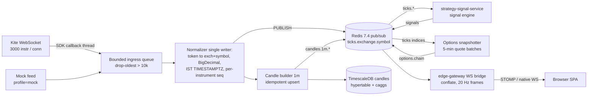
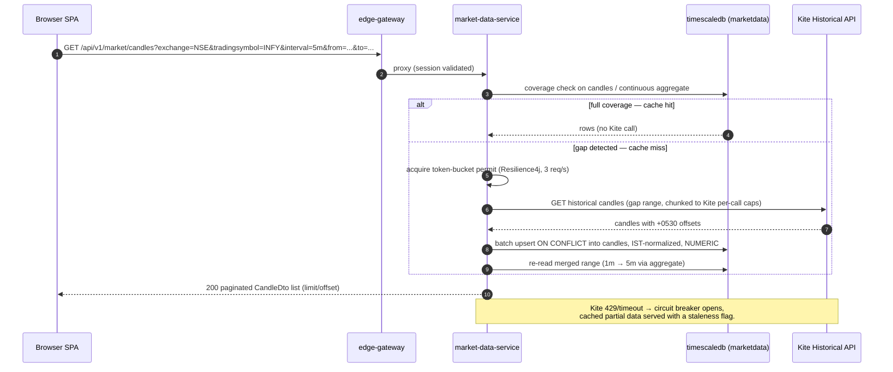

# ArthaYantra 2.0 — Stage B: Market-data spine

**Stage letter / name:** B — Market-data spine
**Plan macro-phase:** Phase 1 (plan §15.2 "Market data spine")
**Phases covered:** 9–17 plus 9A, 15A, 15B, 16A (instruments → candles → historical cache → OAuth → ticker → Greeks solver → options chain → schedulers/canary → watchlists/screener/status; the suffixed phases — run at their suffix positions, e.g. 9A between 9 and 10 — add contract-spec history, the futures data slice, continuous futures, and corporate-action reconciliation [FP-1, FP-3, FP-9, FP-10, FP-11, FP-14, owner selection 2026-06-12])
**Prerequisite stage:** Stage A — Foundations (Phases 1–8). Stage B requires the Phase 7 `market-data-service` skeleton with its **five Kite ports** and embedded mock tick feed, the Phase 8 gateway STOMP-over-native-WS bridge, the Phase 2 TimescaleDB+Redis core infra and backup sidecar, the Phase 3 Flyway init job (admin + per-schema lineages, `marketdata` schema + roles + backtest read-only grant), the Phase 4 Maven reactor + `libs/market-calendar`, and the Phase 5 edge-gateway form login/routing.
**Common reference:** [ARTHAYANTRA_2_COMMON_REFERENCE.md](ARTHAYANTRA_2_COMMON_REFERENCE.md) — cite it for: ADR D1–D18 + amendments A1–A13 (COMMON §6/§9), the chosen-by-default CD-1..CD-17 table (COMMON §4), stack-version table and global conventions (COMMON §3/§9), the error-code taxonomy (COMMON §10 / inlined below), the monorepo layout (COMMON §10.1), the phase index (COMMON §5), and the canonical shared-state names (COMMON §3 — `kite:session:status`, channel `kite.status`, `jobs:summary`, error-code pins `KITE_TOKEN_EXPIRED` / `DATA_GAP`).

**Stage goal.** Stand up `market-data-service` as the single Kite chokepoint and the entire read-side market-data REST/WS surface: the instrument master with stable-key PK and trigram search; the `candles` hypertable with a single-writer 1m builder and 5m/15m/1h/1d continuous aggregates; cache-first historical OHLCV with gap backfill behind a Resilience4j rate-limit/retry/breaker stack; the daily Kite OAuth ritual with an AES-GCM token at rest; the live `KiteTicker` adapter with a refcounted subscription registry and binary-frame guard; the Black-76-on-forward IV/Greeks solver pinned by ~500 offline golden vectors (the gate protecting the irreplaceable IV archive); the options chain endpoint with provenance-complete 5-minute snapshots; all `MarketCalendar`-gated schedulers plus the daily contract canary and retention/depth-probe docs; and watchlists, the server-side screener, and the gateway's aggregated system-status endpoint. Every phase is fully exercisable on the mock profile with zero Kite credentials; live paths are WireMock-tested only. The 2026-06-12 owner feature selection (amendments A7–A12, COMMON §6) adds four phases to this stage — contract-spec (lot/tick) history (9A), the futures data slice with front/next/far pins, per-bar OI, term structure and the INDIA VIX index pin (15A), continuous futures with roll events (15B), and corporate-action candle-cache reconciliation (16A) — plus the `candles_1w` weekly aggregate and the `oi_buildup`/`rs_rank` screener presets folded into Phases 10/11/13/16/17 [FP-1, FP-3, FP-8, FP-9, FP-10, FP-11, FP-14, FP-20, owner selection 2026-06-12].

---

# Part 1 — Design reference (inlined source material this stage needs)

All content below is copied near-verbatim from the four source docs, with cross-references rewritten to point inside this file or to COMMON. Source breadcrumbs are kept as `[plan §x.y]` / `[ADR Dn]` / `[review Sx]` so provenance stays traceable after the old docs are deleted.

## B-1. market-data-service spec [plan §5.2.2]

- **Responsibilities:** everything Kite. OAuth token lifecycle (B-4); `KiteTicker` WebSocket with Resilience4j circuit breaker; instrument master sync (JDBC-batched, fixing v1's 100k row-by-row save); rate-limited OHLCV fetch with DB-as-cache and gap detection; options chain via batched quotes with **computed Black-76 IV/Greeks** (fixing v1's hard-coded zeros, which killed the IV backtest); 5-minute chain snapshots; mock feed under `SPRING_PROFILES_ACTIVE=mock` with identical channels. Also owns **named watchlists** (instrument-reference lists backing the dashboard widget and `/watchlists` page) and **server-side screeners** (momentum and long-term filter queries executed as parameterized SQL over the candle continuous aggregates — no Kite call involved).
- **Owned data:** PG schema `marketdata` (instruments, candles hypertable, options_chain_snapshots hypertable, index_constituents, watchlists + watchlist_items, kite_session with AES-GCM token — see B-7); Redis last-tick map and connection-status keys.
- **Events:** publishes `ticks.{exchange}.{tradingsymbol}`, `candles.1m.{exchange}.{tradingsymbol}` (closed bars), `options.chain`; consumes none.

### Endpoint catalog (the full Stage-B REST surface) [plan §5.2.2]

| Method | Path | Purpose | Request / Response (described) | Phase |
|---|---|---|---|---|
| GET | `/api/v1/auth/kite/login-url` | Start daily OAuth ritual | 200 with Kite login URL embedding `KITE_API_KEY` | 12 |
| GET | `/api/v1/auth/kite/callback` | OAuth redirect target | Query: single-use `request_token`. Exchanges, encrypts, persists token; 200 minimal HTML page that closes the popup (origin-pinned postMessage, fixing v1's `'*'`) | 12 |
| POST | `/api/v1/auth/kite/session` | Manual token exchange fallback | Body: requestToken. 200 with connected flag, Kite user id, expiry estimate | 12 |
| GET | `/api/v1/auth/kite/status` | Token/connection health | 200 with connected, tokenValidUntil (~06:00 IST next day), ticker state, circuit state; carries `lastContractCheck` + drift list (B-9 canary) | 12 / 16 |
| DELETE | `/api/v1/auth/kite/session` | Invalidate stored token | 204 | 12 |
| GET | `/api/v1/instruments` | Paged instrument list | Query: exchange, type, q, limit/offset. 200 paged DTO list keyed by `exchange + tradingsymbol` | 9 |
| GET | `/api/v1/instruments/search` | Ranked typeahead search | Query: q, limit. 200 ranked matches (trigram index — addresses chronic v1 search pain) | 9 |
| GET | `/api/v1/instruments/{exchange}/{tradingsymbol}` | Single instrument | 200 DTO or 404 envelope | 9 |
| POST | `/api/v1/instruments/sync` | On-demand full NSE/NFO/BFO sync | 202 with jobId; progress readable at `/instruments/sync/status` (runs async on a service executor; **no jobs-table dependency** — that table ships in Phase 28) | 9 |
| GET | `/api/v1/instruments/sync/status` | Last sync audit | 200 with lastRun, per-exchange row counts, duration | 9 |
| GET | `/api/v1/instruments/{underlying}/expiries` | Option expiries from master | 200 sorted expiry dates | 9 |
| GET | `/api/v1/instruments/{underlying}/strikes` | Strikes for an expiry | Query: expiry. 200 sorted strike list | 9 |
| GET | `/api/v1/instruments/indices/{index}/constituents` | Point-in-time index membership | Query: `asOf` (optional; defaults to the latest `as_of_date`). 200 ordered `(exchange, tradingsymbol)` list with the resolved as-of date, served from the `index_constituents` accrual table (Kite's dump carries no membership data); consumed by strategy-signal-service over REST at publish/universe-resolution time, never via direct schema reads (D7/D10 grant model). **Note: the `index_constituents` table + fetcher land in Phase 22 (Stage C); this endpoint is served from there — listed here for surface completeness.** | 22 (Stage C) |
| GET | `/api/v1/market/candles` | OHLCV, cache-first | Query: exchange, tradingsymbol, interval (1m…1d; plus `1w` served from the `candles_1w` aggregate — B-21 [FP-8, owner selection 2026-06-12]), from, to (IST ISO-8601); CONT symbols additionally accept `adjust=back\|none` (B-19) [FP-11, owner selection 2026-06-12]. 200 array of bars; prices as decimal strings; serves continuous aggregates for >1m intervals | 11 / 15B |
| POST | `/api/v1/market/candles/refresh` | Force re-fetch of a range | Body: instrument, interval, range. 202 with jobId (rate-limit bound; async on the service executor — never a blocking request) | 11 |
| GET | `/api/v1/market/ticks/latest` | Last tick snapshot | Query: symbols CSV. 200 map from Redis last-tick state | 17 |
| GET / POST / DELETE | `/api/v1/market/subscriptions` | Manage live WS subscriptions | POST body: instrument list (3,000-token guard). 200/204; GET returns current set | 13 |
| GET | `/api/v1/market/options/chain` | Live chain | Query: underlying, expiry (default nearest). 200 chain with LTP, OI, volume, computed IV/Greeks, PCR, spot from underlying index quote (not strike average) | 15 |
| GET | `/api/v1/market/options/chain/history` | Snapshot replay | Query: underlying, expiry, at. 200 nearest stored snapshot | 15 |
| POST | `/api/v1/market/options/snapshot` | Force snapshot now | 202 with jobId | 15 |
| GET | `/api/v1/market/options/iv-history` | Daily IV series + IV rank/percentile | Query: `underlying`. 200 daily IV series with current IV rank/percentile from `marketdata.iv_daily_summary`. **Note: the rollup table + endpoint land in Phase 42B (Stage F) — listed here for surface completeness.** [FP-12, owner selection 2026-06-12] | 42B (Stage F) |
| GET | `/api/v1/market/futures/term-structure` | Futures term structure | Query: `underlying`. Near/next/far monthly FUT LTP+OI from **one batched quote**, basis vs spot (absolute + annualized), contango/backwardation state, calendar spread; off-hours serves cached values `stale: true` (B-18) [FP-9, owner selection 2026-06-12] | 15A |
| GET | `/api/v1/market/status` | Market calendar state | 200 open/closed, session bounds, next trading day (shared `MarketCalendar`) | 17 |
| GET | `/api/v1/watchlists` | List watchlists with items | 200 `{ items, total, limit, offset }` of watchlist DTOs, each with ordered instrument refs (`exchange + tradingsymbol`); consumed by `MarketStore` for the `/watchlists` page and the dashboard `WatchlistWidget` | 17 |
| POST | `/api/v1/watchlists` | Create a watchlist | Body: name (unique), optional sortOrder. 201 watchlist DTO; 409 `CONFLICT_WATCHLIST_NAME` envelope on duplicate name | 17 |
| PUT | `/api/v1/watchlists/{id}` | Rename / reorder | Body: name, sortOrder. 200 updated DTO; 404 `NOT_FOUND_WATCHLIST` envelope | 17 |
| DELETE | `/api/v1/watchlists/{id}` | Delete a watchlist | 204 (items cascade); 404 `NOT_FOUND_WATCHLIST` envelope | 17 |
| POST | `/api/v1/watchlists/{id}/items` | Add instruments | Body: array of `{exchange, tradingsymbol}` refs, validated against the instrument master (`NOT_FOUND_INSTRUMENT` envelope on unknown ref, never passed through to Kite). 200 updated watchlist; duplicates are idempotent no-ops | 17 |
| DELETE | `/api/v1/watchlists/{id}/items/{exchange}/{tradingsymbol}` | Remove an instrument | 204; 404 envelope if not in the list | 17 |
| GET | `/api/v1/market/screener` | Server-side screener query | Query: `preset` (`momentum` \| `long_term` \| `oi_buildup` \| `rs_rank` — the latter two from the 2026-06-12 selection, B-18 [FP-10, FP-20, owner selection 2026-06-12]) or explicit filters — `lookbackDays` (momentum window), `minReturnPct`, `minAvgVolume`, `minPrice`/`maxPrice`, `exchange`, plus `limit/offset`. 200 paged ranked rows (instrument ref, last close, period return %, avg volume, distance from 52-w high) computed as parameterized SQL over the 1d/1h candle continuous aggregates — pure cached-data reads, never a Kite call; 422 `VALIDATION_FAILED` envelope on filter combinations the aggregates cannot answer | 17 |

The gateway also serves the aggregated `GET /api/v1/system/status` (Phase 17, B-15) and `/topic/system` push.

## B-2. Authentication & Kite token lifecycle [plan §5.5]

Two unrelated trust problems, solved separately [ADR D13]:

**Owner → system.** Spring Security form login at the gateway only; Argon2id hash from `ARTHA_OWNER_PASSWORD_HASH` in git-ignored `.env`; Spring Session in Redis (12-hour idle timeout — covers a full trading day); HttpOnly SameSite=Strict cookie; CSRF token for mutating calls. The gateway binds `127.0.0.1:8080`; internal services accept the gateway-injected identity header and are not host-reachable, so per-service auth stacks are unnecessary. No JWT machinery: sessions in Redis are simpler to revoke and already paid for. *(The gateway login itself is Stage A / Phase 5; restated here for the Kite-ritual context.)*

**System → Kite.** market-data-service owns the daily ritual. Kite access tokens expire ~06:00 IST daily and `request_token`s are single-use with minutes-long validity, so the design assumes one assisted morning login:

```mermaid
sequenceDiagram
    participant O as Owner (browser)
    participant GW as edge-gateway
    participant MD as market-data-service
    participant K as Kite
    O->>GW: GET /api/v1/auth/kite/login-url
    GW->>MD: proxy
    MD-->>O: Kite OAuth URL (popup)
    O->>K: login + TOTP
    K-->>O: redirect /api/v1/auth/kite/callback?request_token=...
    O->>MD: callback (via gateway)
    MD->>K: exchange request_token + checksum
    K-->>MD: access_token
    MD->>MD: AES-GCM encrypt (ARTHA_MASTER_KEY) -> PG kite_session
    MD-->>O: popup closes; status WS push "connected"
```

The encrypted token is reloaded on restart — rebooting containers mid-day never forces re-login (fixing v1's memory-only token). A 5-minute health check (`getProfile`) detects expiry and pushes a "Kite disconnected — login needed" banner via the status topic. `KITE_API_KEY`/`KITE_API_SECRET` arrive via `.env` + Docker secrets.

> **A6 supersession (RATIFIED 2026-06-12).** Plan §5.5's "the leaked v1 credentials are rotated on day zero" is **no longer a build gate** — 2.0 is provisioned with a brand-new Kite key pair and the v1 pair is never configured anywhere. The P1-4 leaked-credential digest tripwire is **dropped as moot** (no digests recorded, nothing to compare). The only credential assertion that remains is the live-profile fail-fast on a *missing* required Kite variable (Phase 12). All other D13 mechanics — Argon2id login, AES-GCM token at rest, `.env` + Docker secrets, mock mode — stand unchanged.

`SPRING_PROFILES_ACTIVE=mock` bypasses the entire ritual with a random-walk feed on identical channels.

### Daily OAuth lifecycle — canonical steps [plan §8.2]

Kite access tokens die at the start of the next trading day (~6:00 AM IST flush); the morning ritual is a first-class flow, not an ops chore:

1. **Login URL** — `GET /api/v1/auth/kite/login-url` returns the Zerodha login URL (api_key + redirect). The dashboard shows a "Connect Kite" banner whenever the session is not LIVE.
2. **Callback** — Zerodha redirects to `https://127.0.0.1:8080/api/v1/auth/kite/callback?request_token=...` (gateway route → market-data-service). The `request_token` is single-use and expires in minutes, so the exchange happens immediately server-side.
3. **Exchange & store** — `SessionGateway.generateSession()` yields the access token, which is **AES-GCM-encrypted under `ARTHA_MASTER_KEY` and persisted to `marketdata.kite_session`** [D13]. Restarts before expiry decrypt and resume without re-login — fixing v1's memory-only token.
4. **Health check** — a 5-minute `@Scheduled` probe (lightweight `getProfile`) classifies the session LIVE / EXPIRED / ERROR. State is written to the Redis key **`kite:session:status`** (COMMON §3 canonical name — plan §8.2's `kite:status` shorthand and Flow 1's `kite:status` both resolve to this; [D11] shared state), which the gateway WS surfaces so the UI flips the re-login banner within seconds of a 403 `TokenException`.
5. **Expiry handling** — on EXPIRED: ticker disconnects cleanly, all outbound Kite calls short-circuit with error code **`KITE_TOKEN_EXPIRED`** (COMMON §3 error-code pin — the §5.4 taxonomy spelling wins over §8.2's `KITE_SESSION_EXPIRED`; envelope per [D8]), REST falls back to cached data flagged stale (B-3), and retries are suppressed (re-login, not retry, is the cure).

**Distribution: the token is never distributed.** No other service can reach `marketdata.kite_session` (schema-per-service grants) or Kite itself (private compose network). Consumers needing market data call market-data-service REST or subscribe to the bus.

### Flow 1 — Daily Kite OAuth login and token "distribution" [plan §3.4]

Kite access tokens expire ~06:00 IST daily, so this is a once-a-morning ritual. Crucially, the token is **never distributed**: market-data-service is the single Kite client [D13], and what other components receive is only the connection-status flag via Redis. The AES-GCM-encrypted token in Postgres survives container restarts within the same trading day — no re-login after `docker compose restart`.

```mermaid
sequenceDiagram
    autonumber
    actor O as Owner
    participant B as Browser SPA
    participant GW as edge-gateway
    participant MDS as market-data-service
    participant K as Zerodha Kite
    participant PG as timescaledb (marketdata)
    participant R as redis

    O->>B: open app (~08:45 IST)
    B->>GW: POST /login (form; Argon2id verify vs ARTHA_OWNER_PASSWORD_HASH)
    GW->>R: create Spring Session
    GW-->>B: Set-Cookie SESSION (HttpOnly, SameSite=Strict)
    B->>GW: GET /api/v1/auth/kite/status
    GW->>MDS: proxy (identity header injected)
    MDS-->>B: 200 connected=false, reason=TOKEN_EXPIRED
    B->>GW: GET /api/v1/auth/kite/login-url
    MDS-->>B: 200 kite.zerodha.com/connect/login?api_key=KITE_API_KEY
    B->>K: popup — owner completes Zerodha 2FA
    K-->>B: redirect to /api/v1/auth/kite/callback?request_token=...
    B->>GW: GET callback (request_token)
    GW->>MDS: proxy
    MDS->>K: generateSession(request_token, SHA-256 checksum) via javakiteconnect 3.5.x
    K-->>MDS: access_token (valid until ~06:00 IST next day)
    MDS->>PG: UPSERT AES-GCM(access_token) under ARTHA_MASTER_KEY
    MDS->>R: SET kite:session:status CONNECTED + PUBLISH kite.status
    MDS->>MDS: start KiteTicker, arm schedulers (MarketCalendar)
    Note over MDS,R: Token never leaves market-data-service.<br/>Downstream services consume only the status flag.
```

> **checksum note:** `generateSession(requestToken, apiSecret)` in javakiteconnect 3.5.x takes the api_secret and computes the SHA-256 checksum itself (review S2A factual-error note) — the diagram's "request_token + checksum" describes what is sent on the wire, not the SDK method signature.

## B-3. Rate limiting, retry, circuit breaking, fallback [plan §5.6, §8.3]

### Per-endpoint-family limiter table [plan §5.6 / §8.3]

A Resilience4j 2.3.x `RateLimiter` per Kite endpoint family inside market-data-service — the only service that may call Kite. (Same library as Retry + CircuitBreaker below, so the stack carries exactly one resilience dependency.)

| Endpoint family | Limiter (`limitForPeriod` / `limitRefreshPeriod`) | Notes |
|---|---|---|
| Historical candles | **3 / 1 s**, FIFO queue | Kite's documented 3 req/s; strict pacing replaces v1's burst-prone `Semaphore(3)`; backtest/chart prefetch jobs drain the same bucket |
| Quote (`getQuote`, options chain) | **1 / 1 s**; 250 instruments per call (default; env `KITE_QUOTE_BATCH_SIZE`, ceiling 500 = documented API max) | One chain refresh = ceil(strikes×2/250) calls — ~2 calls for a ~200-strike chain, ~3–4 for a full NIFTY chain; resolves v1's 200-vs-500 batch ambiguity |
| Instrument dump | **1 / 30 min** | Daily job + manual trigger; guard against accidental hammering |
| Session/profile/misc | **5 / 1 s** | Health checks, margins share it |
| WebSocket subscriptions | hard cap **3,000 tokens** | Reject-with-`VALIDATION_FAILED` beyond cap; config-pinned symbols protected (registry detail in B-6) |

Saturation behavior: callers queue up to 5 s (`timeoutDuration: 5s`; virtual threads, so blocking is cheap), then `RequestNotPermitted` maps to **`429 RATE_LIMIT_LOCAL`** — surfaced distinctly from Kite's own 429 in Grafana's "Kite rate budget" dashboard.

**Toward the UI: deliberately minimal.** One authenticated human cannot DoS himself; per-endpoint quotas would only add latency and config surface. The gateway keeps a single coarse limiter (~50 req/s/session, in-memory) purely to stop runaway SPA bugs from amplifying into Kite-budget exhaustion, plus the natural backpressure of `202+jobId` on every expensive operation. That is the entire UI-side story — a conscious trade-off, not to be "hardened" into an enterprise quota system later.

### Retry [plan §8.3]

Resilience4j 2.3.x `Retry`: idempotent GETs only; max **4 attempts**; exponential backoff **500 ms × 2 (cap 8 s)** with **full jitter**; retry on IO errors, 5xx, and Kite 429 (honoring `Retry-After`); **never** on 4xx auth/validation and **never** on token exchange (single-use request_token).

### Circuit breakers [plan §5.9 / §8.3]

Resilience4j `CircuitBreaker`, replacing v1's hand-rolled `java.util.Timer` + non-volatile counter; state published on the status topic so the UI shows *why* data stopped:

| Breaker | OPEN trigger | OPEN wait | HALF_OPEN probes |
|---|---|---|---|
| `kite-rest` | ≥ 50 % failures over a sliding window of 10 calls | 30 s | 2 trial calls |
| `kite-ticker` | 5 consecutive WS errors/disconnects | 60 s | 1 reconnect attempt |

`kite-rest` is used from Phase 11; `kite-ticker` is *declared* in Phase 11 and *wired* in Phase 13.

### Graceful-degradation ladder & fallback [plan §5.9, §8.3]

(1) Kite healthy → live; (2) token expired → REST cache still served, banner prompts re-login, ticks stop cleanly; (3) circuit open → cached candles/snapshots served with a `DATA_STALE` warning header and `"stale": true, "asOf": "<TIMESTAMPTZ>"` / `staleSince` field in the DTO (UI renders amber staleness chips); (4) no credentials at all → mock profile, full functionality on synthetic data. Writes/streams have no fallback — they pause and the connection-status banner explains why. Backtesting and strategy editing never depend on Kite — they read only cached data.

**Bulkheads & idempotency:** Kite IO on its own virtual-thread executor; signal evaluation decoupled from the tick-receive thread via the Redis hop; candle/snapshot writes are `ON CONFLICT` upserts on natural keys; job claims are conditional updates so duplicate Stream delivery is harmless.

### Instrument-dump sync — order of operations [plan §8.3] (Phase 9)

08:30 IST [D12], before any subscription work: (1) verify session LIVE; (2) download NSE, NFO, BFO dumps sequentially; (3) JDBC-batch into a staging table (fixes v1's 100k row-by-row saves); (4) atomic upsert keyed by `(exchange, tradingsymbol)`; (5) mark vanished rows `expired` — never delete, and never trust `instrument_token` across days (tokens are reused after contract expiry); (6) rebuild the token↔symbol Caffeine maps; (7) refresh expiry/strike lookups; (8) only then permit ticker (re)subscription and chain snapshots for the day. This ordering kills the misattributed-tick bug class. *(Phase 9 deliverables reference "steps 3–7" of this list.)*

## B-4. Caching strategy per data type [plan §5.7]

Three tiers [D11]: Postgres as durable cache of Kite data, Caffeine in-process per Java service, Redis for cross-service shared state. **Every cache must have a named consumer** — no speculative caches (v1's never-used `historical-meta` is the cautionary tale).

| Data type | Tier & TTL | Invalidation |
|---|---|---|
| Instrument master | PG `marketdata.instruments` (durable) + Caffeine `instruments` **1 h** per service | Evict-and-reload on daily 08:30 IST sync or manual sync completion |
| Candles (OHLCV) | PG `candles` hypertable, **no TTL** (DB-as-cache for Kite's minute history — reportedly back to ~2015, fetched in ≤ 60-day pages; local retention is a *policy* choice, not an API bound — see A3, B-7); closed bars immutable | Recency rule: re-fetch only the trailing **last 2 h**; gap detection backfills missing sub-ranges instead of v1's full re-fetch |
| 5m/15m/1h/1d candles | TimescaleDB continuous aggregates off 1m (B-7) | Refresh policies; never fetched separately from Kite |
| Options chain (live) | Redis key `options.chain.{underlying}.{expiry}`, TTL **60 s**; broadcast every 30 s in market hours | Overwritten per refresh; off-hours serves last value flagged `stale: true` |
| Options chain (history) | PG `options_chain_snapshots` hypertable, retained **≥ 5 years** (A2; irreplaceable self-archived IV) | Compression after 7 d; **no deletion** |
| Computed indicators | Caffeine in strategy-signal-service, keyed (instrument, interval, indicator, params-hash, lastBarTime), max ~10k entries | Key embeds last bar time → naturally invalidated by each closed bar; backtests compute in-stream, uncached *(Stage C concern; listed for completeness)* |
| Kite connection status | Caffeine `kite-status` **30 s** + Redis `kite:session:status` key | Health-check writes; event-pushed on state change |
| Expiries/strikes | Caffeine `expiries` **10 m** | Evicted on instrument sync |
| Last tick per symbol | Redis hash, **no TTL** | Overwritten per tick; read by paper P&L and the UI snapshot endpoint |
| Session | Redis (Spring Session), **12-hour** idle timeout | Logout / idle expiry |

> Plan §5.7's "retained ≥ 2 years" for chain history is **superseded by amendment A2 → ≥ 5 years** (B-7, B-12).
>
> The candle recency rule above ("closed bars immutable; re-fetch only the trailing **last 2 h**") is **qualified by amendment A8** [FP-1, owner selection 2026-06-12]: the Phase 16A corporate-action integrity job (B-17) is the **single sanctioned exception** — on a confirmed uniform-ratio anchor-close divergence it purges and fully re-backfills the affected symbol's cached candles. Every other code path still treats closed bars as immutable.

## B-5. Ticks: the retention decision (no tick persistence) [plan §6.3]

**Raw ticks are NOT persisted to Postgres.** v1 already deprecated its `ticks_1s` pipeline; full-depth NFO ticks would cost gigabytes per month for data Kite forbids redistributing and that no engine consumes — live signals run on in-memory ta4j series fed from Redis pub/sub, and backtests replay candles. Tick state lives in exactly two places: a Redis last-tick hash (`tick:last:{exchange}:{tradingsymbol}`, [D11]) and in-process ring buffers inside strategy-signal-service. market-data-service aggregates ticks into **1m candles** and upserts them into `marketdata.candles` (`source = TICK_AGG`), later reconciled against Kite's historical API (`source = KITE`). The 1-minute candle is therefore the smallest persisted granularity; this is the one deliberate fidelity loss, and it is recoverable for any window inside Kite's minute-candle history (reportedly to ~2015; fetched in ≤ 60-day pages — actual depth confirmed by the Phase 16 one-call probe). Local retention is a policy choice, not an API bound.

**Post-incident signal replay needs no event journal** (review S3A — REJECTED). Every event class a journal would mirror already lives in its authoritative table (1m candles, chain snapshots, emitted signals); "re-run all signals from last Friday" is a backtest-service replay over stored candles with the pinned strategy version — the shared strategy-engine JAR plus the reproducibility triple makes that replay exactly equivalent and side-effect-free. **One runbook caveat (lands in the Stage G runbook, Phase 48):** live signals are computed on `source = TICK_AGG` bars that the reconciliation job later upserts over with canonical KITE bars under a PK that excludes `source` — so incident replay verifies engine logic against *canonical* data; an investigation must **diff the candle streams first and screen out bar-divergence-driven signal deltas (TICK_AGG vs KITE)** before attributing the remainder to the engine.

## B-6. Integration layer — five ports, ticker management, internal pipeline [plan §8.1, §8.4, §8.5]

All Zerodha connectivity concentrates in market-data-service [D7]: the only container holding Kite credentials, the only Kite HTTP/WebSocket client, the only publisher of market events onto the Redis bus [D9]. This single-chokepoint rule is what makes rate limiting enforceable and mock mode airtight.

### The five ports [plan §8.1]

market-data-service is a Spring Modulith 1.3 app whose `kite` module exposes five **ports** (interfaces); profile selection binds exactly one implementation per port, fixing the v1 trap where `kite.enabled=false` without the `mock` profile left no `TickerService` bean and crashed startup. *(The port interfaces + mock impls ship in the Phase 7 skeleton, Stage A; Stage B adds the live impls — WireMock-tested — and the registry/builder/solver that sit above them.)*

| Port | Responsibility | Live impl (javakiteconnect 3.5.x, Gson 2.13.2 pinned) | Mock impl (`SPRING_PROFILES_ACTIVE=mock`) |
|---|---|---|---|
| `SessionGateway` | OAuth exchange, token validation, profile check | `generateSession`, `getProfile` | Always-valid synthetic session |
| `MarketFeed` | Streaming ticks: connect, subscribe, set mode | `KiteTicker` wrapper (**token-first ctor quirk preserved**) | Random-walk generator, 1 tick/s/instrument, same Redis channels |
| `QuoteGateway` | Batch snapshot quotes (options chains, spot) | `getQuote` batched | Deterministic chain with Black-76 IV/Greeks |
| `HistoricalCandleGateway` | OHLCV fetch behind the candle cache | `getHistoricalData`, `continuous=true` for derivatives | Seeded synthetic candles (reproducible per symbol) |
| `InstrumentDumpGateway` | Full instrument master download | `getInstruments(exchange)` gzip CSV | Bundled fixture dump (~5k rows: indices, top stocks, one NFO expiry ladder) |

Mock mode is a **runtime profile**, behaviorally identical at the bus level (same channels, payload schema, cadence); WireMock 3.x stubs the Kite HTTP API only in tests. All normalization sits *above* the ports, so mock and live ticks traverse the identical pipeline. These five ports are also the **entire version seam** (review S2A — version-aware adapter REJECTED as YAGNI): javakiteconnect exposes no API-version metadata to sniff, so a future Kite contract break is a new implementation behind the same ports, with drift caught by the daily contract canary (B-9) and recorded WireMock fixtures rather than pre-built stubs for a format that does not exist.

### Kite WebSocket management — subscription registry [plan §8.4] (Phase 13)

One `KiteTicker` connection (Kite permits 3 per key; one suffices for a single user) managed by a **subscription registry** with reference counting:

- **Multiplexing**: each subscriber (UI watchlist, signal engine's published-strategy universe, options snapshotter's spot indices) registers `(exchange, tradingsymbol, mode)`. The registry resolves to tokens via the synced instrument map and sets the **highest requested mode** per instrument: `ltp` (8 B) < `quote` (44 B) < `full` (184 B) — `full` only where depth/OI is consumed (option strikes on screen).
- **Budget guard**: hard cap **3,000 instruments/connection**. On pressure, evict by priority: **pinned indices > active-strategy instruments > UI-watched > speculative**; evictions are logged and surfaced as a UI warning rather than failing silently; beyond cap → `VALIDATION_FAILED`.
- **Reconnect & resubscribe**: SDK auto-reconnect plus a supervisor that, on `onConnected`, replays the full registry (subscribe + per-mode `setMode`) idempotently.
- **Gap detection**: the normalizer records `last_tick_at` per instrument (Redis last-tick map). After reconnect during market hours (shared `MarketCalendar`), any instrument with a gap **> 2 minutes** gets a 1-minute-candle backfill scheduled through the rate-limited `HistoricalCandleGateway`; backfilled candles carry **`source='BACKFILL'`** so downstream analytics can tell replayed bars from streamed ones.

### Internal tick pipeline [plan §8.5]



**Stages.** Kite callback threads only **enqueue** raw packets into a bounded ingress queue (capacity **10k**, drop-oldest with a counter metric — latest price beats a stalled backlog). A **single-writer normalizer** then resolves token → stable `(exchange, tradingsymbol)` key, converts prices to exact decimals (`BigDecimal`-safe string serialization, never float), normalizes exchange timestamps to `Asia/Kolkata` `TIMESTAMPTZ`, assigns a **per-instrument monotonic sequence number**, and publishes compact JSON to Redis. *(The Phase 7 mock feed already feeds this queue; Stage B's live `MarketFeed` enqueues identically.)*

**Channel naming** [D9, verbatim]: `ticks.{exchange}.{tradingsymbol}`, `candles.1m.{exchange}.{tradingsymbol}`, `signals`, `options.chain`, `jobs.progress`. Higher intervals (5m/15m/1h/1d) are *not* bus traffic — they come from continuous aggregates on read.

**Consumers.** (1) **candle builder** — in-process in market-data-service; closes 1m bars at minute boundary + **5 s late-tick grace** (Phase 10); (2) **signal engine** — strategy-signal-service subscribes only to channels matching published strategies' universes (Stage C); (3) **options snapshotter** — `@Scheduled` 5-min REST quote batches persisted to `options_chain_snapshots` (Phase 15; ticks only supply index spot for IV inputs); (4) **gateway WS bridge** — the browser path (Stage A Phase 8).

### Backpressure, ordering, duplicates, candle math [plan §8.6] (Phase 10)

- Each consumer drains into a **latest-value-wins conflation map keyed by instrument** — a busy signal evaluation skips intermediate ticks, never queues them.
- **Never conflated**: `signals`, `jobs.progress`, `candles.1m.*` — low-rate, every message matters; signals are additionally persisted in Postgres and re-synced over REST on WS reconnect (bus delivery best-effort; the DB is truth).
- **Ordering & duplicates**: the single-writer normalizer makes per-instrument sequence numbers monotonic; consumers **drop `seq ≤ lastSeen`** (catches reconnect-overlap duplicates).
- **Candle write math**: idempotent upserts on PK `(exchange, tradingsymbol, interval, bucket)` with **`high = GREATEST`, `low = LEAST`, close = highest-seq tick**; volume derives from Kite's *cumulative* day volume (**bucket-end minus bucket-start**), so replayed ticks cannot double-count. *(This is the §8.6 cumulative-delta rule the Phase 10 builder implements.)*

### Flow 2 — Live tick, Kite to browser [plan §3.4]

Target: tick-to-browser ≤ 150 ms p99. Token→symbol resolution uses the Caffeine instrument cache; instruments are keyed by stable `(exchange, tradingsymbol)`, never by reusable numeric token.

```mermaid
sequenceDiagram
    autonumber
    participant K as Kite Ticker WS
    participant MDS as market-data-service
    participant R as redis pub/sub
    participant SSS as strategy-signal-service
    participant GW as edge-gateway (WS bridge)
    participant B as Browser SPA

    K-)MDS: binary tick (instrument_token, ltp, volume, OI, depth)
    MDS->>MDS: token → (NSE, RELIANCE) via Caffeine map; normalize to NUMERIC + IST DTO
    MDS->>R: PUBLISH ticks.NSE.RELIANCE; HSET last-tick map
    par fan-out
        R-)SSS: deliver (subscribed: published strategies' symbols)
        R-)GW: deliver (subscribed: active browser STOMP topics only)
    end
    GW-)B: STOMP frame /topic/ticks.NSE.RELIANCE → SignalStore update
    MDS->>MDS: 1m bar builder accumulates tick
    MDS->>R: PUBLISH candles.1m.NSE.RELIANCE (on bar close) + persist to candles hypertable
```

### Flow 3 — Historical data fetch with cache miss and rate limiting [plan §3.4] (Phase 11)

The DB-as-cache tier [D11]: the `candles` hypertable caches Kite's minute history; continuous aggregates serve 5m/15m/1h/1d without re-fetching. The limiter is a Resilience4j token bucket at 3 req/s shared across all callers inside market-data-service.



## B-7. marketdata schema + hypertables + caggs + indexing [plan §6.3–6.7]

Schema `marketdata` is **written only by market-data-service** (single-writer rule [D10]); backtest-service receives a **read-only grant** on it (Phase 9 grant test asserts SELECT-yes / INSERT-no). Cross-schema references are **soft** (no cross-schema FKs).

### `instruments` — master registry [plan §6.4] (Phase 9)

Synced daily 08:30 IST. PK is the stable key, never the reusable numeric token (fixes v1's symbol-PK cross-exchange collision).

| Column | Type | Notes |
|---|---|---|
| `exchange`, `tradingsymbol` | TEXT | **Composite PK** — stable instrument key |
| `instrument_token`, `exchange_token` | BIGINT | Kite tokens; refreshed each sync, never used as identity |
| `name`, `segment`, `instrument_type` | TEXT | EQ / FUT / CE / PE / INDEX |
| `underlying_exchange`, `underlying_tradingsymbol` | TEXT | Soft self-reference for derivatives |
| `expiry` | DATE | NULL for cash/index |
| `strike`, `tick_size` | NUMERIC | Exact decimals (fixes v1 `DOUBLE PRECISION` violation) |
| `lot_size` | INT | |
| `is_active` | BOOLEAN | **Tombstoned, not deleted**, when absent from dump |
| `first_seen_at`, `last_seen_at`, `updated_at` | TIMESTAMPTZ | Asia/Kolkata |

### `index_constituents` — point-in-time index membership [plan §6.4] (Phase 22, Stage C)

Append-only, owned by market-data-service (single writer [D7/D10]). The Kite dump carries **no** membership data, so `universe.mode: index_constituents` resolves against this table, fed from the NSE Indices published constituent CSVs (e.g. `ind_nifty100list.csv`) on the daily 08:30 IST sync. NSE publishes *current* lists, not point-in-time archives, so membership history is reconstructable only for dates **on or after capture begins**; backtest windows that predate accrual carry a documented survivorship-bias caveat. The mock profile bundles a fixture CSV so the mode works credential-free [D13]. **The table and fetcher are built in Phase 22 (Stage C, S8 part 1), not Stage B** — restated here because the schema column-table and the `/instruments/indices/{index}/constituents` endpoint belong to market-data-service. **Owner open item (review §4 #2): verify the NSE CSV source (format, URL stability, cadence, ToS) *before* Phase 22; if unverified, Phase 22 ships only the port + mock fixture.**

| Column | Type | Notes |
|---|---|---|
| `index_name` | TEXT | Normalized to the index instrument's tradingsymbol, e.g. `NIFTY 100` |
| `exchange`, `tradingsymbol` | TEXT | Constituent's stable key; soft reference to `instruments` |
| `as_of_date` | DATE | Fetch date (IST); **PK `(index_name, as_of_date, exchange, tradingsymbol)`** |
| `fetched_at` | TIMESTAMPTZ | Cache-audit column |

### `candles` — hypertable [plan §6.4] (Phase 10)

DB-as-cache for Kite OHLCV plus tick-aggregated 1m bars.

| Column | Type | Notes |
|---|---|---|
| `exchange`, `tradingsymbol`, `interval`, `bucket` | TEXT, TEXT, TEXT, TIMESTAMPTZ | **Composite PK** [D10]; `interval` ∈ 1m/5m/15m/1h/1d (only 1m and 1d are *fetched*; mid intervals come from aggregates, kept in the enum for Kite-fetched backfills beyond the 1m window) |
| `open`, `high`, `low`, `close` | NUMERIC(18,4) | **No float/double anywhere** |
| `volume`, `oi` | BIGINT | `oi` for F&O |
| `source` | TEXT | **KITE / TICK_AGG / MOCK / BACKFILL** — one casing, CHECK-enforced (the phases-doc adds BACKFILL to plan §6.4's KITE/TICK_AGG/MOCK list for reconnect backfill, B-6) |
| `fetched_at` | TIMESTAMPTZ | Cache-audit column (v1 keeper) |

### `options_chain_snapshots` — hypertable [plan §6.4] (Phase 15)

The only market data that is *irreplaceable* (Kite offers no historical IV/OI chains).

| Column | Type | Notes |
|---|---|---|
| `ts`, `underlying`, `expiry`, `strike`, `option_type` | TIMESTAMPTZ, TEXT, DATE, NUMERIC, TEXT | **Composite PK** (`option_type` CE/PE) |
| `tradingsymbol` | TEXT | Joins back to `instruments` |
| `ltp`, `bid`, `ask`, `spot_price` | NUMERIC(18,4) | **Real underlying spot stored per row** (fixes v1's strike-average fake) |
| `volume`, `oi`, `oi_change` | BIGINT | |
| `iv`, `delta`, `gamma`, `theta`, `vega`, `rho` | NUMERIC(12,6) | Computed **Black-76 at capture time** in market-data-service (fixes v1's IV=0 dead end) |
| `price_source` | TEXT | Which quote the solver priced from (e.g. LTP vs mid) — provenance for the stored IV/Greeks |
| `forward_price`, `risk_free_rate` | NUMERIC(18,4), NUMERIC(8,5) | Exact solver inputs captured per row (forward per the S4 precedence, B-10; pinned `r`) — makes every stored IV/Greek **recomputable from the row alone**, so a later solver fix backfills the archive instead of losing it |

### `kite_session` [plan §6.4] (Phase 12)

Single row: AES-GCM-encrypted access token blob, nonce, `encrypted_at`, `last_validated_at` [D13].

### `watchlists` / `watchlist_items` [plan §6.4] (Phase 17)

`watchlists(id UUID PK, name UNIQUE, sort_order, created_at)`; `watchlist_items(watchlist_id FK, exchange, tradingsymbol, sort_order, added_at)` with PK `(watchlist_id, exchange, tradingsymbol)`. Owned by market-data-service since items are instrument references; item delete cascades from watchlist delete.

### New `marketdata` tables from the 2026-06-12 feature selection [FP-1, FP-3, FP-11, owner selection 2026-06-12]

Three plain relational tables (no hypertables) join the schema: `contract_spec_history` (column table in B-20; Phase 9A), `roll_events` (B-19; Phase 15B), and `corporate_action_events` (B-17; Phase 16A). All are written only by market-data-service [D10], carry no cross-schema FKs (soft instrument references only), use PK-only indexing until a named consumer needs more (B-4 no-speculative-caches spirit), and are covered by the same Phase-9-pattern read-only grant test (`ay_backtest` SELECT-yes / INSERT-no). Synthetic continuous-futures rows (e.g. `NIFTY-FUT-CONT`) ride the existing `candles` hypertable — no schema change (B-19).

### Hypertable / compression / retention / archival [plan §6.5]

| Table | Chunk interval | Space partitioning | Compression | Expected ratio | Retention |
|---|---|---|---|---|---|
| `candles` | **1 week** (≈ 0.4 M rows/chunk at ~200 instruments × 375 1m bars/day) | **None** | After **7 days**; `segmentby (exchange, tradingsymbol, interval)`, `orderby bucket DESC` | 10–20× (90–95 % smaller) | **None (no-drop)** — DB-as-cache; Kite's minute history extends back years (reportedly to ~2015, ≤ 60-day pages; depth confirmed by the Phase 16 probe), so local retention is a policy choice; compressed cost trivial (~0.2–0.3 GB/yr) |
| `options_chain_snapshots` | **1 day** (~50–60 k rows/day at 2–3 underlyings, 5-min cadence) | **None** | After **7 days**; `segmentby (underlying, expiry, option_type)`, `orderby ts DESC` | 12–18× (~0.3–0.4 GB/yr compressed from ~4–5 GB raw) | **Retain ≥ 5 years** (amendment A2 raises D10's ≥ 2-year *floor*; default = **no drop**). Annual review: if size pressure appears, chunks older than 5 years are **exported via `pg_dump` to cold storage *before* any drop** |

**Why no space partitioning:** hash partitioning exists to parallelize I/O across disks/nodes. On one NVMe disk under Docker Desktop it adds planner complexity and more, smaller chunks for zero throughput gain; the `segmentby` columns already give per-symbol locality inside compressed chunks. Relational tables stay plain.

**Disk budget (Q4 / amendment A2/A3).** ~200 instruments × 375 1m bars × ~250 trading days ≈ 19 M candle rows/yr (~3 GB raw → ~0.2–0.3 GB/yr compressed), plus ATM-window chains for 2–3 underlyings at 5-min cadence ≈ 12–15 M snapshot rows/yr (~4–5 GB raw → ~0.3–0.4 GB/yr compressed). "No candle retention cap" means *no drop policy*, not unbounded growth — steady-state growth is capture-rate-bounded at ~0.5–1 GB/yr compressed total. A 2-year minute backfill ≈ 37 M rows (≤ 1 GB compressed); full-depth ~5× that — still a policy choice. Widening chain capture to full width raises snapshots to ~2–6 GB/yr compressed. Either scope fits the **50–100 GB SSD headroom** for many years. **50 GB total hypertable size is a review *trigger*, not an alert**: visibility from `ay_hypertable_bytes` (live from Phase 10) and the projection-based disk alert on existing channels — no new service, panel, or spike. If tripped, execute the export-before-drop path and the DuckDB/Parquet lever (revisit trigger). Owner action (review §4 #6): reserve **≥ 100 GB SSD headroom**.

### Continuous aggregates [plan §6.6] (Phase 10)

Continuous aggregates roll **1m → 5m / 15m / 1h / 1d** (`candles_5m`, `candles_15m`, `candles_1h`, `candles_1d`), each grouping by `(exchange, tradingsymbol)` with first(open)/max(high)/min(low)/last(close)/sum(volume)/last(oi). All are **real-time aggregates** (`materialized_only = false`) so the in-progress bucket is computed live for charts. Refresh policies: **5m every 5 min (offset 1 min); 15m/1h every 15 min; 1d at 16:00 IST after close.** The chart datafeed and backtest reads resolve mid intervals from these views; Kite is only asked for 1m and 1d. Cagg-creating migrations must run **outside a transaction** (`executeInTransaction=false` / `.conf` files).

Computed on the fly, never stored: technical indicators, unrealized paper P&L, PCR/max-pain (one aggregate query over the latest snapshot), full backtest equity curves. Stored, not recomputed: IV/Greeks (irreplaceable point-in-time inputs) and all backtest metrics.

### Indexing strategy [plan §6.7]

| Table | Index | Serves |
|---|---|---|
| `candles` | Composite PK `(exchange, tradingsymbol, interval, bucket)` — **no extra index** (v1's redundant lookup index dropped) | Chart/backtest range scans |
| `options_chain_snapshots` | PK; plus `(underlying, expiry, ts DESC)` | "Chain for NIFTY 25-Jun over last N hours"; expiry pickers |
| `instruments` | PK; **partial `(instrument_token) WHERE is_active`**; `(underlying_exchange, underlying_tradingsymbol, expiry)`; **GIN trigram on `tradingsymbol, name`** (`pg_trgm`) | Tick token→symbol resolve; chain strike enumeration; typeahead search |
| `watchlists` / `watchlist_items` | `watchlists.name` unique; item PK `(watchlist_id, exchange, tradingsymbol)` | Ledger / list views |

## B-8. Backup & migrations context (relevant to Stage B writes) [plan §6.9, §6.10]

- **Migrations** [D17, CD-7]: Flyway 11 one-shot init job before any app service starts; `ddl-auto=none`. Stage B adds `marketdata` migrations `V002`…`V007` (per phase). The 2026-06-12 feature-selection phases add **suffix-versioned** migrations that keep Flyway's version order aligned with the suffixed build positions without renumbering anything existing: `V002_1__contract_spec_history.sql` (Phase 9A), `V006_1__roll_events.sql` (Phase 15B), `V006_2__corporate_action_events.sql` (Phase 16A); the `candles_1w` aggregate joins Phase 10's `V004` cagg migration [FP-1, FP-3, FP-8, FP-11, owner selection 2026-06-12]. Hypertable creation, compression/retention policies, and continuous aggregates are themselves versioned migrations, so a fresh volume reproduces the *entire* physical design. Applied migrations are immutable (checksum-enforced); additive-first. CI boots the pinned `timescale/timescaledb:2.17.x-pg17` image via Testcontainers and runs `flyway validate` on every commit.
- **Backup** [D16]: the nightly `pg_dump -Fc` sidecar (00:30 IST, Stage A Phase 2) covers `marketdata` — `options_chain_snapshots` is irreplaceable (RPO ≤ 24 h, RTO < 30 min); `instruments`/`candles` are Kite-refetchable cache. The sidecar's own failure alert is a first-party curl POST to the same ntfy topic the canary uses (B-9 / B-14).

## B-9. Daily Kite contract canary + binary-frame guard (review S2B) [plan §8.2] (Phases 13, 16)

CI's WireMock fixture tests catch drift only when fixtures are re-recorded; the canary is their **production complement**, closing R1's discovered-at-runtime gap. It lives in market-data-service's `kite` module ([D7] — **never backtest-service**, which has no Kite credentials or egress) and runs **once per trading day, triggered when the session first transitions to LIVE after the morning ritual** (`MarketCalendar`-guarded, idempotent per day via a Redis daily-once marker key, **no-op under mock**) — **not** a fixed pre-dawn cron: the day's token cannot exist before the owner logs in.

> **Cron pitfall (review S2B factual-error note):** Spring `@Scheduled` cron is **six-field**. `"0 5 * * * *"` fires at **minute 5 of every hour**; daily 05:00 IST is `"0 0 5 * * *"` **with `zone = "Asia/Kolkata"`**. The Phase 16 acceptance criteria explicitly fail on hourly-vs-daily cron mistakes.

The canary issues **3–4 direct `RestClient` probes** with the stored token — `GET /user/profile`, one batched quote for a pinned liquid index, one historical-candles page, the instrument-dump CSV header row — **bypassing the SDK's Gson→POJO mapping** (which silently discards unknown keys) and diffs **recursive key sets and primitive types** against committed **expected-field manifests derived from the same recorded fixtures WireMock replays** — one source of truth, refreshed whenever fixtures are re-recorded. Probes route through the B-3 limiters (3–4 calls/day is rate-budget noise).

- **Missing or type-changed** fields → first-party **ntfy critical** (B-14).
- **Newly added** fields → ntfy **warning**.
- Result (`lastContractCheck`, drift list) lands in the `kite:session:status` Redis key and on `GET /api/v1/auth/kite/status`.
- Micrometer exposes **`ay_kite_contract_drift_total`**.

### Binary-frame guard [plan §8.2] (Phase 13)

The tick normalizer counts WS packets matching no expected layout as **`ay_kite_unparsed_frames_total`**; a non-zero rate while `MarketCalendar` says OPEN raises the same first-party alert, covering frame-format changes REST fixtures cannot see. Two rules keep the guard honest:

1. **Split first, never judge raw frame length.** Packet lengths are evaluated only **after** splitting the frame per Kite's binary envelope: **a 2-byte packet count, then a 2-byte length prefix per packet** (Kite batches multiple packets per frame).
2. **Expected size per token from the registry `(mode, is_index)`.** The known layouts are **{8, 28, 32, 44, 184} bytes**; index instruments (subscribed by design) use the **28 B index-quote and 32 B index-full** layouts, *not* the 44/184 B instrument layouts. (The review's original guard omitted the 28/32 B index sizes and would have fired the critical alert continuously during market hours.)

A unit test replays a recorded **mixed frame — index and instrument packets interleaved — and asserts zero false unparsed counts**; a deliberately corrupted packet increments the counter by exactly 1. Without the split-first rule and the index sizes, the guard would fire continuously through market hours, breeding alarm fatigue on the same channel as token-expiry criticals.

## B-10. Black-76-on-forward IV/Greeks — final design (review S4, spike S1) [plan §17.2] (Phase 14)

> Existential concern: the Phase 15 snapshot job computes IV **at capture**, so a wrong solver poisons the platform's only irreplaceable dataset. The framework is **Black-76 on the forward** (the ADR-bound model for Indian index options) — *not* Black-Scholes on spot (the review's original error mispriced the forward by computing BS on NIFTY *spot* with r = 6.5 % and no dividend treatment). The solver is pinned by ~500 committed golden vectors generated by an **offline dev-time py_vollib script** (amendment **A4**: sanctioned non-runtime exception to "Python ONLY in optimizer-service" — never containerized, never in any service image or CI runtime path; the committed JSON fixtures are the only artifact consumed, by JUnit; see [CD-6] for the solver method).

### Pinned conventions (recorded under amendment A4 / spike S1)

- **Model** = Black-76 on the **forward**.
- **Forward-construction precedence:** (a) **put-call-parity-implied** forward from chain quotes at the **nearest-ATM** strike when **both legs have live, two-sided quotes**; (b) **matching-expiry futures LTP — monthly expiries only** (NSE lists near/next/far *monthly* futures, so **weekly-expiry rows fall back from PCP-implied directly to (c)**); (c) **`S·e^{rT}`**. `r` = pinned per-fixture constant from a pinned source (**default 6.5 %**, RBI 91-day T-bill, monthly config refresh — **configurable**). The futures leg exists *only for monthly expiries* — weekly NIFTY rows (the bulk of volume) fall through to PCP/fallback, so their recomputability rests on stored chain quotes.
- **Day count** = **ACT/365** calendar time to **15:30 IST** on the expiry date.
- **Theta per calendar day**; **vega per 1 vol point** — matching py_vollib's analytical-greeks units exactly.
- **Greeks output:** delta, gamma, theta (per calendar day), vega (per vol point), rho, plus price. *(`T_min` clamp; ACT/365 to 15:30 IST.)*

### Price-input rule + provenance

The solver consumes the bid/ask **mid when both sides are live and uncrossed, else LTP behind a staleness guard**; the per-row **`price_source`** provenance code is computed here and persisted with the snapshot, so every stored IV records which input produced it. Alongside it, **`forward_price`** and **`risk_free_rate`** are persisted per row (B-7), making every stored IV exactly recomputable.

### Edge corpus

At/below-**discounted-intrinsic** and **zero-bid + zero-ask** quotes → **null IV + a reason code, never NaN/Infinity**; the row still persists with its raw quote data. Expiry-day **T → 0** stays finite via a documented **`T_min` clamp**; after 15:30 IST on expiry, IV/Greeks are null by definition.

### IV solver [CD-6]

Bracketed **Newton–Raphson with bisection fallback**, `T_min` clamp.

### Golden-vector grid + tolerances (the S1 gate)

- **Grid:** F/K **0.85–1.15**, T ∈ **{0.5 d, 2 d, 7 d, 30 d, 90 d}**, σ ∈ **{8–60 %}**, **CE + PE** → **~500 vectors**.
- **Greeks vs reference:** **relative error ≤ 1e-6** (absolute **≤ 1e-9 where |reference| < 1e-3**, covering far-OTM gamma/vega — magnitude-appropriate per greek, never a flat absolute like 1e-4). Closed-form vs closed-form, so only convention mismatches can produce visible error — the tolerance is deliberately tight.
- **IV solver round-trip:** reprice **|Black76(IV) − market price| ≤ ₹0.01**.
- **Expiry-day:** T from 5 trading minutes to 0 returns finite greeks (documented `T_min` clamp).
- **Market sanity (informational, non-gating):** solved IV within ±2 vol points of NSE chain-page IV for liquid ATM±2 strikes on one live capture.

**Implementation note:** all math in `BigDecimal` at the API surface; the internal solver may use `double` with documented final rounding (chosen-by-default: solver-internal double, outputs NUMERIC(12,6)-compatible).

**The gate (S1-SEQ):** the Phase 15 snapshot job enables its **computed IV/Greeks columns only when this suite is green**; **raw-quote capture (quotes, OI, forward inputs) starts on day one and is never blocked.** "Every day of delay is IV history lost forever" applies to raw quotes, and with solver inputs stored per row a later defect is a **backfill migration, not data loss**. This is an **intra-Phase-1 gate, not a Phase 0 blocker** (Phase 0 contains no solver). Zero net effort — the 3-day spike budget already exists in plan §17.2.

## B-11. Mock Kite simulator behaviors [plan §10.5] (used by every Stage-B phase)

The mock simulator is a first-class deliverable — substrate for dev mode [D13], integration tests, E2E, and k6. It ships as one deterministic Java library; for Stage B the relevant form is the **embedded** one under `SPRING_PROFILES_ACTIVE=mock` (feeds the internal tick pipeline directly, identical topics/flows to live).

> **[CD-10]:** the **standalone `kite-sim` WireMock container is deferred** — embedded mock profile + per-test WireMock cover all Stage-B phases. The embedded feed gains scenario (`MOCK_SCENARIO`: trend-up / trend-down / chop / gap-open) and rate (`MOCK_TICKS_PER_SEC`) knobs in Phase 7. The full plan-§10.5 scenario library (`expiry-pin`, `circuit-halt`), the fault-injection harness, and recorded-session replay are deferred with the container (COMMON Appendix §21). Stage-B mock requirements below are the subset that **must** exist now.

The generator is **seeded** (same seed + scenario → byte-identical stream). Stage-B-relevant behaviors:

| Capability | Detail |
|---|---|
| Scenario set (embedded, now) | `trend-up`, `trend-down`, `chop`, `gap-open` (±2 % overnight gap) via `MOCK_SCENARIO` |
| Chain synthesis | Full strike ladder with a **Black-76-consistent IV surface**, OI/volume evolution; **bid/ask = 0 + EOD OI outside market hours** (preserves the documented degradation behavior → `stale: true`) |
| Candle determinism | Seeded synthetic candles, reproducible per symbol — the basis for Phase 10's "byte-identical 1m bars across two runs" and Phase 11's mock `HistoricalCandleGateway` |
| Instrument dump | Bundled ~5k-row fixture CSV (indices, top stocks, one NFO expiry ladder) — [CD-14] |

Off-hours behavior is the load-bearing detail for Phase 15: the mock chain zeroes bid/ask and freezes OI to EOD, so the chain endpoint serves `stale: true`.

## B-12. Schedules (MarketCalendar-gated) [plan §5.8] (Phase 16)

Spring `@Scheduled` **in market-data-service** (no scheduler container), all consulting one shared `MarketCalendar` library (09:15–15:30 IST Mon–Fri + NSE holiday list; [CD-2] stores the holiday calendar as a versioned resource file inside `libs/market-calendar`). **All `zone="Asia/Kolkata"`, all calendar-gated.**

| Schedule (IST) | Task |
|---|---|
| **08:30 daily** | Full NSE/NFO/BFO instrument sync (JDBC batched) |
| **Every 5 min, market hours** | Options chain snapshot → hypertable |
| **Every 30 s, market hours** | Live chain broadcast to `options.chain` |
| **Every 5 min** | Kite token/connection health check (exists from Phase 12 — registered here) |
| **09:10 / 15:35** | Ticker auto-start / auto-stop |
| **15:45** | EOD candle backfill + gap audit for subscribed instruments (gains the pinned FUT contracts + INDIA VIX in Phase 15A [FP-9, FP-14, owner selection 2026-06-12]) |
| **16:15 daily** | Continuous-futures roll scheduler — roll detection, `roll_events` append, CONT stitch (Phase 15B; B-19) [FP-11, owner selection 2026-06-12] |
| **16:30 daily** | Corporate-action anchor-close integrity job — sparse anchor diff; purge + re-backfill only on confirmed uniform-ratio divergence (Phase 16A; B-17) [FP-1, owner selection 2026-06-12] |

*(The 15:45 strategy-signal expire-signals task and the 00:30 pg_dump sidecar are owned by other services/Stage A and are not Stage-B schedules.)*

## B-13. Health checks + aggregated system status [plan §12.6] (Phase 17)

Every Java service enables Spring Boot health groups: `/actuator/health/liveness` (process up) and `/actuator/health/readiness` (DB + Redis + critical caches warm). The UI status bar is fed by **one aggregated endpoint on the gateway** — `GET /api/v1/system/status` — treating Kite state as a first-class health signal. market-data-service continuously writes ticker/session state into Redis shared keys [D11], so the gateway aggregates **without fan-out REST calls**; results are **Caffeine-cached 5 s**; the UI polls every 10 s plus listens on a `/topic/system` STOMP topic for push deltas (published on `kite.status` changes).

| Field | Example | Source |
|---|---|---|
| `overall` | `UP \| DEGRADED \| DOWN` | worst-of rollup |
| `services[]` | `{name, status, latencyMs}` | readiness probes |
| `kite.session` | `VALID \| EXPIRED \| ABSENT` | Redis key from 5-min token check |
| `kite.ticker` | `CONNECTED \| DISCONNECTED \| CIRCUIT_OPEN` | Redis key |
| `kite.lastTickAgeMs` / `kite.rateBudget` | `850` / `0.42` | Redis last-tick map |
| `market.phase` | `OPEN \| CLOSED \| PRE_OPEN` | shared `MarketCalendar` [D12] |
| `jobs` | `{queued: 3, running: 6}` | backtest-service summary via the **`jobs:summary`** Redis key ([COMMON §3]) — **rendered zero until backtest-service ships it in Phase 28** |

## B-14. Alerting touch-points for Stage B [plan §12.7]

Two alerts are **first-party** (market-data-service POSTs ntfy directly — a 5-line HTTP call, no Grafana dependency, works even when the `obs` profile is down):

| Alert | Condition | Severity |
|---|---|---|
| Kite ticker disconnected in market hours | `ay_kite_circuit_state=1` or no tick > 60 s while `MarketCalendar` says OPEN | critical |
| Kite token expired / login missing | `ay_kite_session_valid=0` after 08:45 IST on a trading day | critical |
| Kite contract drift / unparsed WS frames | canary missing/type-changed field, or `ay_kite_unparsed_frames_total` > 0 while OPEN | **critical** (missing/changed) / **warning** (new fields) |

The **first-party ntfy client** (5-line POST, env-configured topic) is shared by the canary + the no-tick/token alerts. The backup sidecar's failure alert is its **own** curl POST to the same topic (Stage A Phase 2) — shared *convention*, not shared *code*. (Grafana-side ops alerts and the Stage-C/E signal *notifier* are out of Stage B.)

## B-15. Research spikes touching Stage B [plan §17.2]

| Spike | Question | Method | Time-box | Pairing | Gate |
|---|---|---|---|---|---|
| **S1 — Greeks accuracy** | Does Black-76-on-**forward** IV/Greeks match `py_vollib.black` reference vectors within tolerance across moneyness/expiry, incl. expiry-day and arbitrage-violating quotes? | Offline `py_vollib.black` JSON fixtures committed to the repo (amendment A4; never invoked from JUnit, never in any runtime image); JUnit suite in the `options` module | 3 days | **Inside Phase 14**, before the Phase 15 snapshot job persists IV | **Gates IV/Greeks persistence:** the snapshot job enables computed IV/Greeks columns only when the suite is green; **raw-quote capture is never blocked** |
| **S2 — Kite WS under expiry-day load** | Tick coalescing, disconnect frequency, max instruments per connection in FULL mode; does the circuit breaker recover cleanly? | Live observation on **one weekly index expiry day — Tuesday for NSE indices since Sep 2025 (SEBI single-expiry-day rule; NSE moved from Thursday)** — with metrics on; replay against the mock feed | 1 trading day + 1 day analysis | Next weekly index expiry (**Tuesday**) once the Phase 13 ticker is live | **Informational (non-blocking):** findings recorded; tick-buffer/coalescing and circuit-breaker thresholds tuned in config |

> S4 (STOMP fan-out, ≤ 150 ms p99 via k6) pairs with the Stage A gateway WS and is informational for the Stage C MVP latency acceptance; the **binding p99 gate is the Stage G (Phase 46) k6 run**. S3 (optimizer pruner calibration) is a Stage D concern.

## B-16. Amendments & open items governing Stage B (quick reference)

- **A2 (RATIFIED):** `options_chain_snapshots` retention floor ≥ **5 years** (raises D10's ≥ 2 y). No-drop default; export-before-drop above the floor. → B-4, B-7, Phase 15.
- **A3 (RATIFIED):** "Kite 2-year minute window" corrected to **policy-bound retention** — minute history reportedly to ~2015; the 60-day limit is *paging*, not depth. The Phase 16 one-call probe confirms and is **recorded against A3**. → B-5, B-7, Phase 16.
- **A4 (RATIFIED):** offline py_vollib Greeks fixture generator (`tools/greeks-vectors/`) sanctioned as a non-runtime D6 exception. → B-10, Phase 14.
- **A6 (owner decision):** fresh Kite key pair; **P1-4 tripwire dropped as moot**. → B-2, Phase 12.
- **A7 (RATIFIED 2026-06-12):** strategy-schema/v1 freeze-time additions [FP-6, FP-8, FP-11a, FP-19, owner selection 2026-06-12]. Stage-B touch-points: the `1w` timeframe rides `candles_1w` (B-21, Phases 10/11/17); `universe.mode: futures_of_underlying` consumes the futures data slice + CONT series (B-18/B-19, Phases 15A/15B). Schema validation itself lands at the Phase 18 freeze (Stage C).
- **A8 (RATIFIED 2026-06-12):** corporate-action candle-cache reconciliation [FP-1, owner selection 2026-06-12] — the single sanctioned exception to B-4's closed-bars-immutable recency rule; Kite-diff is the sole detection mechanism (no NSE feed). → B-17, Phase 16A.
- **A11 (RATIFIED 2026-06-12):** derivatives lifecycle & futures data [FP-2, FP-3, FP-9, FP-10, FP-11, FP-14, owner selection 2026-06-12] — Stage-B share: contract-spec history (B-20, Phase 9A), futures slice + INDIA VIX pin (B-18, Phase 15A), continuous futures + roll events (B-19, Phase 15B). The paper expiry-settlement half lands in Stage F (Phase 43B).
- **Open item (review §4 #1):** the **Kite minute-depth probe** (Phase 16, one live call against a 2015 window) feeds A3, the Q4 backfill bound, and the S1A regime-coverage story.
- **Open item (review §4 #2):** **NSE index-constituents CSV source verification** before Phase 22 (Stage C); owner action pre-Phase 22. S8 part-1 accrual lands Phase 22.
- **Review S3A (REJECTED):** no Postgres tick/event journal; replay is a backtest-service run over persisted data. One runbook caveat (TICK_AGG vs KITE bar-divergence screening) lands in the **Stage G runbook (Phase 48)**. → B-5.

## B-17. Corporate-action detection & candle-cache reconciliation [FP-1, owner selection 2026-06-12; amendment A8] (Phase 16A)

The B-4 recency rule ("closed bars immutable; re-fetch only the trailing 2 h") has one blind spot: a split, bonus or special dividend makes Kite re-serve a symbol's **entire** history back-adjusted, while the local cache keeps pre-event prices — silently poisoning every multi-year backtest and indicator on that symbol. Amendment A8 supersedes the rule's absoluteness with **one sanctioned exception**, designed here. **Kite-diff is the sole detection mechanism** — no NSE corporate-actions feed exists anywhere in this design (none was selected).

### Detection — sparse anchor-close diff (EOD, MarketCalendar-gated)

A 16:30 IST job (B-12) walks the active equity symbols and, per symbol, re-fetches a multi-year **1d** range in one historical call through the existing 3 req/s limiter (a ~200-symbol sweep ≈ 200 calls ≈ 70 s of budget — rate-budget noise after hours). It compares ~8 **sparse anchor closes** (≈ 1w/1m/3m/6m/1y/2y/3y/5y back, snapped to trading days via `MarketCalendar`) against the cached closes:

- Divergence beyond tolerance (**default 0.5 % relative**, config) on **≥ 2 anchors** with a **uniform ratio** (relative stddev of per-anchor ratios below a pinned epsilon) ⇒ corporate action detected. The uniform-ratio test is what distinguishes back-adjustment (all pre-event anchors off by ≈ the same factor, e.g. 0.2 for a 1:5 split) from random divergence noise.
- Single-anchor divergence **never** triggers remediation — it is logged and counted (`ay_corporate_action_anchor_noise_total`).

### `corporate_action_events` (Phase 16A)

| Column | Type | Notes |
|---|---|---|
| `id` | UUID | PK |
| `exchange`, `tradingsymbol` | TEXT | Soft reference to `instruments` (no cross-schema FK) |
| `detected_at` | TIMESTAMPTZ | IST |
| `effective_boundary` | DATE | First anchor date at which divergence appears (approximate ex-date) |
| `ratio` | NUMERIC(18,8) | Uniform divergence ratio (cached ÷ Kite) |
| `anchors_checked`, `anchors_diverged` | INT | Evidence summary |
| `details` | JSONB | Per-anchor `{date, cached_close, kite_close, ratio}` — full provenance |
| `status` | TEXT | CHECK: `DETECTED` / `REBACKFILL_RUNNING` / `RESOLVED` / `FAILED` |
| `resolved_at` | TIMESTAMPTZ | NULL until terminal |

### Remediation — purge + full re-backfill

On confirmation (async on the service executor, lifecycle tracked on the event row):

1. **Purge** the symbol's cached candle rows (all fetched intervals).
2. **Full re-backfill** via the rate-limited `HistoricalCandleGateway` in ≤ 60-day pages — a full 1m re-backfill of one symbol back to ~2015 ≈ **~61 pages ≈ ~21 s** of the 3 req/s budget (plus the 1d series in a handful of calls); a same-evening rebuild even for several symbols at once.
3. **Cagg refresh** (`refresh_continuous_aggregate`) over the affected window for 5m/15m/1h/1d **and 1w** (B-21).
4. **`fetched_at` bump** on the rewritten rows → the backtest **dataHash** (Stage D reproducibility triple) changes, flagging every pre-event run **not-like-for-like** rather than silently comparable.
5. **First-party ntfy** (B-14 client): *warning* on detection/successful rebuild, *critical* on `FAILED`.

### Surfacing & downstream hooks

- Job result + last-run timestamp land in a Redis integrity key, aggregated onto `GET /api/v1/system/status` (B-13 pattern — no REST fan-out).
- **Backtest pre-flight warning hook** (designed here, consumed in Stage D Phase 30): a run whose window overlaps a `corporate_action_events` row for its symbol carries a "corporate action inside window — pre-event runs not like-for-like" warning alongside the existing `DATA_GAP` pre-flight semantics.
- Mock: the mock `HistoricalCandleGateway` gains a **synthetic corporate-action scenario** (a designated symbol whose "Kite" history is served back-adjusted by a planted ratio), so the entire detect → purge → re-backfill → refresh flow is demonstrable with zero Kite credentials.

## B-18. Futures data slice — pins, per-bar OI, term structure, INDIA VIX [FP-9, FP-10, FP-14, owner selection 2026-06-12; amendment A11] (Phase 15A)

The 2.0 plan subscribes FUT ticks but builds no futures data products — the catalog's one structural style gap. Phase 15A lands the substrate consumed by the Phase 17 `oi_buildup` preset, the Stage D futures replays (via 15B), and the Stage F futures workbench (Phase 42A).

### Registry pins (front/next/far + INDIA VIX)

- After each 08:30 sync, front/next/far **monthly** FUT contracts of the configured underlyings (`ARTHA_FUTURES_UNDERLYINGS`, default `NIFTY 50, NIFTY BANK`) are resolved from the instrument master (`instrument_type='FUT'`, expiry-sorted) and pinned in the Phase 13 subscription registry at **quote** mode, pinned-priority tier (B-6 eviction ladder). Morning re-resolution makes expiry rollover re-pin automatically.
- **INDIA VIX** joins the pinned-indices set [FP-14]. It is an ordinary NSE index instrument on Kite — same subscription, candle and history machinery as any index, no special casing; 1d (+1m where available) history is backfilled through the Phase 11 cache. It feeds the Stage C `VIX_LEVEL` context indicator (amendment A7 instrument-override mechanism) and the Stage E/F dashboard surfaces.

### Per-bar OI + EOD FUT backfill

- **Verified: the B-7 `candles` schema already carries `oi BIGINT` ("`oi` for F&O") — no additive column is needed.** What Phase 10 gains is the explicit confirmation that the 1m builder populates it from the tick's OI field for F&O instruments [FP-10 dep]; the 1d cagg's `last(oi)` then provides day-over-day OI for buildup classification (Phase 17 `oi_buildup` preset).
- The 15:45 EOD backfill (B-12) extends to the pinned FUT contracts (1m + 1d, fetched **per contract** — the Phase 15B CONT stitch is deliberately local, not Kite's roll-unaware `continuous=true` concatenation) and INDIA VIX.

### `GET /api/v1/market/futures/term-structure?underlying=` (Phase 15A)

One **batched quote** (near/next/far FUT + spot index, ≤ 4 instruments, a single call under the 1/1s quote limiter — B-3) returns:

| Field | Content |
|---|---|
| `contracts[]` | `{tradingsymbol, expiry, ltp, oi, volume}` for near/next/far |
| `spot` | Underlying index LTP (never a strike average) |
| `basis` | Per contract: absolute `F − S` and annualized `(F/S − 1) × 365 / days-to-expiry` (ACT/365 to 15:30 IST on expiry — same day count as B-10) |
| `state` | `CONTANGO` / `BACKWARDATION` (sign of the near→next slope) |
| `calendarSpread` | next − near LTP |

Decimal-string prices; off-hours the endpoint serves the last cached values flagged `stale: true` per the B-3 degradation ladder. Basis **history** charting needs no new storage — it derives from cached FUT vs index candles (a Stage F workbench read).

The mock fixture dump gains a deterministic **FUT ladder** (two consecutive monthly expiries per underlying) plus an INDIA VIX index row; the mock `QuoteGateway` serves FUT quotes — every behavior above is mock-verifiable.

## B-19. Continuous futures series + roll events [FP-11, owner selection 2026-06-12; amendment A11] (Phase 15B)

Without rollover-stitched series, multi-expiry futures backtests are structurally broken: every contract's candles end at its expiry. Phase 15B builds per-underlying **synthetic continuous (CONT) series** that `universe.mode: futures_of_underlying` (amendment A7) replays in Stage D, while live trading follows the actual front contract.

- **CONT rows ride the existing `candles` hypertable** under a synthetic key — e.g. `NFO / NIFTY-FUT-CONT` (pattern `{underlying}-FUT-CONT`); no schema change. Rows are stored **unadjusted** (a raw stitch of front-contract bars); back-adjustment is applied **on read** from accumulated roll gaps, so the adjustment policy can change without ever rewriting data.
- A synthetic `instruments` row (segment **`SYN-CONT`**) makes the symbol resolvable by search/datafeed/charts; the Phase 9 tombstone step gains a one-line exemption for `SYN-CONT` rows; the symbol is **never** passed to a Kite port or the subscription registry.
- **Roll scheduler** (16:15 IST, `MarketCalendar`-gated — registered in B-12, next to the Phase 16 jobs): rolls `roll_days_before_expiry` (**default 1**, the A7 `universe.futures` knob) trading days before expiry; records the roll and extends the CONT series from the per-contract FUT candles (B-18).

### `roll_events` (Phase 15B)

| Column | Type | Notes |
|---|---|---|
| `underlying` | TEXT | e.g. `NIFTY 50`; PK part |
| `roll_date` | DATE | **PK `(underlying, roll_date)`** |
| `from_tradingsymbol`, `to_tradingsymbol` | TEXT | Outgoing / incoming contracts (soft refs to `instruments`) |
| `price_gap` | NUMERIC(18,4) | Incoming-contract close − outgoing-contract close on the roll date |
| `created_at` | TIMESTAMPTZ | IST |

### Read modes + datafeed exposure

`GET /api/v1/market/candles` gains **`adjust=back|none`** (default `back`) for CONT symbols: `back` offsets every pre-roll bar by the cumulative `price_gap` of all later rolls (pure read-time NUMERIC arithmetic); `none` returns the raw stitch. The chart datafeed exposes CONT symbols like any other instrument — Stage E charts get continuous futures with zero chart-page work once the first-party symbol search exists (Phase 40C) [A13, 2026-06-12].

> **Documented divergence (mandatory caveat):** backtests of `futures_of_underlying` replay the CONT series while live trades the actual front contract. On roll days the CONT bar ≠ the front-contract bar (the basis gap between contracts). This roll-day divergence is **documented, not hidden** — replay results around rolls approximate live behavior.

Mock: the 15A FUT ladder spans a roll boundary, so the scheduler produces a deterministic roll event + price gap credential-free.

## B-20. Contract-spec (lot/tick) history [FP-3, owner selection 2026-06-12; amendment A11] (Phase 9A)

The 08:30 instrument sync is overwrite-only, but NIFTY's lot size has changed repeatedly — a multi-year F&O backtest would size 2022 trades with today's lot. Phase 9A accrues spec history **by diffing each day's sync staging output against the current master** — set-based SQL inside the existing Phase 9 pipeline (between B-3 dump-sync steps 3 and 4), **no Kite calls of its own**.

### `contract_spec_history` (Phase 9A)

| Column | Type | Notes |
|---|---|---|
| `exchange`, `tradingsymbol` | TEXT | Soft reference to `instruments` |
| `as_of_date` | DATE | Sync date (IST); **PK `(exchange, tradingsymbol, as_of_date)`** |
| `lot_size` | INT | Spec in force from `as_of_date` |
| `tick_size` | NUMERIC | Same |
| `change_type` | TEXT | CHECK: `FIRST_SEEN` (row new to the master) / `CHANGED` (lot/tick differ from the previous day) |
| `prev_lot_size`, `prev_tick_size` | INT, NUMERIC | NULL for `FIRST_SEEN` |
| `recorded_at` | TIMESTAMPTZ | Audit |

### As-of resolution rule + honesty flag

Spec for `(exchange, tradingsymbol)` at date *D* = the latest row with `as_of_date ≤ D`. **Windows predating accrual** (no row ≤ *D*) resolve to the **current** spec and carry a **`spec_asof_estimated` data-quality flag** — the same accrue-from-today posture as `index_constituents` (B-7): honest about what the archive cannot know. Consumers: backtest-service replay sizing reads the table over its existing read-only `marketdata` grant (Stage D); the live sizing path (Stage F Phase 43A) takes current specs from the instruments endpoints as today.

## B-21. Weekly (1w) aggregate [FP-8, owner selection 2026-06-12; amendment A7] (Phases 10, 11, 17)

Kite has **no weekly candle API**, so rolling locally from cached daily data is the only correct source. `candles_1w` is a **hierarchical continuous aggregate rolled from the `candles_1d` aggregate** (TimescaleDB 2.17 supports cagg-on-cagg), grouped `(exchange, tradingsymbol)` with the same first(open)/max(high)/min(low)/last(close)/sum(volume)/last(oi) shape as B-7's caggs:

- **Buckets:** IST **trading-week** buckets — Monday-origin `time_bucket`, consistent with `MarketCalendar` semantics (a holiday-shortened week still rolls into its Monday bucket).
- **Real-time** (`materialized_only = false`); refresh policy **daily 16:10 IST**, after the 1d refresh (B-7), so the in-progress week renders live.
- **Escape hatch:** the implementer may roll 1w **directly off 1m** if the cagg-on-cagg hierarchy proves awkward in practice — the choice must be noted in the migration.
- **Surface extensions:** the REST `interval` enum gains `1w` (Phase 11; the base `candles` hypertable CHECK is untouched — no 1w row is ever fetched or persisted there); screener lookbacks may use 1w windows (Phase 17); `strategy-schema/v1` `timeframes` accepts `1w` at the Phase 18 freeze (amendment A7 — Stage C consumes); the chart page's interval picker offers `1w` (served as `interval=1w`) [A13, 2026-06-12] (Stage E).

---

# Part 2 — Phase specs (Phases 9–17, plus 9A / 15A / 15B / 16A from the 2026-06-12 feature selection)

Each phase below is copied near-verbatim from the implementation-phases doc; cross-references that read "plan §x.y", "D10", "S2B", "CD-6", "§0.3" etc. are rewritten to point at Part 1 of this file or at COMMON. The general kickoff/done protocol is COMMON §1; global conventions are COMMON §3. The four suffixed phases are **new** [owner selection 2026-06-12] and follow the same template; they run at their suffix positions in the build sequence (9A between 9 and 10; 15A/15B between 15 and 16; 16A between 16 and 17).

## Phase 9 — Instruments: schema, sync, search API

**Objective.** Persist the instrument master with the stable-key PK, batched sync from the dump gateway, and the search/lookup endpoints (B-1 endpoint catalog; B-7 `instruments` table).

**Why this phase is independent.** Mock dump fixture (Phase 7, [CD-14]) supplies data; endpoints verifiable through the gateway with curl. Live Kite dump impl is WireMock-tested only.

**Deliverables.**
- Migration: `instruments` table — PK `(exchange, tradingsymbol)`, tokens refreshed-never-identity, NUMERIC `strike`/`tick_size`, `is_active` tombstoning, audit timestamps; partial index `(instrument_token) WHERE is_active`; underlying+expiry index; GIN trigram on `tradingsymbol, name` (`pg_trgm`). (Full column table: B-7; indexing: B-7.)
- Sync service: staging-table JDBC batch → atomic upsert keyed by stable key → vanished rows tombstoned → token↔symbol Caffeine maps rebuilt → expiry/strike caches refreshed (B-3 dump-sync order of operations, steps 3–7).
- Live `InstrumentDumpGateway` impl (gzip CSV parse) — WireMock-tested.
- Endpoints: `GET /api/v1/instruments` (paged/filtered), `/instruments/search` (trigram ranked), `/instruments/{exchange}/{tradingsymbol}`, `POST /instruments/sync` (202 Accepted — runs async on a service executor; progress/outcome readable at `/instruments/sync/status`, **no jobs-table dependency**), `/instruments/sync/status`, `/{underlying}/expiries`, `/{underlying}/strikes`.
- Caffeine caches: `instruments` 1 h, `expiries` 10 m ([D11]; B-4), registered with Micrometer (`cache_gets_total{cache,result}` — the Phase 45 dashboards consume it).

**Minimal code/config.** Upsert: `INSERT … ON CONFLICT (exchange, tradingsymbol) DO UPDATE`, batch size 1,000.

**DB changes.** `deploy/flyway/marketdata/V002__instruments.sql` (incl. `CREATE EXTENSION IF NOT EXISTS pg_trgm`).

**Build & Run.**
```
./mvnw -pl services/market-data-service -am verify
./ay.sh up && curl '127.0.0.1:8080/api/v1/instruments/search?q=RELI' -b cookies.txt
```

**Tests & Verification.**
- IT (Timescale container): sync from fixture CSV → row counts, tombstoning on second sync with a removed row, NUMERIC roundtrip; **grant test: `ay_backtest` can SELECT but not INSERT on `marketdata.instruments`** ([D10]).
- IT: search ranking; expiries/strikes for the fixture NFO ladder.
- WireMock: live dump download + 5xx handling.

**Acceptance criteria.**
- PASS: full mock sync ≤ 5 s for the 5k fixture; search returns ranked matches via gateway; grant test green.
- FAIL: row-by-row saves (v1 anti-pattern); symbol-only PK.

**Commit message.** `feat(market-data): instrument master with batched sync, tombstoning and trigram search`

**PR title.** `Phase 9: instruments schema + sync + search`

**Time estimate.** 90–120 min. **Token size target.** ≤ 30k output tokens.

**If phase too big.** (a) migration + sync + grant test; (b) REST endpoints + caches.

---

## Phase 9A — Contract-spec history accrual (lot/tick as-of) [FP-3]

*(New phase — owner selection 2026-06-12, amendment A11; runs between Phases 9 and 10.)*

**Objective.** Accrue lot-size/tick-size history by diffing each daily instrument sync against the previous day's master, so multi-year F&O replays size trades with the lot that was in force on the trade date instead of today's (B-20) [FP-3, owner selection 2026-06-12].

**Why this phase is independent.** Reads the Phase 9 sync's staging output only — **no Kite calls of its own**; two mock dump fixtures (baseline + lot-changed variant) drive the whole accrual credential-free; history queryable via SQL.

**Deliverables.**
- Migration: `contract_spec_history` — PK `(exchange, tradingsymbol, as_of_date)`, `lot_size INT`, `tick_size NUMERIC`, `change_type` CHECK `FIRST_SEEN`/`CHANGED`, `prev_lot_size`/`prev_tick_size` NULL, `recorded_at TIMESTAMPTZ` (column table: B-20).
- Set-based diff step inside the Phase 9 sync pipeline (between B-3 dump-sync steps 3 and 4): one `INSERT … SELECT` comparing the staging table against the current master — `FIRST_SEEN` rows for contracts new to the master, `CHANGED` rows when lot/tick differ; never a per-row Java loop.
- As-of resolver (documented query/repository): spec for `(exchange, tradingsymbol)` at date *D* = latest row with `as_of_date ≤ D`; **dates predating the first accrued row resolve to the current spec plus a `spec_asof_estimated` honesty flag** (B-20; same accrue-from-today posture as `index_constituents`) — consumed by backtest-service over its existing read-only grant (Stage D) and by the Stage F sizing path.
- Grant coverage: the Phase 9 grant test extends to the new table (`ay_backtest` SELECT-yes / INSERT-no [D10]).
- Metric `ay_contract_spec_changes_total`.
- Mock: second fixture dump variant with a changed FUT lot size (e.g. 50 → 25) exercising the diff.

**Minimal code/config.** The diff is one SQL statement; accrual must add ≤ ~1 s to the 5k-row mock sync.

**DB changes.** `marketdata/V002_1__contract_spec_history.sql` (suffix-versioned so Flyway order matches the 9A build position — B-8).

**Build & Run.**
```
./mvnw -pl services/market-data-service -am verify
./ay.sh up && curl -X POST 127.0.0.1:8080/api/v1/instruments/sync -b cookies.txt
# then: SELECT change_type, count(*) FROM marketdata.contract_spec_history GROUP BY 1;
```

**Tests & Verification.**
- IT (Timescale container): first sync → `FIRST_SEEN` rows for the fixture's F&O ladder; second sync with the lot-changed variant → exactly one `CHANGED` row per changed contract and zero churn on unchanged rows; grant test green on the new table.
- Unit: as-of resolution at the boundary (the change date itself resolves to the new lot); pre-accrual date returns current spec + `spec_asof_estimated=true`.

**Acceptance criteria.**
- PASS: lot-change fixture produces exactly the changed rows; as-of query returns the old lot for a date between accrual start and the change; pre-accrual honesty flag asserted; sync runtime budget held; all green in mock with zero Kite credentials.
- FAIL: row-by-row Java diffing (v1 anti-pattern); history written from anywhere but the sync pipeline (single-writer [D10]); silent as-of answers for pre-accrual windows (the flag is mandatory).

**Commit message.** `feat(market-data): contract-spec history accrual with as-of lot/tick resolution`

**PR title.** `Phase 9A: contract-spec history accrual (lot/tick as-of)`

**Time estimate.** 60–90 min. **Token size target.** ≤ 25k output tokens.

**If phase too big.** (a) migration + diff accrual + grant test; (b) as-of resolver + honesty flag + metric.

---

## Phase 10 — Candles hypertable + 1m builder + continuous aggregates

**Objective.** Create the `candles` hypertable with compression, build 1m bars from the mock tick stream (single writer), publish `candles.1m.*`, and roll up 5m/15m/1h/1d continuous aggregates ([D10]; B-7 hypertable + caggs).

**Why this phase is independent.** Mock ticks (Phase 7) feed the builder; aggregates verified by SQL. No consumer required yet.

**Deliverables.**
- Migrations: `candles` (PK `(exchange, tradingsymbol, interval, bucket)`, NUMERIC(18,4) OHLC, BIGINT volume/oi, `source` KITE/TICK_AGG/MOCK/BACKFILL (one casing, CHECK-enforced), `fetched_at`; hypertable 1-week chunks; compression after 7 d `segmentby (exchange, tradingsymbol, interval)` `orderby bucket DESC`); four continuous aggregates `candles_5m/15m/1h/1d` (real-time, refresh policies per B-7 caggs) plus the `candles_1w` hierarchical cagg (B-21) [FP-8, owner selection 2026-06-12]. Cagg migrations flagged `executeInTransaction=false`.
- 1m candle builder: in-process consumer of normalized ticks; minute-boundary close + 5 s late-tick grace; idempotent upsert (`high=GREATEST`, `low=LEAST`, close = highest-seq, volume = cumulative-delta per B-6 candle math); publishes closed bars to `candles.1m.{ex}.{ts}`.
- `candles_1w` continuous aggregate [FP-8, owner selection 2026-06-12]: hierarchical cagg rolled from `candles_1d` (TimescaleDB 2.17 cagg-on-cagg; IST Monday-origin trading-week buckets per `MarketCalendar` semantics; real-time; refresh daily 16:10 IST after the 1d refresh; Kite has no weekly API — 1w is only ever rolled, never fetched). The implementer may roll 1w directly off 1m if the hierarchy proves awkward — note the choice in the migration. (B-21.)
- Per-bar OI confirmation for F&O [FP-10 dep, owner selection 2026-06-12]: the builder populates the existing `oi BIGINT` column from the tick's OI field for F&O instruments (no schema change — B-7 already carries the column); unit test asserts non-null per-bar OI from mock F&O ticks (B-18).
- Metric `ay_candle_builder_lag_seconds`; `ay_hypertable_bytes` gauge (15-min sample).

**Minimal code/config.** Bucket flooring in IST; 09:15 partial open bucket handled per the Stage-C candle tests (plan §10.3) — floor to the 09:15 open and 15:30 close, day-boundary aware.

**DB changes.** `marketdata/V003__candles_hypertable.sql`, `V004__candles_continuous_aggregates.sql` (+ `.conf` files for no-transaction).

**Build & Run.**
```
./mvnw -pl services/market-data-service -am verify
./ay.sh up    # after ~3 min: SELECT count(*) FROM marketdata.candles WHERE interval='1m';
```

**Tests & Verification.**
- Unit: bucket flooring (09:15 open, 15:30 close, day boundary), out-of-order ticks, duplicate-seq drops, volume delta math.
- IT: tick stream → closed bars persisted + published; replayed ticks don't double-count; cagg query returns correct 5m OHLC from known 1m rows; compression policy coexists with upserts.
- IT: `candles_1w` returns the correct weekly OHLC bucket from known 1d rows, holiday-shortened week included [FP-8, owner selection 2026-06-12].

**Acceptance criteria.**
- PASS: deterministic mock seed produces byte-identical 1m bars across two runs; 5m aggregate matches hand-computed fixture.
- FAIL: floats anywhere in OHLC; mid intervals fetched rather than aggregated.

**Commit message.** `feat(market-data): candles hypertable, 1m tick aggregation and 5m/15m/1h/1d continuous aggregates`

**PR title.** `Phase 10: candles hypertable + 1m builder + caggs`

**Time estimate.** 90–120 min. **Token size target.** ≤ 30k output tokens.

**If phase too big.** (a) migrations + builder + persistence; (b) caggs + publish + metrics.

---

## Phase 11 — Historical candle cache + gap detection + Kite rate limiting

**Objective.** Cache-first OHLCV: `GET /api/v1/market/candles` served from the hypertable/caggs, gap detection against `MarketCalendar`, missing sub-ranges fetched through a Resilience4j token bucket (3/s) with retry + circuit breakers (B-6 Flow 3; B-3 resilience stack).

**Why this phase is independent.** Mock `HistoricalCandleGateway` returns seeded synthetic candles; the live impl is WireMock-tested. End-to-end verifiable via gateway curl in mock mode.

**Deliverables.**
- `GET /api/v1/market/candles?exchange&tradingsymbol&interval&from&to` — coverage check → serve, or fetch gaps (≤ 60-day pages) → upsert → re-read; decimal-string prices; `limit/offset`; >1m intervals from caggs; trailing 2 h recency re-fetch rule (B-4); `DATA_STALE` warning header path when breaker open (B-3 fallback).
- Interval enum gains `1w`, served from the `candles_1w` aggregate — never fetched from Kite (B-21) [FP-8, owner selection 2026-06-12]. *(The CONT-symbol `adjust` parameter lands in Phase 15B.)*
- `POST /api/v1/market/candles/refresh` (202 Accepted; async on the service executor like Phase 9's sync — never a blocking request).
- Resilience4j: RateLimiters per endpoint family (historical 3/1s, quote 1/1s, dump 1/30m, misc 5/1s — B-3 limiter table); Retry (max 4, expo 500 ms ×2 cap 8 s, full jitter, idempotent GETs only); CircuitBreakers `kite-rest` (≥ 50 %/10 calls → OPEN 30 s → 2 probes) and `kite-ticker` (**declared now, used in Phase 13**); `RequestNotPermitted → 429 RATE_LIMIT_LOCAL`.
- Live `HistoricalCandleGateway` (javakiteconnect, `continuous=true` for derivatives, `+0530` parsing) — WireMock-tested.
- Metric `ay_kite_rate_limiter_saturation`, `ay_candle_cache_hit_ratio`.

**Minimal code/config.** Gap detector: expected buckets from `MarketCalendar.expectedMinuteBuckets(range)` minus present buckets → contiguous missing sub-ranges.

**DB changes.** none (uses Phase 10 tables).

**Build & Run.**
```
./mvnw -pl services/market-data-service -am verify
curl '127.0.0.1:8080/api/v1/market/candles?exchange=NSE&tradingsymbol=RELIANCE&interval=5m&from=…&to=…' -b cookies.txt
```

**Tests & Verification.**
- Unit: gap math against calendar fixtures; limiter pacing (3 burst then queue); retry/jitter policy.
- IT: cold fetch fills, second call is a pure cache hit (assert zero gateway-port invocations); 429-from-WireMock → backoff honored; breaker opens on failure storm and stale data is flagged.

**Acceptance criteria.**
- PASS: warm read of 1 y of 1m mock candles ≤ 300 ms p95 locally; cache-hit path provably Kite-free; limiter never exceeds 3/s under a 50-request burst test.
- FAIL: full re-fetch on partial coverage (v1 anti-pattern); transaction held across gateway I/O.

**Commit message.** `feat(market-data): cache-first historical candles with gap backfill, token-bucket rate limiting and breakers`

**PR title.** `Phase 11: historical candle cache + rate limiting`

**Time estimate.** 90–120 min. **Token size target.** ≤ 30k output tokens.

**If phase too big.** (a) cache-first read + gap fetch; (b) resilience stack + WireMock live-impl tests.

---

## Phase 12 — Kite OAuth lifecycle + AES-GCM token store

**Objective.** Implement the daily OAuth ritual endpoints, AES-GCM-encrypted token persistence surviving restarts ([D13]; B-2), and the 5-min session health check — all WireMock-verified, no real Kite needed. (The P1-4 leaked-credential tripwire is **dropped per amendment A6** — 2.0 uses a brand-new key pair and the v1 pair is never configured; B-2.)

**Why this phase is independent.** `SessionGateway` live impl is exercised against WireMock; mock profile bypasses the ritual entirely. Status observable via REST + Redis key.

**Deliverables.**
- Migration: `kite_session` (single row: AES-GCM blob, nonce, encrypted_at, last_validated_at).
- Endpoints: `GET /api/v1/auth/kite/login-url`, `GET /auth/kite/callback` (exchange → encrypt → persist → `kite:session:status` CONNECTED + publish on `kite.status`; origin-pinned postMessage close page), `POST /auth/kite/session` (manual fallback), `GET /auth/kite/status`, `DELETE /auth/kite/session`. (Full request/response shapes: B-1 endpoint catalog.)
- compose `secrets:` file mounts for `KITE_API_SECRET` + `ARTHA_MASTER_KEY` into market-data-service only (`/run/secrets/`) — values must be **absent from `docker inspect` env output**.
- AES-GCM util (256-bit `ARTHA_MASTER_KEY`, 96-bit random nonce per write); token reload on startup; never logged/exported.
- 5-min `@Scheduled` health probe (`getProfile`) → LIVE/EXPIRED/ERROR → Redis key + `ay_kite_session_valid` gauge; EXPIRED short-circuits outbound calls with **`KITE_TOKEN_EXPIRED`** (COMMON §3 pin; the plan §8.2 `KITE_SESSION_EXPIRED` spelling resolves to this — B-2 step 5).
- Log masking: `MaskingMessageConverter` for token/PHC patterns + unit test (pulled forward from plan §11.7 because tokens now exist).

**Minimal code/config.** Live profile **fails fast at startup when any required Kite variable is absent** (plan §9.8) — the only credential assertion that remains post-A6.

**DB changes.** `marketdata/V005__kite_session.sql`.

**Build & Run.**
```
./mvnw -pl services/market-data-service -am verify
curl 127.0.0.1:8080/api/v1/auth/kite/status -b cookies.txt   # mock: connected=true, profile=mock
```

**Tests & Verification.**
- Unit: AES-GCM roundtrip + wrong-key failure; live-profile fail-fast on missing Kite variables vs mock-profile indifference; masking test (fake token never appears in log output).
- IT (WireMock): full callback exchange (request_token → access_token), token persisted encrypted, restart-reload decrypts and resumes; expiry → 403 TokenException → status flip + retry suppression.

**Acceptance criteria.**
- PASS: WireMock ritual end-to-end green; restart of the service container with a stored token requires no re-login; live profile fails fast without Kite variables while mock needs none; `docker inspect` shows no secret values in env.
- FAIL: token in env/logs/Redis; mock profile demanding any Kite variable.

**Commit message.** `feat(market-data): kite oauth lifecycle with aes-gcm token at rest and session health probe`

**PR title.** `Phase 12: Kite OAuth + token store`

**Time estimate.** 90–120 min. **Token size target.** ≤ 30k output tokens.

**If phase too big.** (a) OAuth endpoints + crypto + persistence; (b) health probe + masking.

---

## Phase 13 — Live ticker adapter + subscription registry + binary-frame guard

**Objective.** Wrap `KiteTicker` behind `MarketFeed` for the live profile, with the refcounted subscription registry (3,000-token cap, highest-mode resolution), reconnect/resubscribe supervision, gap-backfill scheduling, and the S2B binary-frame guard (B-6 ticker management; B-9 binary-frame guard).

**Why this phase is independent.** All behavior unit-testable with recorded binary frame fixtures and a fake ticker; mock profile remains the runtime default. No live Kite required.

**Deliverables.**
- Live `MarketFeed`: token-first `KiteTicker` ctor quirk preserved; SDK callbacks enqueue into the Phase 7 ingress queue only (B-6 pipeline).
- Subscription registry: `(exchange, tradingsymbol, mode)` refcounts; mode ladder ltp(8 B) < quote(44 B) < full(184 B); index packet sizes 28/32 B; eviction priority pinned-indices > strategy > UI > speculative with logged warnings; cap 3,000 → `VALIDATION_FAILED`.
- Pinned-indices set gains **INDIA VIX** (an ordinary NSE index instrument — no special casing) (B-18) [FP-14, owner selection 2026-06-12]; the front/next/far FUT pins land in Phase 15A.
- `GET/POST/DELETE /api/v1/market/subscriptions` endpoints.
- Reconnect supervisor: on `onConnected` replay registry idempotently; gap detection — instruments silent > 2 min in market hours get 1m backfill via the rate-limited gateway, `source='BACKFILL'`.
- **Binary-frame guard:** packet-count/length-prefix split first; expected size from registry `(mode, is_index)`; mismatches counted in `ay_kite_unparsed_frames_total`; recorded mixed index+instrument frame fixture asserting zero false positives (B-9).
- `kite-ticker` breaker wired (5 consecutive failures → OPEN 60 s → 1 probe); `ay_kite_ws_reconnects_total`, `ay_kite_circuit_state`.

**Minimal code/config.** Frame split rule: 2-byte packet count, then per-packet 2-byte length prefix — **never judge raw frame length** (B-9).

**DB changes.** none.

**Build & Run.**
```
./mvnw -pl services/market-data-service -am verify
```

**Tests & Verification.**
- Unit: registry refcount/mode/eviction/cap; mixed-frame fixture → 0 unparsed; a deliberately corrupted packet → counter +1; reconnect replays exact subscription set.
- IT: subscriptions endpoint round-trip in mock (registry works without a live socket).

**Acceptance criteria.**
- PASS: mixed-frame test green; cap and eviction behavior asserted; breaker state transitions observable via metric.
- FAIL: guard evaluated on raw frame length; index packets flagged as unparsed.

**Commit message.** `feat(market-data): live kite ticker adapter with refcounted subscription registry and binary-frame guard`

**PR title.** `Phase 13: live ticker + subscription registry`

**Time estimate.** 90–120 min. **Token size target.** ≤ 30k output tokens.

**If phase too big.** (a) live adapter + registry + endpoints; (b) reconnect/gap backfill + frame guard.

---

## Phase 14 — Black-76 Greeks solver + offline golden vectors (spike S1)

**Objective.** Implement Black-76-on-the-forward IV/Greeks in market-data-service's `options` module and pin it with ~500 committed py_vollib-generated golden vectors — the gate that protects the irreplaceable IV archive (review S4, spike S1, amendment A4; B-10 full design).

**Why this phase is independent.** Pure math + fixtures; no containers, no Kite, no DB. The fixture generator is offline dev tooling, never in any image.

**Deliverables.**
- `tools/greeks-vectors/generate.py` — py_vollib `black` fixture generator (grid: F/K 0.85–1.15, T ∈ {0.5 d, 2 d, 7 d, 30 d, 90 d}, σ 8–60 %, CE+PE) → committed JSON (~500 vectors); README stating the **A4 exception** (never containerized, never in CI runtime).
- Java solver: Black-76 price/delta/gamma/theta(per calendar day)/vega(per vol point)/rho; IV via bracketed Newton + bisection fallback ([CD-6]); `T_min` clamp; ACT/365 to 15:30 IST.
- Forward-construction precedence: (a) PCP-implied at nearest-ATM with live two-sided quotes; (b) matching-expiry futures LTP — **monthly expiries only**; (c) `S·e^{rT}`; pinned `r` (default 6.5 %, configurable). (B-10.)
- Price-input rule: mid when bid/ask live and uncrossed, else LTP behind a staleness guard; `price_source` provenance code computed here.
- Edge corpus: at/below-discounted-intrinsic and zero-bid+ask quotes → null IV + reason code, never NaN/Infinity; expiry-day T→0 finite via clamp.
- JUnit golden suite: relative ≤ 1e-6 (absolute ≤ 1e-9 where |ref| < 1e-3); IV round-trip reprice ≤ ₹0.01.

**Minimal code/config.** All math in `BigDecimal` at the API surface; internal solver may use `double` with documented final rounding (chosen-by-default: solver-internal double, outputs NUMERIC(12,6)-compatible).

**DB changes.** none.

**Build & Run.**
```
python tools/greeks-vectors/generate.py     # dev-time only, fixtures already committed
./mvnw -pl services/market-data-service -am test -Dtest='*Black76*'
```

**Tests & Verification.**
- Golden suite green across all ~500 vectors; edge corpus green; deterministic across runs.

**Acceptance criteria.**
- PASS: every tolerance row of the S1 acceptance criteria (B-10 / B-15) checked off in `PHASE_GATES.md` — this is the formal **S1 gate**.
- FAIL: any Black-Scholes-on-spot shortcut; NaN escaping the solver; fixtures generated at test runtime.

**Commit message.** `feat(market-data): black-76 forward iv/greeks solver pinned by offline py_vollib golden vectors`

**PR title.** `Phase 14: Black-76 Greeks solver + golden vectors (S1 gate)`

**Time estimate.** 90–120 min. **Token size target.** ≤ 30k output tokens.

**If phase too big.** (a) generator + fixtures + pricing greeks; (b) IV solver + forward precedence + edge corpus.

---

## Phase 15 — Options chain endpoint + 5-min snapshots (raw-first, IV gated)

**Objective.** Serve the live options chain with computed IV/Greeks and persist 5-minute snapshots to the hypertable with full solver-input provenance — raw quote capture unconditional, IV columns populated only because Phase 14's gate is green (S1-SEQ; B-10).

**Why this phase is independent.** Mock `QuoteGateway` synthesizes a deterministic Black-76-consistent chain (Phase 7 port; B-11); endpoint + snapshots verifiable fully in mock.

**Deliverables.**
- Migration: `options_chain_snapshots` hypertable — PK `(ts, underlying, expiry, strike, option_type)`; NUMERIC quotes incl. real `spot_price`; `iv/delta/gamma/theta/vega/rho NUMERIC(12,6)`; **`price_source`, `forward_price`, `risk_free_rate`** provenance columns; 1-day chunks; compress after 7 d `segmentby (underlying, expiry, option_type)`; **no retention policy** (≥ 5 y floor per amendment A2 — default no-drop; B-7).
- Snapshot writer: batched quotes → rows with raw quote fields **always**; IV/Greeks computed via Phase 14 solver (null + reason code rows persist when solver declines).
- `GET /api/v1/market/options/chain` (underlying, expiry default nearest; LTP/OI/volume/IV/Greeks/PCR; spot from underlying quote — **never strike average**), `GET /options/chain/history` (nearest stored snapshot), `POST /options/snapshot` (manual trigger).
- Redis: `options.chain.{underlying}.{expiry}` key TTL 60 s + `options.chain` channel publish; off-hours `stale: true` degradation (B-11 off-hours behavior).
- Mock chain: full strike ladder, IV surface, OI/volume evolution, bid/ask zeroed + EOD OI off-hours (B-11).
- Metrics `ay_options_snapshot_duration_seconds`, `ay_options_snapshot_rows_total`.
- **S1-SEQ note:** in this build both phases precede any live run, so no IV history is at risk; if the owner goes live early, the **raw-capture half of this phase (split (a)) may be executed before Phase 14** — raw capture is never delayed by solver work.

**Minimal code/config.** Quote batching ≤ `KITE_QUOTE_BATCH_SIZE` (default 250) at 1 call/s — chain refresh ≈ 2–4 calls (B-3).

**DB changes.** `marketdata/V006__options_chain_snapshots.sql`.

**Build & Run.**
```
./mvnw -pl services/market-data-service -am verify
curl '127.0.0.1:8080/api/v1/market/options/chain?underlying=NIFTY%2050' -b cookies.txt
```

**Tests & Verification.**
- IT: snapshot run persists rows with non-null IV for liquid mock strikes and null+reason for zero-bid wings; provenance columns populated on every row; history endpoint returns nearest snapshot.
- Unit: PCR computation; nearest-expiry selection; staleness flag off-hours.

**Acceptance criteria.**
- PASS: chain endpoint returns computed (non-zero) IV/Greeks in mock; every stored IV row is recomputable from its own row (provenance complete).
- FAIL: IV hard-coded/zeroed anywhere (the v1 defect); snapshot skipped because the solver declined (raw rows must still land).

**Commit message.** `feat(market-data): options chain with computed black-76 greeks and provenance-complete 5-min snapshots`

**PR title.** `Phase 15: options chain + snapshot archive`

**Time estimate.** 90–120 min. **Token size target.** ≤ 30k output tokens.

**If phase too big.** (a) migration + snapshot writer; (b) chain/history endpoints + mock chain + Redis publish.

---

## Phase 15A — Futures data slice: registry pins, FUT backfill, per-bar OI, term-structure endpoint [FP-9, FP-10-dep, FP-14]

*(New phase — owner selection 2026-06-12, amendment A11; runs between Phases 15 and 16.)*

**Objective.** Land the futures data substrate: front/next/far monthly FUT contracts of configured underlyings pinned in the subscription registry, EOD FUT candle backfill with per-bar OI verified end-to-end, the `GET /api/v1/market/futures/term-structure` endpoint, and INDIA VIX as a pinned index with history backfill (B-18) [FP-9, FP-10, FP-14, owner selection 2026-06-12].

**Why this phase is independent.** The mock fixture dump gains a deterministic FUT ladder (two consecutive monthly expiries per underlying) plus an INDIA VIX index row; the mock `QuoteGateway` serves FUT quotes; the endpoint is verifiable via gateway curl in mock; live impls are WireMock-tested only.

**Deliverables.**
- Contract resolution + pins: after each 08:30 sync, resolve front/next/far monthly FUT per configured underlying (`ARTHA_FUTURES_UNDERLYINGS`, default `NIFTY 50, NIFTY BANK`) from the instrument master (`instrument_type='FUT'`, expiry-sorted) and pin them in the Phase 13 registry at quote mode, pinned-priority tier (B-6); morning re-resolution makes expiry rollover re-pin automatically.
- INDIA VIX joins the pinned-indices set (an ordinary NSE index instrument on Kite — no special casing) with 1d (+1m where available) history backfilled through the Phase 11 cache machinery [FP-14].
- 15:45 EOD backfill extends to the pinned FUT contracts (1m + 1d, fetched per contract — the Phase 15B CONT stitch is deliberately local, never Kite's roll-unaware `continuous=true` concatenation) and INDIA VIX (B-12).
- End-to-end per-bar OI check for FUT: mock F&O ticks → 1m bars carry non-null `oi` (builder behavior confirmed in Phase 10 [FP-10 dep]); the 1d cagg's `last(oi)` yields day-over-day OI for the Phase 17 `oi_buildup` preset.
- `GET /api/v1/market/futures/term-structure?underlying=` — near/next/far + spot in **one** batched quote (≤ 4 instruments under the 1/1s quote limiter); per-contract LTP/OI/expiry, basis absolute (`F − S`) and annualized (`(F/S − 1) × 365/days-to-expiry`, ACT/365 to 15:30 IST on expiry — B-10 day count), contango/backwardation state, calendar spread (next − near); decimal strings; off-hours serves last cached values `stale: true` (B-3 ladder). (Response shape: B-18.)
- Metric `ay_futures_pinned_contracts` gauge.

**Minimal code/config.** Basis math in `BigDecimal`; days-to-expiry via calendar days ACT/365 to 15:30 IST on expiry (same convention as B-10).

**DB changes.** none (FUT/VIX candles are rows in the existing hypertable; the `oi BIGINT` column already exists — B-7).

**Build & Run.**
```
./mvnw -pl services/market-data-service -am verify
curl '127.0.0.1:8080/api/v1/market/futures/term-structure?underlying=NIFTY%2050' -b cookies.txt
```

**Tests & Verification.**
- Unit: basis absolute/annualized vs hand-computed fixture (4 dp); contango/backwardation classification; front/next/far resolution incl. expiry-week rollover.
- IT (mock): term-structure returns 3 contracts + spot from exactly **one** `QuoteGateway` invocation (assert call count); registry pins present after mock sync; FUT 1m bars carry non-null `oi`; VIX history rows served via `/api/v1/market/candles`.

**Acceptance criteria.**
- PASS: one-batched-quote assertion green; annualized basis matches the fixture; FUT bars carry OI in mock; VIX treated as an ordinary pinned index end-to-end; all demonstrable with zero Kite credentials.
- FAIL: term-structure assembled from per-contract candle closes while live quotes are available (off-hours staleness fallback excepted); any VIX special-casing; FUT pins violating the B-6 eviction-priority semantics.

**Commit message.** `feat(market-data): futures data slice with fut/vix registry pins, eod backfill and term-structure endpoint`

**PR title.** `Phase 15A: futures data slice + term structure + INDIA VIX`

**Time estimate.** 90–120 min. **Token size target.** ≤ 30k output tokens.

**If phase too big.** (a) pins + EOD backfill + per-bar OI verification; (b) term-structure endpoint + VIX history + metrics.

---

## Phase 15B — Continuous futures series + roll events [FP-11b]

*(New phase — owner selection 2026-06-12, amendment A11; runs between Phases 15A and 16.)*

**Objective.** Build per-underlying synthetic continuous futures series (`{underlying}-FUT-CONT`) in the candles hypertable, with `marketdata.roll_events` documenting every roll date and price gap, plus adjusted/unadjusted read modes — the substrate `universe.mode: futures_of_underlying` (amendment A7) replays in Stage D (B-19) [FP-11, owner selection 2026-06-12].

**Why this phase is independent.** The mock FUT ladder (Phase 15A) spans a roll boundary, so the scheduler produces a deterministic roll event and stitched series credential-free; reads verifiable via curl/SQL.

**Deliverables.**
- Migration: `roll_events` — PK `(underlying, roll_date)`, `from_tradingsymbol`, `to_tradingsymbol`, `price_gap NUMERIC(18,4)` (incoming close − outgoing close on roll date), `created_at` (column table: B-19).
- Roll scheduler (16:15 IST, `MarketCalendar`-gated, registered in B-12): rolls `roll_days_before_expiry` (default 1 — the A7 `universe.futures` knob) trading days before expiry; appends the roll event and extends the CONT series from the per-contract FUT candles (15A).
- CONT rows stored **unadjusted** (raw stitch) under the synthetic key (e.g. `NFO / NIFTY-FUT-CONT`); back-adjustment applied **on read** from cumulative `roll_events` gaps — adjustment policy can change without rewriting data.
- Synthetic `instruments` row (segment `SYN-CONT`) so search/datafeed/charts resolve the symbol; the Phase 9 tombstone step gains a one-line exemption for `SYN-CONT` rows; the symbol is **never** passed to a Kite port or the subscription registry.
- `GET /api/v1/market/candles` gains `adjust=back|none` (default `back`) for CONT symbols; the chart datafeed exposes CONT symbols like any instrument (Stage E picks this up with zero chart-page work once the first-party symbol search exists — Phase 40C) [A13, 2026-06-12].
- **Documented caveat (mandatory):** backtests of `futures_of_underlying` replay the CONT series while live trades the actual front contract — on roll days the CONT bar ≠ the front-contract bar (basis gap); the divergence is documented, not hidden (B-19).
- Grant coverage: the Phase 9 grant-test pattern extends to `roll_events`.

**Minimal code/config.** Back-adjustment: at `adjust=back`, every pre-roll bar is offset by the sum of `price_gap` of all later rolls — pure read-time NUMERIC arithmetic.

**DB changes.** `marketdata/V006_1__roll_events.sql` (suffix-versioned — B-8).

**Build & Run.**
```
./mvnw -pl services/market-data-service -am verify
curl '127.0.0.1:8080/api/v1/market/candles?exchange=NFO&tradingsymbol=NIFTY-FUT-CONT&interval=1d&adjust=back&from=…&to=…' -b cookies.txt
```

**Tests & Verification.**
- Unit: back-adjustment math vs a hand-built two-roll fixture; roll-date selection across a holiday-adjacent expiry.
- IT (mock): ladder roll boundary → one `roll_events` row with the exact fixture gap; CONT series continuous across the roll; `adjust=none` returns the raw stitch while `adjust=back` shifts pre-roll bars by the cumulative gap; tombstone exemption survives a second sync; grant test green on `roll_events`.

**Acceptance criteria.**
- PASS: byte-identical CONT series + roll events across two runs from the same mock seed; adjusted read = unadjusted + documented offsets; roll-day divergence caveat present in the docs; all green with zero Kite credentials.
- FAIL: back-adjusted prices **stored** (adjustment must be read-time); CONT symbol reaching any Kite port or the subscription registry; roll events derived from Kite's `continuous=true` series.

**Commit message.** `feat(market-data): continuous futures series with roll events and read-time back-adjustment`

**PR title.** `Phase 15B: continuous futures + roll events`

**Time estimate.** 90–120 min. **Token size target.** ≤ 30k output tokens.

**If phase too big.** (a) roll detection + `roll_events` + scheduler; (b) CONT stitcher + adjusted reads + datafeed exposure.

---

## Phase 16 — Schedulers, Kite contract canary, retention doc + depth probe

**Objective.** Wire all market-data `@Scheduled` work to `MarketCalendar`, add the once-per-trading-day Kite contract canary with fixture-derived manifests (S2B), the first-party ntfy alert client, and the Q4 retention/disk documentation incl. the minute-depth probe procedure (B-9, B-12, B-14).

**Why this phase is independent.** Schedules are clock-injected and unit-testable; the canary runs against WireMock; ntfy is stubbed. Mock profile no-ops the canary by design.

**Deliverables.**
- Schedules (B-12 table): 08:30 instrument sync; 5-min chain snapshot + 30 s chain broadcast (market hours); 5-min token health (exists — registered); 09:10/15:35 ticker auto start/stop; 15:45 EOD candle backfill + gap audit. All `zone="Asia/Kolkata"`, all calendar-gated.
- Cross-reference: the **continuous-futures roll scheduler (16:15 IST)** is built in Phase 15B and registered in the B-12 table [FP-11, owner selection 2026-06-12].
- Cross-reference: the **corporate-action anchor-close integrity job (16:30 IST)** is built in Phase 16A and registered in the B-12 table [FP-1, owner selection 2026-06-12].
- **Contract canary:** triggered on first session transition to LIVE each trading day (never a pre-dawn cron); 3–4 direct `RestClient` probes (profile, one quote, one historical page, dump CSV header) bypassing Gson POJOs; recursive field-set/type diff vs committed manifests derived from the WireMock fixtures; drift → ntfy critical (missing/changed) / warning (new); result on `kite:session:status` + `GET /auth/kite/status`; `ay_kite_contract_drift_total`; routed through the Phase 11 limiters. (Full design + cron pitfall: B-9.)
- First-party ntfy client (5-line POST, env-configured topic) shared by canary + no-tick/token alerts (B-14 first-party rows); the backup sidecar's failure alert is its own curl POST to the same topic (Stage A Phase 2) — shared convention, not shared code.
- `docs/retention.md` — Q4 record: snapshots ≥ 5 y floor, candles uncapped, 50 GB review trigger, disk budget table (B-7 disk budget).
- `docs/runbook-notes.md` — **Kite minute-depth probe**: one live historical call against a 2015 window (owner runs once in live mode; **outcome feeds amendment A3**) + S2 expiry-day observation note (**Tuesday** — NSE index weeklies moved from Thursday, Sep 2025; B-15).

**Minimal code/config.** Daily-once guard: idempotent per-trading-day marker key in Redis.

**DB changes.** none.

**Build & Run.**
```
./mvnw -pl services/market-data-service -am verify
```

**Tests & Verification.**
- Unit (injected Clock): each schedule fires only inside its calendar window; canary once-per-day idempotence.
- IT (WireMock): fixture-faithful responses → zero drift; fixture with a removed field → critical drift recorded + ntfy POST captured; added field → warning.

**Acceptance criteria.**
- PASS: canary detects planted drift in both directions; all schedules calendar-gated with IST zone; mock profile runs no canary and needs no ntfy config.
- FAIL: hourly-vs-daily cron mistakes (**six-field Spring cron!** — B-9); canary placed anywhere but market-data-service.

**Commit message.** `feat(market-data): market-calendar schedulers, daily kite contract canary and first-party ntfy alerts`

**PR title.** `Phase 16: schedulers + contract canary + retention doc`

**Time estimate.** 60–90 min. **Token size target.** ≤ 25k output tokens.

**If phase too big.** (a) schedulers + ntfy client; (b) canary + manifests + docs.

---

## Phase 16A — Corporate-action detection + candle-cache rebuild [FP-1]

*(New phase — owner selection 2026-06-12, amendment A8; runs between Phases 16 and 17.)*

**Objective.** Implement the EOD corporate-action integrity job: sparse anchor-close diffs against Kite's back-adjusted history, uniform-ratio detection, `corporate_action_events` recording, purge + full rate-limited re-backfill, cagg refresh, `fetched_at`/dataHash semantics and first-party alerting — the single sanctioned exception to the closed-bars-immutable rule (B-17) [FP-1, owner selection 2026-06-12].

**Why this phase is independent.** The mock `HistoricalCandleGateway` gains a synthetic corporate-action scenario (a designated symbol whose "Kite" history is served back-adjusted by a planted ratio), so the full detect → purge → re-backfill → refresh flow runs credential-free; ntfy is stubbed.

**Deliverables.**
- Migration: `corporate_action_events` (column table: B-17) — detection row with ratio, per-anchor evidence JSONB, status lifecycle `DETECTED` → `REBACKFILL_RUNNING` → `RESOLVED`/`FAILED`.
- Anchor-close diff job (16:30 IST, `MarketCalendar`-gated, registered in B-12): ~8 sparse anchors per active equity symbol, covered by one ranged 1d fetch per symbol through the existing 3/s limiter (~200-symbol sweep ≈ 200 calls ≈ 70 s of budget); divergence beyond tolerance (default 0.5 % relative, config) on ≥ 2 anchors with a uniform ratio ⇒ corporate action; single-anchor noise never triggers (counted in `ay_corporate_action_anchor_noise_total`).
- Remediation pipeline (async on the service executor, lifecycle on the event row): purge the symbol's cached candles → full 1m+1d re-backfill via the rate-limited `HistoricalCandleGateway` (≤ 60-day pages; ~10 years of 1m ≈ 61 pages ≈ ~21 s of the 3/s budget per symbol) → `refresh_continuous_aggregate` over the affected window for 5m/15m/1h/1d/1w → `fetched_at` bumped so the backtest dataHash flags pre-event runs not-like-for-like.
- First-party ntfy (Phase 16 client): warning on detection/successful rebuild, critical on `FAILED`; result in a Redis integrity key surfaced on `GET /api/v1/system/status` (B-13 pattern — no fan-out).
- Backtest pre-flight hook (documented here, consumed in Stage D Phase 30): runs whose window overlaps a `corporate_action_events` row for their symbol carry a not-like-for-like warning (B-17).
- Kite-diff is the **sole** detection mechanism — no NSE corporate-actions feed (none selected).
- Grant coverage: the Phase 9 grant-test pattern extends to `corporate_action_events`.

**Minimal code/config.** Tolerance + anchor offsets in config; uniform-ratio test = relative stddev of per-anchor ratios below a pinned epsilon.

**DB changes.** `marketdata/V006_2__corporate_action_events.sql` (suffix-versioned — B-8).

**Build & Run.**
```
./mvnw -pl services/market-data-service -am verify
# mock scenario: planted-split symbol → SELECT status, ratio FROM marketdata.corporate_action_events;
```

**Tests & Verification.**
- Unit (injected Clock): uniform-ratio detector — planted 1:5 split detected, single-anchor noise rejected; tolerance boundary cases.
- IT (mock scenario): full flow — event row `DETECTED` → `RESOLVED`, candles purged + rebuilt matching the adjusted fixture, caggs refreshed, `fetched_at` bumped, ntfy POST captured by the stub; non-diverging symbols untouched; grant test green.

**Acceptance criteria.**
- PASS: planted split fully remediated in mock with a byte-identical post-rebuild series across two runs; noise never purges; re-backfill provably routed through the limiter; all demonstrable with zero Kite credentials.
- FAIL: purge on single-anchor divergence; re-backfill bypassing the rate limiter; any non-Kite detection input; the recency-rule exception invoked by any other code path.

**Commit message.** `feat(market-data): corporate-action detection with anchor-close diffs and full candle-cache rebuild`

**PR title.** `Phase 16A: corporate-action detection + cache rebuild`

**Time estimate.** 90–120 min. **Token size target.** ≤ 30k output tokens.

**If phase too big.** (a) anchor diff job + events table + alerting; (b) purge/re-backfill + cagg refresh + dataHash bump + pre-flight hook.

---

## Phase 17 — Watchlists, screener, aggregated system status

**Objective.** Add named watchlists (CRUD), the server-side screener over continuous aggregates, and the gateway's aggregated `GET /api/v1/system/status` + `/topic/system` push — completing the Stage-B REST surface (B-1, B-13).

**Why this phase is independent.** Pure cached-data reads + Redis status keys that already exist; verifiable via curl in mock.

**Deliverables.**
- Migration: `watchlists` / `watchlist_items` per B-7.
- Endpoints: watchlist CRUD + item add/remove (validated against instrument master; duplicate-idempotent; `CONFLICT_WATCHLIST_NAME`, `NOT_FOUND_WATCHLIST` envelopes), `GET /api/v1/market/ticks/latest` (Redis last-tick map), `GET /api/v1/market/status` (calendar), `GET /api/v1/market/screener` (presets `momentum`/`long_term` + explicit filters as parameterized SQL over 1d/1h caggs; 422 on unanswerable combos). (Full request/response shapes: B-1 endpoint catalog.)
- Screener presets `oi_buildup` and `rs_rank` plus `1w` lookback windows [FP-10, FP-20, FP-8, owner selection 2026-06-12]: `oi_buildup` classifies long buildup / short buildup / long unwinding / short covering from day-over-day close+OI deltas off the 1d cagg for the pinned FUT contracts (Phase 15A data); `rs_rank` ranks stock-return vs benchmark-index-return percentile over 63/126/252-day lookbacks — its membership filter reads `index_constituents` once Phase 22 (Stage C) lands; until then it ranks across cached active equities (same forward-dependency convention as the `jobs:summary` placeholder). Both are parameterized SQL over caggs — the never-touches-a-Kite-port PASS criterion holds (B-18, B-21).
- Gateway `GET /api/v1/system/status` — worst-of rollup from Redis shared keys + readiness probes, Caffeine-cached 5 s; `/topic/system` deltas published on `kite.status` changes (B-13 field table); the `jobs {queued, running}` field reads the `jobs:summary` Redis key — **rendered zero until backtest-service ships it in Phase 28**.

**Minimal code/config.** none beyond the endpoints; screener SQL is plain parameterized queries.

**DB changes.** `marketdata/V007__watchlists.sql`.

**Build & Run.**
```
./mvnw -pl services/market-data-service,services/edge-gateway -am verify
curl 127.0.0.1:8080/api/v1/system/status -b cookies.txt
```

**Tests & Verification.**
- IT: watchlist CRUD lifecycle incl. cascade delete + unknown-instrument rejection; screener returns ranked rows from seeded candles; system status reflects a flipped `kite:session:status` key within one cache window.
- IT: `oi_buildup` classifies all four price/OI delta quadrants correctly from a seeded FUT fixture; `rs_rank` percentile matches a hand-computed fixture; `1w` lookback windows answer from `candles_1w` [FP-10, FP-20, FP-8, owner selection 2026-06-12].

**Acceptance criteria.**
- PASS: screener query never touches a Kite port (assert zero gateway invocations) — the `oi_buildup` and `rs_rank` presets included [FP-10, FP-20, owner selection 2026-06-12]; status endpoint aggregates without REST fan-out; **Stage-B exit — `PHASE_GATES.md` checklist mirrors the plan §15.2 Phase-1 row** (Part 3 below).
- FAIL: unknown instrument refs passed through to Kite; status poll triggering per-service REST calls.

**Commit message.** `feat(market-data,gateway): watchlists crud, screener over aggregates and aggregated system status`

**PR title.** `Phase 17: watchlists + screener + system status`

**Time estimate.** 90–120 min. **Token size target.** ≤ 30k output tokens.

**If phase too big.** (a) watchlists + screener; (b) system status + /topic/system.

---

# Part 3 — Stage exit gate (plan §15.2 Phase-1 row)

At the close of Phase 17 (the stage's last phase), copy this checklist into `PHASE_GATES.md` and walk it against the running **mock** stack at the Friday gate review (S5 ritual; COMMON §1, §16.6). An unchecked box extends the stage — never the reverse. This is the plan §15.2 / COMMON §16.2 acceptance row for plan macro-Phase 1, inlined.

**Stage B / plan Phase 1 — Market data spine — acceptance criteria (demo-able):**

- [ ] **Live tick reaches Redis < 50 ms after Kite delivery.** (In this build, "Kite delivery" is the mock feed under `SPRING_PROFILES_ACTIVE=mock`; the live path is WireMock/fake-ticker tested. Verified via the B-6 pipeline → `ticks.*` channels.)
- [ ] **Historical fetch fills gaps idempotently at ≤ 3 req/s.** (Phase 11: cold fetch fills, second call is a pure cache hit with zero gateway-port invocations; limiter never exceeds 3/s under a 50-request burst.)
- [ ] **The same flows pass on the mock profile** (every Stage-B phase is mock-green with zero Kite credentials).
- [ ] **Snapshots accruing every 5 min in market hours** (Phase 15 + Phase 16 scheduler; mock chain in market-hours window).
- [ ] **The snapshot job persists raw quote rows from its first market day** (LTP/bid/ask/spot/OI + `forward_price`, `risk_free_rate`), **with the computed IV/Greeks columns enabled *only after* the S1 golden-vector suite is green** — unvalidated IV never enters the ≥ 5-year archive (S1-SEQ; Phases 14–15; the ≥ 2 y in the plan row is superseded by amendment A2 → ≥ 5 y).
- [ ] **The Kite contract canary runs after the first live login and its result is visible on `/api/v1/auth/kite/status`** (Phase 16; mock profile runs no canary by design).
- [ ] **Contract-spec history accrues from the very first sync** — lot/tick as-of resolution correct at change boundaries; pre-accrual windows carry the `spec_asof_estimated` honesty flag (Phase 9A) [FP-3, owner selection 2026-06-12].
- [ ] **Front/next/far FUT + INDIA VIX pinned; term structure from one batched quote** — basis/contango math fixture-verified; FUT 1m bars carry per-bar OI in mock (Phase 15A) [FP-9, FP-10, FP-14, owner selection 2026-06-12].
- [ ] **Continuous futures stitch deterministically** — roll events recorded with exact gaps; `adjust=back|none` reads verified; the roll-day live-vs-CONT divergence caveat documented (Phase 15B) [FP-11, owner selection 2026-06-12].
- [ ] **The corporate-action job detects a planted split in mock and rebuilds the cache** — uniform-ratio guard rejects noise; re-backfill rate-limited; `fetched_at`/dataHash bump verified (Phase 16A) [FP-1, owner selection 2026-06-12].

**Stage-end deliverables roll-up (review additions in the §15.2 row, COMMON §16.1 ledger):**

- [ ] Daily Kite contract canary — post-login field-set drift check vs recorded fixture manifests, first-party ntfy on drift (S2B, **+1.5 d**; Phases 13/16).
- [ ] Greeks golden-vector suite with pinned conventions + S1-spike gating of IV/Greeks persistence; raw quotes captured from day one (S4, **+1 d**; Phases 14/15).
- [ ] Retention/disk-budget doc (`docs/retention.md`) + minute-depth probe procedure (`docs/runbook-notes.md`) (Q4, **+0.5 d**; Phase 16).
- [ ] ~~Leaked-credential digest tripwire at startup~~ — **P1-4 dropped per amendment A6** (no digests recorded, nothing to compare; B-2). Only the live-profile missing-variable fail-fast remains (Phase 12).
- [ ] 2026-06-12 feature-selection additions — Phases 9A / 15A / 15B / 16A (contract-spec history; futures data slice + INDIA VIX; continuous futures + roll events; corporate-action reconciliation) plus the `candles_1w` aggregate and `oi_buildup`/`rs_rank` screener presets folded into Phases 10/11/13/17 (**+6–8 h**; amendments A7/A8/A11) [FP-1, FP-3, FP-8, FP-9, FP-10, FP-11, FP-14, FP-20, owner selection 2026-06-12].

**Stage-end notes.**

- **Amendment A3 / Q4 open item:** the minute-depth probe is documented in Phase 16 but is an **owner action in live mode** (one historical call against a 2015 window); its outcome is recorded against A3 and feeds the Q4 backfill bound and the S1A regime-coverage story (Stage D).
- **S8 hand-off:** the `marketdata.index_constituents` table, its fetcher, and the `/instruments/indices/{index}/constituents` endpoint are **built in Phase 22 (Stage C)**, not here — the schema/endpoint are documented in B-1/B-7 because market-data-service owns them. The **NSE CSV source-verification open item is an owner action *before* Phase 22** (review §4 #2; COMMON §2 item 7).
- **Runbook caveat hand-off (review S3A):** the TICK_AGG-vs-KITE bar-divergence screening note (B-5) lands in the **Stage G runbook (Phase 48)**.
- **`jobs:summary` placeholder:** the system-status `jobs {queued, running}` field renders zero until backtest-service writes the `jobs:summary` Redis key in Phase 28 (Stage D).
- **`rs_rank` forward dependency [FP-20, owner selection 2026-06-12]:** the preset's membership filter reads `index_constituents`, which lands in Phase 22 (Stage C); until then it ranks across cached active equities — same forward-dependency convention as the `jobs:summary` placeholder.
- **A7 hand-off [FP-8, FP-11a, owner selection 2026-06-12]:** the `1w` timeframe and `universe.mode: futures_of_underlying` validate at the Phase 18 schema freeze (Stage C); Stage B only lays their data substrate (`candles_1w`, FUT pins, CONT series + `roll_events`). The corporate-action **pre-flight warning hook** (B-17) and the **contract-spec as-of resolver** (B-20) are likewise consumed in Stage D (Phase 30 / replay sizing).
- **Critical-path position:** Stage B is on the strict critical path **A → B → C → D → G** (COMMON §16.3). Real candles must flow (Stage B) before the strategy engine (Stage C) can be validated.


